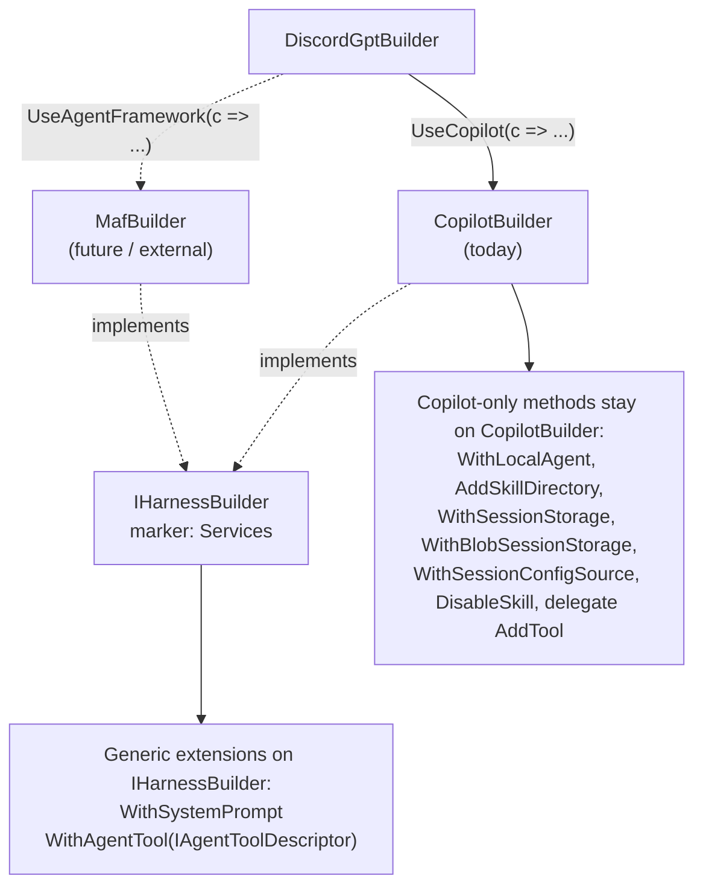

# Harness-Builder Abstraction for Multi-Harness DiscordGpt SDK

## Problem Frame

The DiscordGpt SDK currently supports a single agent harness — GitHub Copilot — exposed via
`services.AddDiscordGpt().UseCopilot(c => ...)`. Future harnesses (Microsoft Agent Framework,
Anthropic/Claude, third-party) are likely. The risk today is that the public configuration
surface ossifies into a Copilot-shaped vocabulary, leaving external implementers no clear
target to aim at and giving consumers no symmetric `Use<X>(c => ...)` story across harnesses.

The runtime swap point already exists (`IDiscordAgent` in `gpt/src/BC3Technologies.DiscordGpt.Core/IDiscordAgent.cs`,
whose docstring already anticipates a MAF adapter). What's missing is a **builder-side
contract** — a marker interface plus a small set of portable extension methods — so that
every harness package can present a consistent shape on top of `DiscordGptBuilder`.

This work is future-proofing the public SDK contract for cases (ii) "SDK as product for
others" and (iii) "guard against Copilot-only ossification" — not preparation for an
imminent second-harness implementation.

## Architecture

Key visual: harness-specific methods stay on the concrete builder. The marker enables
*portable* extension methods. Future harnesses plug in by implementing the marker and
exposing their own `Use<X>` selector — no changes to `DiscordGptBuilder` or to existing
harnesses required.

## Requirements

**Marker Interface**

- R1. Introduce `IHarnessBuilder` in `BC3Technologies.DiscordGpt.Hosting` exposing
  a single property: `IServiceCollection Services { get; }`.
- R2. `CopilotBuilder` (in `gpt/src/BC3Technologies.DiscordGpt.Copilot/CopilotBuilder.cs`)
  implements `IHarnessBuilder`. The existing `Services` property satisfies the contract;
  no behavioural change.
- R3. The interface is the documented public target for any future harness builder
  (first-party or third-party).

**Selector Convention**

- R4. Document the convention that each harness package exposes a single
  `Use<HarnessName>(this DiscordGptBuilder, Action<TBuilder>)` extension method on
  `DiscordGptBuilder`, where `TBuilder : IHarnessBuilder`. Already true for Copilot
  (`UseCopilot`); this requirement promotes it from coincidence to contract.

**Portable Extension Methods**

- R5. Provide `WithSystemPrompt<T>(this T builder, string prompt) where T : IHarnessBuilder`
  in `Hosting`. The SDK is responsible for the *registration surface*; each harness's
  runtime is responsible for *applying* the prompt to its conversation flow.
- R6. Provide `WithAgentTool<T>(this T builder, IAgentToolDescriptor descriptor) where T : IHarnessBuilder`
  in `Hosting`. `IAgentToolDescriptor` abstracts "a foreign agent surfaced as a tool inside
  the harness" — the concept that today is concretely realised by `WithAzureFoundryAgent`.
- R7. Refactor `WithAzureFoundryAgent(string agentId)` to be an adapter on top of
  `WithAgentTool` — internally constructs an `IAgentToolDescriptor` for the Foundry
  persistent agent. Caller-facing signature and behaviour unchanged.

**Documentation**

- R8. Update `gpt/src/BC3Technologies.DiscordGpt.Hosting/README.md` (or add a focused
  `EXTENSIBILITY.md` at SDK root — see outstanding question) to document:
  - The `IHarnessBuilder` contract and the `Use<X>(c => ...)` selector convention
  - The portable-vs-harness-specific divide (which methods live on `IHarnessBuilder`
    vs. on a concrete harness builder, and *why*)
  - A worked walkthrough showing what implementing a new harness package looks like

## Success Criteria

- A reader of the SDK extensibility docs can answer *"how would I add a new harness?"*
  without having to read the Copilot implementation source.
- Adding `: IHarnessBuilder` to `CopilotBuilder` requires zero changes to existing
  callers, tests, or behaviour. Build stays green; no test failures introduced.
- `WithSystemPrompt(...)` and `WithAgentTool(...)` work against `CopilotBuilder` today
  (proven via tests inside the Copilot package), so a hypothetical external `MafBuilder`
  would inherit them for free by implementing the marker.
- `services.AddDiscordGpt().UseCopilot(c => c.WithAzureFoundryAgent("..."))` continues
  to work identically from the caller's perspective after the R7 refactor.

## Scope Boundaries

- **Out of scope: implementing a second harness** (MAF, Claude, etc.). This work
  designs the contract; it does not produce a second concrete implementation.
- **Out of scope: migrating Copilot-specific methods to the marker.**
  `AddSkillDirectory`, `DisableSkill`, `WithLocalAgent`, `WithSessionConfigSource<T>`,
  `WithSessionStorage<T>`, `WithBlobSessionStorage`, and the delegate-form `AddTool`
  all stay on `CopilotBuilder`. The underlying concepts (`ISessionFsHandler`,
  `ISessionConfigSource`, Copilot skill directories, `CustomAgentConfig.Infer`) are
  Copilot-SDK-specific and don't translate cleanly to other harnesses.
- **Out of scope: a shared `WithLocalAgent(LocalAgentConfig)` abstraction.** Deferred
  until a second harness exists and the abstracted record can be shaped from real
  evidence (Rule of Three).
- **Out of scope: promoting any extension method to an interface member** (the "C" path
  per brainstorm). Stays at marker + extensions ("A + selective B"). Revisit only if
  evidence accumulates that external implementers repeatedly miss something.
- **Out of scope: changes to `DiscordGptBuilder` itself.** No new methods, no removals.
  The harness-agnostic surface (`AddTool<T>`, `WithConversationStore<T>`, `WithFoundryModels`)
  stays exactly as-is.

## Key Decisions

- **Start at "A + selective B"**: marker interface + a small handful of genuinely portable
  extension methods. Rationale: extension methods are additive and can grow over time
  without breaking anyone; interface members are sticky and break external implementers
  when added later.
- **Marker name: `IHarnessBuilder`**. The "Agent" / "Prompt" qualifier is redundant
  inside the `BC3Technologies.DiscordGpt.*` namespace.
- **Marker location: `BC3Technologies.DiscordGpt.Hosting`**. Already depends on
  `Microsoft.Extensions.DependencyInjection` (required for `IServiceCollection`) and
  is already referenced by every harness package (`Copilot` references it today).
  Avoids creating a new abstractions package that would only contain one type.
- **`WithAzureFoundryAgent` becomes an adapter, not deleted**. Preserves caller
  ergonomics — the Foundry-specific name is the right level of abstraction for callers
  who know they want a Foundry agent. The new generic `WithAgentTool` exists for
  callers who have a custom descriptor.
- **`Use<X>` selector convention is documented, not enforced** (no analyser, no
  interface-on-`DiscordGptBuilder`). Lightweight; matches how `IServiceCollection`
  ecosystem treats `Add*` / `Use*`.

## Dependencies / Assumptions

- Assumes `IAgentToolDescriptor` can be designed harness-agnostically *without* a second
  harness implementation to validate against. There is non-trivial risk that the shape
  ends up Copilot-flavoured by accident — flagged as a planning-time research item (see
  Outstanding Questions).
- Assumes the Foundry-agent-as-tool refactor (R7) does not require changes to the
  underlying `FoundryAgentToolSessionConfigSource`. The adapter simply provides a
  different *registration entry point*; the runtime path stays the same.
- Existing tests for `WithAzureFoundryAgent` continue to be the regression net for R7.

## Outstanding Questions

### Resolve Before Planning

(None — major product decisions are made.)

### Deferred to Planning

- [Affects R5][Technical] How does each harness *apply* the system prompt? `IDiscordAgent`
  doesn't take a system-prompt argument directly — the consuming app today uses a chat-client
  wrapper (`FrcSystemPromptChatClient` in `services/ChatBot/`). Decide during planning
  whether the SDK is responsible for wiring the prompt into each harness's runtime, or
  just for exposing the registration surface and letting the harness's `IDiscordAgent`
  implementation read the registered prompt from DI.
- [Affects R6][Technical, needs research] Exact shape of `IAgentToolDescriptor`. Two
  candidate shapes:
  - **(a) Data record**: name + description + parameter schema + an invocation delegate.
    Each harness adapts the record to its native tool-registration mechanism.
  - **(b) Self-registering factory**: `void RegisterWith(IHarnessBuilder builder)` —
    the descriptor knows how to register itself with whatever harness it's handed.
    Shifts complexity to descriptor implementations but keeps the marker simpler.
  Validate against at least one non-Copilot harness's tool model (read MAF docs / source)
  before committing to a shape.
- [Affects R6][Needs research] Whether `IAgentToolDescriptor` can really be designed
  harness-agnostically without a second harness to validate against. If during planning
  the design feels Copilot-shaped, escalate — better to ship just R1–R5 and defer R6
  than to bake in a leaky abstraction.
- [Affects R7][Technical] Where the Foundry-agent-as-tool adapter lives. Stay in the
  current `BC3Technologies.DiscordGpt.Copilot.Foundry` package, or move to a new
  `BC3Technologies.DiscordGpt.Foundry` package decoupled from Copilot so it can
  register against any `IHarnessBuilder`?
- [Affects R8][Technical] Whether the extensibility documentation lives in the existing
  `Hosting/README.md` or a new top-level `EXTENSIBILITY.md`. Depends on how much room
  the worked example needs.

## Next Steps

→ `/ce-plan` for structured implementation planning.
