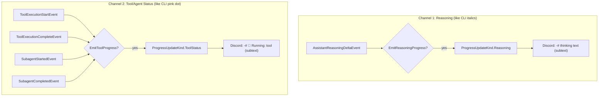

# Tool & Agent Progress Feedback to Discord

## Problem Frame

Users of the FRC Discord Bot see **nothing** during complex AI responses that take 1–5 minutes. The only feedback is Discord's ephemeral typing indicator, which conveys "alive" but not "making progress." Users lose trust, assume the bot is broken, or send duplicate messages.

The GitHub Copilot CLI provides two clear feedback channels: (1) **italicized reasoning text** showing the model's thinking, and (2) **pink-dot status indicators** showing tool/agent activity. The Discord bot should mirror both channels using Discord-native formatting.

A full progress pipeline already exists (`ConversationContext.OnProgress` → buffer → dedup → `SendProgressLineAsync` → Discord). It handles `AssistantMessageDeltaEvent`, `AssistantReasoningDeltaEvent` (→ Discord subtext via `-# ` prefix), `AssistantIntentEvent`, and `ToolExecutionProgressEvent`. However:

1. **Reasoning is gated off by default** — `EmitReasoningProgress` defaults to `false` and is only set `true` in ChatBot's hardcoded DI config. It should default to `true`.
2. **Tool and agent lifecycle events are not mapped to progress** — `ToolExecutionStartEvent`, `ToolExecutionCompleteEvent`, `SubagentStartedEvent`, `SubagentCompletedEvent` all fire reliably (confirmed by telemetry) but are never routed to `OnProgress`.

The fix is to (a) default reasoning progress on and (b) map tool/agent lifecycle events into the existing progress pipeline with distinct formatting.

## Requirements

**Reasoning Progress (Channel 1 — "thinking")**

- R1. `EmitReasoningProgress` should default to `true` in `DiscordGptOptions` rather than relying on ChatBot's hardcoded DI override. Reasoning feedback is a core UX signal, not a dev-only feature.
- R2. The existing reasoning pipeline (subtext via `-# ` prefix) requires no other changes — it already works when enabled.

**Tool/Agent Progress (Channel 2 — "status")**

- R3. When `EmitToolProgress` is enabled and a `ToolExecutionStartEvent` fires, emit a progress update with the tool name (e.g., "🔧 Running: search_codebase").
- R4. When `EmitToolProgress` is enabled and a `ToolExecutionCompleteEvent` fires, emit a progress update with the tool name and elapsed time (e.g., "✅ search_codebase (2.3s)" on success, "❌ search_codebase failed" on failure).
- R5. When `EmitToolProgress` is enabled and a `SubagentStartedEvent` fires, emit a progress update with the agent display name (e.g., "🤖 Agent: Reasoning Agent").
- R6. When `EmitToolProgress` is enabled and a `SubagentCompletedEvent` fires, emit a progress update with the agent display name and elapsed time (e.g., "🤖 Reasoning Agent completed (4.2s)").
- R7. Tool/agent progress updates use a new `ProgressUpdateKind.ToolStatus` so the hosting layer can format them distinctly from both normal content and reasoning. In Discord, tool status messages render as subtext (same `-# ` prefix as reasoning) to keep them visually secondary to the actual response, mirroring how the CLI renders status indicators as secondary to content.
- R8. All tool/agent progress updates must end with `\n` to flush through the existing line-based buffering pipeline immediately.

**Configuration**

- R9. Add `EmitToolProgress` boolean option to `DiscordGptOptions`, following the same pattern as `EmitReasoningProgress`. This option gates both tool events (R3–R4) and agent/sub-agent events (R5–R6) under a single toggle. The name `EmitToolProgress` is intentionally broad — splitting into `EmitToolProgress` + `EmitAgentProgress` adds configuration complexity without clear user benefit, since the typical user either wants status feedback or doesn't.
- R10. `EmitToolProgress` defaults to `true` — the whole point is that users need to see progress by default.
- R11. Both options are bindable from `IConfiguration` (e.g., `DiscordGpt:EmitToolProgress`, `DiscordGpt:EmitReasoningProgress`).

**Integration**

- R12. The progress mapping lives in `TryCreateIntermediateProgressUpdate` within the harness, extending the existing event-to-progress translation. This is where the `OnProgress` callback is accessible and where all other progress mapping lives.
- R13. `ToolExecutionCompleteEvent` handling must both increment `toolCallsExecuted` (existing behavior) AND emit a progress update (new behavior). **Design constraint:** The inline handler at line 180–184 currently returns early after incrementing the counter, bypassing `TryCreateIntermediateProgressUpdate` entirely. The restructuring must move `toolCallsExecuted` incrementing into the same flow as progress dispatch (e.g., increment inside `TryCreateIntermediateProgressUpdate` for this event type, or increment before calling `TryCreate` without returning early). The counter value is checked post-loop for the "no tools executed" warning — this behavior must be preserved.
- R14. Tool start timestamps must be tracked to calculate elapsed time for R4. A lightweight `ConcurrentDictionary<string, long>` (Stopwatch ticks) keyed by `ToolCallId` is sufficient. **The dictionary must be cleared on dispose/session-end** to prevent leaks from tools that start but never complete (timeout, abort). Follow the cleanup pattern from `TelemetrySessionSubscriber._activeToolActivities`.
- R15. Agent start timestamps must be tracked for R6, with the same cleanup requirement as R14.

**Display Name Mapping**

- R16. Use `ToolExecutionStartEvent.Data.ToolName` as the display name. If `McpServerName` is also available, prefer `McpServerName/McpToolName` format for richer context. **If `ToolName` is null or empty, use a generic "unknown tool" fallback** — do not emit a malformed message.
- R17. Use `SubagentStartedEvent.Data.AgentDisplayName` if non-empty, falling back to `AgentName`. If both are empty, use "sub-agent" as fallback.

**ProgressUpdateKind Extension**

- R18. Add `ToolStatus` to the `ProgressUpdateKind` enum.
- R19. The hosting layer (`DiscordGptEventHandler`) must handle `ToolStatus` with its own buffer and dedup slot. **Implementation note:** The current hosting layer uses binary `if/else` routing (Normal vs Reasoning) at ~6 branch points (`SendProgressUpdateAsync`, `EmitCompleteProgressLinesAsync`, `FlushSingleBufferAsync`, `SendProgressLineAsync`). Adding `ToolStatus` requires converting these to three-way routing (switch or similar). Tool status gets `-# ` prefix (subtext) for Discord rendering.
- R20. Flush ordering: Reasoning → ToolStatus → Normal (thinking first, then status, then content). **Note:** `FlushProgressBufferCoreAsync` currently has a comment referencing "Trinity's ordering" for the Reasoning → Normal order — extend this convention.

## Success Criteria

- Users see tool-by-tool progress messages in Discord during multi-tool queries
- Existing progress behavior (message deltas, reasoning, intent, tool execution progress) is unaffected
- The feature can be disabled via configuration without code changes
- All existing tests continue to pass

## Scope Boundaries

- No Discord message editing (edit-in-place) — use the existing line-by-line message emission
- No reaction-based status indicators — keep the existing text-based progress
- No post-response summary footer (separate future feature)
- No per-channel verbosity control (future extension)
- No changes to `ISessionEventSubscriber` interface or `TelemetrySessionSubscriber`
- `DiscordAgentProgressUpdate` record gets the new `ToolStatus` kind value but no structural changes

## Key Decisions

- **Two feedback channels, mirroring the CLI**: Reasoning text (Channel 1, like CLI italics) and tool/agent status (Channel 2, like CLI pink dot). Both render as Discord subtext (`-# `) to stay visually secondary to the actual response.
- **Extend harness, not new subscriber**: The progress callback (`OnProgress`) lives on `ConversationContext`, which is only available in the harness's `session.On()` handler. Creating a new `ISessionEventSubscriber` would require threading `ConversationContext` through the subscriber interface, breaking the current singleton pattern.
- **Both default to enabled**: Reasoning and tool progress are core UX signals. Users should opt out, not opt in.
- **New ProgressUpdateKind.ToolStatus**: Gives the hosting layer a distinct buffer and formatting path for tool events, keeping them separable from reasoning and normal content. This follows the existing dual-buffer pattern.
- **Line-based emission**: Each progress update ends with `\n` to trigger immediate line emission through the existing buffer.

## Dependencies / Assumptions

- The SDK reliably fires `ToolExecutionStartEvent` and `ToolExecutionCompleteEvent` for every tool call (verified by telemetry subscriber behavior)
- `SubagentStartedEvent` and `SubagentCompletedEvent` fire for agent lifecycle (verified by telemetry subscriber)
- **Discord rate limits:** 5 messages / 5 seconds / channel. Dedup suppresses consecutive identical strings but will NOT help here — tool messages are all unique (different names, times). Discord.Net's REST client handles HTTP 429 with automatic retry/backoff, so rate limits won't cause failures, but rapid tool execution (10+ parallel tools) may produce a burst of messages. This is acceptable for the initial implementation; coalescing/batching can be added as a future optimization if users find it noisy.
- **`EmitReasoningProgress` default change:** Changing from `false` to `true` is a behavioral change for any deployment not already overriding it. The ChatBot service already sets `true`, so the bot itself is unaffected. Other consumers of the library (if any) would start seeing reasoning output. This is intentional — reasoning feedback should be opt-out.

## Outstanding Questions

### Deferred to Planning

- [Affects R13][Technical] What is the most efficient way to restructure the `ToolExecutionCompleteEvent` early-return (line 180–184) to both count tools and emit progress without introducing a regression?
- [Affects R4, R6][Technical] Should elapsed time be formatted as seconds (2.3s) or adapt to minutes for long-running tools (e.g., "1m 23s")? Note: R4 and R6 currently show example format "2.3s" — treat as illustrative pending this decision.
- [Affects R16][Needs research] What do `McpServerName` and `McpToolName` actually resolve to for the bot's configured tools (StatBotics, TBA, etc.)? The display names should be verified against real event data.
- [Affects R19][Technical] Should the `ToolStatus` buffer be separate from the `Reasoning` buffer, or can they share one? They both render as subtext, but separate buffers allow independent dedup.

## Next Steps

→ `/ce-plan` for structured implementation planning
