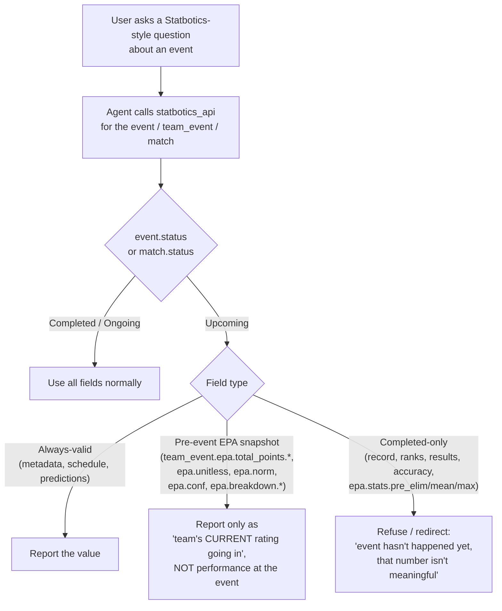

# Statbotics Future-Event Metric Validity

## Problem Frame

Statbotics computes many of its metrics from observed match results. When the
chatbot queries Statbotics for an event that hasn't happened yet (`status =
"Upcoming"`), those fields come back as zero, null, or a default value — but
they look like real numbers. The agent currently relays them as facts, so
users get answers like "Team 2046 went 0-0 with 0 RPs at next month's
regional, ranked 0 of 0 teams" or "the event-winning EPA is 0.0", which are
false-but-confident.

A second, subtler failure mode: on an Upcoming `team_event`, the `epa.*`
fields ARE populated, but they represent the team's **current season EPA they
are bringing into the event**, not their performance at the event. The agent
will happily report "Team 2046's EPA at next month's regional is 47.3" as if
that were event performance.

The fix is teaching the agent — at every Statbotics surface (the discovery
tool, the foundry agent prompt, and the local agent prompt) — which fields
are safe pre-event, which are not, and what to do when an event is Upcoming.

## User Flow

## Per-Resource Field Validity

The classifications below are derived from the upstream Statbotics ORM at
`avgupta456/statbotics` `backend/src/db/models/{event,team_event,team_match,
match,team_year,year}.py` (ref `98c3868`).

**Legend**
- ✅ Always valid — usable regardless of `status`
- ⚠️ Pre-event projection — populated, but means "current/projected", NOT "at this event"
- ❌ Completed-only — zero / null / default until matches play; do NOT report on Upcoming events

### Event (`/v3/event/{event}`, `/v3/events`)

| Field path | Validity | Notes |
|---|---|---|
| `key, year, name, country, state, district, start_date, end_date, type, week, video, num_teams, time` | ✅ | Static event metadata |
| `status, status_str` | ✅ | The gating field — read this first |
| `current_match` | ✅ | `-1` = upcoming, `0` = schedule released, `>0` = match `n` complete |
| `qual_matches` | ✅ | `0` until schedule released; valid signal |
| `epa.max, epa.top_8, epa.top_24, epa.mean, epa.sd` | ⚠️ | On Upcoming, summarize **registered teams' incoming season EPAs**, not event performance |
| `metrics.win_prob.*` (count, conf, acc, mse) | ❌ | Prediction accuracy — requires played matches |
| `metrics.score_pred.*` (count, rmse, error) | ❌ | Score-prediction error — requires played matches |
| `metrics.rp_pred.*` | ❌ | RP-prediction error — requires played matches |

### TeamEvent (`/v3/team_event/{team}/{event}`, `/v3/team_events`)

| Field path | Validity | Notes |
|---|---|---|
| `team, year, event, time, team_name, event_name, country, state, district, type, week` | ✅ | Static metadata |
| `status, first_event` | ✅ | Status gates the rest |
| `epa.stats.start` | ✅ | Team's entering EPA — explicitly pre-event |
| `epa.total_points.*, epa.unitless, epa.norm, epa.conf, epa.breakdown.*` | ⚠️ | On Upcoming, this is the team's **current season EPA they're bringing in**, NOT performance at the event. Equals `epa.stats.start` until matches play. |
| `epa.stats.pre_elim` | ❌ | Only computed after qualification rounds finish |
| `epa.stats.mean, epa.stats.max` | ❌ | Mean/max across played matches at this event |
| `record.qual.*` (wins, losses, ties, count, winrate, rps, rps_per_match, rank, num_teams) | ❌ | Zero until quals play |
| `record.elim.*` (wins, losses, ties, count, winrate, alliance, is_captain) | ❌ | Zero/null until elims play |
| `record.total.*` | ❌ | Aggregate of above |
| `district_points` | ❌ | Awarded at event end |

### TeamMatch (`/v3/team_match/...`)

| Field path | Validity | Notes |
|---|---|---|
| `team, match, year, event, alliance, time, week, elim, status` | ✅ | Static |
| `epa.total_points` | ⚠️ | Pre-match EPA going into the match — valid before play |
| `epa.breakdown.*` | ⚠️ | Pre-match component projections |
| `epa.post` | ❌ | Post-match updated EPA — null until match plays |
| `dq, surrogate` | ❌ | Resolved at match time |

### Match (`/v3/match/{match}`, `/v3/matches`)

| Field path | Validity | Notes |
|---|---|---|
| `key, year, event, week, elim, comp_level, set_number, match_number, match_name, time, predicted_time, status, video` | ✅ | Static schedule data |
| `alliances.{red,blue}.{team_keys, surrogate_team_keys, dq_team_keys}` | ✅ | Roster (DQ list resolves at match time but is empty pre-match, which is correct) |
| `pred.*` (winner, red_win_prob, red_score, blue_score, red_rp_*, blue_rp_*) | ✅ | Predictions exist before the match |
| `result.*` — entire subtree | ❌ | Actual scoring breakdown — only after match plays. Base keys: `winner, red_score, blue_score, red_no_foul, blue_no_foul`. Year-specific keys are added per `key_to_name[year]` in upstream `match.py.to_dict` (e.g., 2025+ uses renamed `coral`/`algae`/`barge` keys, plus `red_rp_1`, `red_rp_2`, etc.). The agent should refuse on the entire `result.*` subtree by structural rule rather than by literal field name. |

### Out of Scope (this brainstorm)

`TeamYear`, `Year`, and `Team` are **explicitly out of scope**. The
season-level numbers (current EPA, season-to-date record, etc.) are
"factually current" even when small or zero — the agent reporting "Team 2046
is 0-0 this season" pre-week-1 is correct, not wrong. Only event-scoped
queries are affected by this brainstorm.

## Requirements

**Field-validity teaching (`StatboticsTool.DescribeApiSurfaceAsync` guidance string at `services/ChatBot/Tools/StatboticsTool.cs`)**

- R1. The `guidance` string returned by `statbotics_api_surface` MUST include a
  "Future-event metric validity" section that names the three categories
  (always-valid, pre-event projection, completed-only) and lists per-resource
  which fields fall in the completed-only and pre-event-projection buckets
  for `Event`, `TeamEvent`, `TeamMatch`, and `Match`.
- R2. The guidance MUST instruct the agent to read `event.status` (or
  `match.status`) FIRST when answering any question scoped to a specific
  event or match, before interpreting EPA, record, ranking, or result fields.
- R3. The guidance MUST explicitly call out the `team_event.epa.*` landmine:
  on an Upcoming event these fields represent the team's CURRENT season EPA
  they are bringing into the event, NOT performance at the event, and the
  agent must phrase it that way.

**Agent behavior (local_agent_prompt.txt and agent_prompt.txt)**

- R4. Both agent prompts MUST include a short "Statbotics + future events"
  rule that summarizes: if the queried event/match is Upcoming, refuse to
  report record/rank/result/accuracy fields and instead tell the user the
  event hasn't happened yet, optionally offering pre-event predictions
  (`pred.*` on Match) or the team's incoming EPA
  (`team_event.epa.stats.start`) as a substitute.
- R5. Both agent prompts MUST tell the agent to never report a zero/null
  value from a **completed-only field** (record/rank/result/`metrics.*_pred.*`/
  `epa.stats.{pre_elim,mean,max}`) on an event-scoped query without first
  checking `status`. A "0-0 record" or "rank 0 of 0" answer is treated as a
  bug, not a valid response. Always-valid fields whose legitimate value is
  zero or negative (e.g., `qual_matches = 0` meaning schedule unreleased,
  `current_match = -1` meaning Upcoming) are exempt.
- R6. The agent MUST be allowed to use the always-valid fields freely on
  Upcoming events (schedule, registered teams, predictions, time, location).

**Cross-document consistency**

- R7. The classification (which fields fall in which bucket) MUST live in
  exactly one authoritative place — the `statbotics_api_surface` guidance
  string. The agent prompts reference the rule by name and concept but do
  NOT re-list every field, to avoid the two surfaces drifting apart.
- R8. The `foundry-agent.yaml` `instructions` (which mirrors
  `agent_prompt.txt` for the hosted agent) MUST be updated in lockstep with
  `agent_prompt.txt`.

## Success Criteria

- For an Upcoming event, asking "what was Team 2046's record at <event>?" or
  "who won <event>?" or "what was the win-prediction accuracy at <event>?"
  results in a refusal/redirect that names the event status, instead of a
  fabricated zero-valued answer.
- For an Upcoming event, asking "what's Team 2046's EPA at <event>?" results
  in language like "Team 2046 is bringing a current-season EPA of X into
  <event>" — never "their EPA at <event> is X" framed as event performance.
- For an Ongoing or Completed event, behavior is unchanged — all fields are
  reported as before.
- Asking schedule/registered-teams/predicted-winner questions about an
  Upcoming event still works and uses the always-valid fields.

## Scope Boundaries

- Out of scope: any tool-side response annotation, filtering, or rewriting.
  This brainstorm is prompt-only. (Tool-side enforcement was considered and
  rejected — see Key Decisions.)
- Out of scope: `TeamYear`, `Year`, and `Team` resources. Season-level
  numbers for in-progress or future seasons are factually correct as
  "current" values and don't need this treatment.
- Out of scope: any change to the Statbotics OpenAPI client, generated
  models, or `StatboticsTool` C# logic beyond editing the `guidance` string
  literal.
- Out of scope: the enum-validation work in
  `docs/brainstorms/2026-04-26-statbotics-query-validation-requirements.md`.
  Different concern, same tool — they should not block each other.

## Key Decisions

- **Refuse / redirect over caveat-and-report**: when a completed-only field
  is requested on an Upcoming event, the agent refuses to give a number and
  tells the user the event hasn't happened. Reporting "0 (caveat: event
  hasn't started)" still primes the user to anchor on zero.
- **Prompt-only fix, no tool-side enforcement**: the rest of the Statbotics
  tool surface teaches the agent through the `guidance` string and prompts;
  this rule fits the same pattern. Tool-side annotation or filtering would
  require coupling `StatboticsTool` to per-resource field knowledge that
  duplicates upstream Statbotics shape, with non-trivial carrying cost when
  Statbotics adds fields.
- **Event-scoped only**: `TeamYear` / `Year` are deliberately excluded to
  keep the rule tight and easy to remember. A team's "current" season EPA is
  always meaningful even when small.
- **Single source of truth for the field list**: only the
  `statbotics_api_surface` guidance string enumerates fields. Agent prompts
  reference the rule conceptually. Prevents drift.

## Dependencies / Assumptions

- Assumes the upstream Statbotics `EventStatus` enum values remain
  `Upcoming`, `Ongoing`, `Completed`. If new values appear, the rule needs
  to define behavior for them.
- Assumes `event.status` is the authoritative gate. (Confirmed in upstream
  source — both `event.status` and `team_event.status` come from the event
  row.)
- Coordinates with — but does not block on —
  `docs/brainstorms/2026-04-26-statbotics-query-validation-requirements.md`.

## Outstanding Questions

### Resolve Before Planning

(none)

### Deferred to Planning

- [Affects R4][Technical] Should the "Statbotics + future events" rule live
  alongside the existing `STATBOTICS PATH RULE` block (the section in
  `local_agent_prompt.txt` and `agent_prompt.txt` that governs Statbotics
  v3 path/query usage), or get its own labeled section? (Stylistic —
  planning can decide based on prompt length budget.)
- [Affects R1][Technical] What's the most compact way to express the
  per-resource field lists in the `guidance` string without bloating the
  tool response that the model sees on every call? Options: short tables,
  bulleted "do not report" lists, or a terse "completed-only fields:
  record.*, rank, result.*, metrics.*_pred.*" pattern with examples.

## Next Steps

→ `/ce-plan` for structured implementation planning
