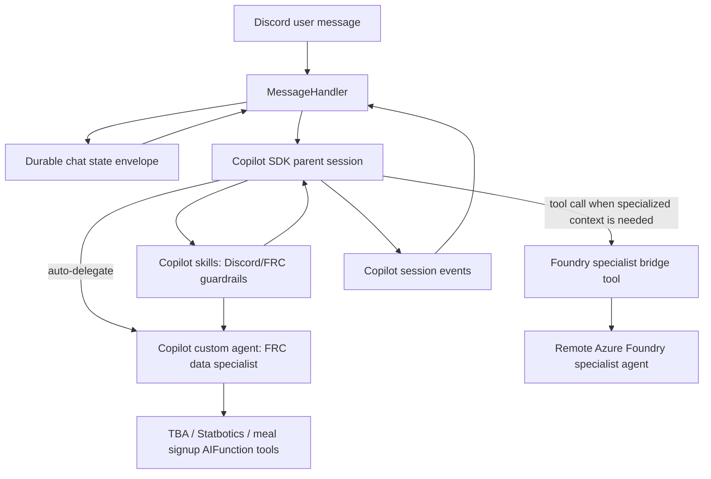

# refactor: Replace chatbot harness with Copilot SDK orchestration

## Overview

Replace the current bespoke Azure AI Foundry workflow harness with a GitHub Copilot SDK-driven conversation runtime that still preserves the repo's two specialist lanes: local FRC/tool execution and the remote Azure Foundry specialist agent. The goal is to let Copilot own parent-session orchestration, sub-agent selection, and streaming while keeping Discord UX, durable chat state, and specialist grounding intact. In the SDK design, **custom agents** are the right specialization boundary, while **skills** are supporting instruction modules used only where they remove prompt duplication or package repeatable guardrails.

## Problem Frame

The current chatbot stack in `services/ChatBot` is effective but heavily custom:

- `services/ChatBot/Conversation.cs` hand-builds a workflow graph, JSON `next_step` contract, retry loops, evaluator turns, soft/hard deadlines, and handoff bookkeeping.
- `services/ChatBot/Agents/foundry-agent.yaml` and `services/ChatBot/Agents/local-agent.yaml` depend on that bespoke harness shape rather than on a more general session runtime.
- `services/ChatBot/MessageHandler.cs` and `app/DiscordInterop/DiscordInitializationService.cs` provide a good Discord transport shell that should survive the migration.

The requested end state is a Copilot SDK-centered harness where the user-facing conversation is driven by Copilot, specialist agents still work together quickly and accurately, and the implementation leans on SDK constructs instead of repo-specific orchestration code whenever possible.

## Requirements Trace

- R1. The user-facing chat loop must be driven by GitHub Copilot SDK rather than the current custom Foundry workflow harness.
- R2. Local specialist behavior and the remote Azure Foundry specialist must both remain available and cooperate inside the same overall chatbot experience.
- R3. The migration should prefer Copilot SDK and Microsoft Agent Framework constructs over bespoke routing, retry, and delegation code, using custom agents for specialist delegation and skills only for reusable instruction packs.
- R4. Existing Discord DM and guild-mention entry points, streamed status updates, and failure handling must remain intact.
- R5. Chat state must remain cloud-safe and durable; instance-local SDK session state cannot become the only source of truth.
- R6. The new design must preserve observability, explicit tool boundaries, and testability.

## Scope Boundaries

- No changes to non-chat bot features such as subscriptions, team/event APIs, or Discord command registration beyond what the chat runtime needs.
- No attempt to migrate the remote Foundry specialist definition out of Azure Foundry in this phase.
- No redesign of the current Discord UX surface beyond what is needed to keep progress/final answer streaming working with Copilot SDK events.
- No attempt to preserve legacy Foundry thread history verbatim across the harness swap; incompatible stored state will be versioned and reset safely.

## Context & Research

### Relevant Code and Patterns

- `app/DiscordInterop/DiscordInitializationService.cs` wires chat handling into Discord DM and guild mention flows and should remain the outer transport boundary.
- `services/ChatBot/MessageHandler.cs` already handles durable per-user locking, transient progress messages, chunked Discord streaming, and conversation-state persistence. That makes it the right place to keep transport concerns while swapping the underlying conversation runtime.
- `services/ChatBot/Conversation.cs` is the current orchestration hotspot. It constructs the Foundry/local workflow, answer evaluators, prompt repair loops, and session binding. This is the primary replacement target.
- `services/ChatBot/Configuration/AiOptions.cs` and `services/ChatBot/ChatBotConstants.cs` show the current configuration pattern: options objects with explicit validation plus constants for configuration keys.
- `services/ChatBot/Tools/IProvideFunctionTools.cs`, `services/ChatBot/Tools/TbaApiTool.cs`, and `services/ChatBot/Tools/StatboticsTool.cs` already package local specialist capabilities as `AIFunction`s. These are reusable inputs to a Copilot SDK session.
- `lib/AgentFramework.OpenTelemetry/Agents/FoundryAgent.cs` and `lib/AgentFramework.OpenTelemetry/Agents/LocalAgent.cs` show the repo's existing Microsoft Agent Framework/OpenTelemetry wrapper pattern for agents.
- `app/FunctionApp.Tests/HttpGetToolBaseTests.cs` and `app/FunctionApp.Tests/StartupInfrastructureFactoryTests.cs` show the current xUnit test style and test project location.

### Institutional Learnings

- No `docs/solutions/` directory or prior solution notes were present, so this plan relies on code patterns and external guidance.

### External References

- GitHub Docs: Copilot SDK + Microsoft Agent Framework integration — use `CopilotClient.AsAIAgent(...)` to compose Copilot with other MAF agents instead of inventing a custom orchestration layer.
- GitHub Docs: Copilot SDK custom agents — session-level `CustomAgents`, scoped `Tools`, optional `McpServers`, and sub-agent lifecycle events can replace the repo's homegrown "hosted router -> local router" JSON protocol.
- GitHub Docs: Copilot SDK custom skills — `SkillDirectories`, `DisabledSkills`, and per-agent `skills` let the runtime load reusable prompt modules, but they do not replace specialist agent boundaries.
- GitHub Copilot SDK .NET README — `CopilotClient`, `CreateSessionAsync`, streaming session events, permission handlers, and resume semantics are the core parent-runtime primitives.

## Key Technical Decisions

- **Copilot SDK becomes the parent conversation runtime.** The parent/user-facing conversation should move to `GitHub.Copilot.SDK` so that session management, streaming, permission handling, and specialist inference come from the SDK instead of `Conversation.cs`'s custom workflow graph.
- **Keep Discord transport concerns outside the SDK.** `MessageHandler` should remain the layer that translates runtime events into Discord typing indicators, transient progress messages, chunked final output, and failure embeds. This mirrors the current separation of concerns and avoids rewriting Discord-specific UX.
- **Use custom agents for specialists and skills for shared guardrails.** The local TBA/Statbotics/meal-signup specialist and any explicit Foundry-invocation helper should be represented as Copilot custom agents because they need distinct descriptions, tool scopes, and runtime delegation. Skills should only package shared instruction sets such as Discord output constraints, citation/grounding rules, or FRC-domain guardrails that would otherwise be duplicated across prompts.
- **Promote local FRC expertise into Copilot custom agents.** The local TBA/Statbotics/meal-signup specialist is a strong fit for Copilot custom agents because the existing `AIFunction` tools can be scoped directly to a sub-agent instead of being mediated through a bespoke `next_step = query_local` protocol.
- **Retain the remote Foundry specialist through a thin bridge, not as the parent runtime.** The remote Foundry agent already exists for specialized knowledge and should stay external in this phase. The plan uses a narrowly scoped bridge tool/service that invokes the Foundry specialist via Microsoft Agent Framework wrappers, then exposes that capability to Copilot as a specialist lane.
- **Durable state remains in Azure Table Storage; Copilot session IDs are cache hints.** Copilot SDK session persistence is instance-local by default, which is not sufficient for Azure Functions on Container Apps. Persist a versioned chat-state envelope and recent transcript window in `userChatAgentThreads`, then resume a Copilot session when available or rebuild one from durable state when it is not.
- **Remove workflow/evaluator knobs that only existed to support the bespoke harness.** Current settings such as `MaxWorkflowSteps`, `WorkflowSoftTimeoutSeconds`, `WorkflowHardTimeoutSeconds`, and evaluator retry counts should be retired or sharply reduced once Copilot parent orchestration replaces the custom workflow loop.

## Open Questions

### Resolved During Planning

- **Should the remote Foundry agent remain external?** Yes. The request explicitly keeps one specialist in Azure Foundry, so this phase preserves that boundary instead of re-authoring it inside Copilot.
- **Should legacy stored Foundry thread IDs be migrated exactly?** No. The plan treats legacy state as incompatible with the new parent runtime, upgrades storage to a versioned envelope, and resets cleanly when only legacy thread state is available.
- **Are agents or skills the better SDK construct here?** Agents are the primary construct. The chatbot needs distinct specialist identities, delegated execution, and explicit tool boundaries, which custom agents provide. Skills remain secondary and should be used only to preload shared guardrails or FRC-domain instruction packs into the parent/local agents.
- **Should the plan use MAF or Copilot-native delegation for local specialists?** Copilot custom agents are the preferred fit for local specialists because they let the runtime infer delegation and scope tools directly, reducing custom orchestration code.

### Deferred to Implementation

- **Exact transcript replay window.** The right number of prior turns to persist and replay should be tuned during implementation based on token cost and answer quality.
- **Whether the Copilot parent model uses GitHub-hosted defaults or BYOK provider settings.** The plan should leave a provider abstraction point in configuration, but the first implementation can default to GitHub-managed Copilot auth/model flow unless deployment constraints require BYOK immediately.
- **Whether the Foundry specialist bridge should be a direct service call or a dedicated Copilot-only tool wrapper type.** The plan assumes a thin tool-facing wrapper, but the final class layout can be simplified once the SDK package APIs are wired in code.

## High-Level Technical Design

> *This illustrates the intended approach and is directional guidance for review, not implementation specification. The implementing agent should treat it as context, not code to reproduce.*

## Implementation Units

- [x] **Unit 1: Introduce Copilot SDK runtime and clean configuration surface**

**Goal:** Add the Copilot SDK parent-runtime dependencies and define a clean chat configuration model that separates Copilot runtime settings from remote Foundry specialist settings.

**Requirements:** R1, R3, R6

**Dependencies:** None

**Files:**
- Modify: `Directory.Packages.props`
- Modify: `services/ChatBot/ChatBot.csproj`
- Modify: `services/ChatBot/Configuration/AiOptions.cs`
- Modify: `services/ChatBot/ChatBotConstants.cs`
- Modify: `services/ChatBot/DependencyInjectionExtensions.cs`
- Modify: `app/appsettings.json`
- Test: `app/FunctionApp.Tests/ChatBot/CopilotConfigurationTests.cs`

**Approach:**
- Add `GitHub.Copilot.SDK` and the MAF bridge package needed to integrate Copilot cleanly with the existing agent abstractions.
- Split configuration into a parent Copilot runtime section and a smaller Foundry specialist section, trimming settings that only exist for the current workflow graph.
- Register a singleton Copilot runtime host/factory through DI so the SDK client lifecycle is owned by the application host rather than by per-message code.

**Patterns to follow:**
- `services/ChatBot/Configuration/AiOptions.cs`
- `services/ChatBot/DependencyInjectionExtensions.cs`
- `app/FunctionApp.Tests/StartupInfrastructureFactoryTests.cs`

**Test scenarios:**
- Happy path — valid Copilot + Foundry configuration binds and validates successfully.
- Edge case — optional provider-specific fields omitted still allow the parent Copilot runtime to start with default auth/model behavior.
- Error path — missing required Copilot runtime settings fail fast with clear options validation messages.
- Error path — legacy workflow-only settings are ignored or removed instead of silently influencing the new runtime.

**Verification:**
- The chat service collection can build with Copilot runtime services registered and no dependency on the old workflow-only configuration fields.

- [x] **Unit 2: Replace legacy conversation state with a durable Copilot chat-state envelope**

**Goal:** Redesign persisted chat state so the bot can survive instance churn while using Copilot SDK sessions opportunistically.

**Requirements:** R1, R4, R5, R6

**Dependencies:** Unit 1

**Files:**
- Modify: `services/ChatBot/ConversationThreadState.cs`
- Modify: `services/ChatBot/MessageHandler.cs`
- Create: `services/ChatBot/Copilot/CopilotChatState.cs`
- Create: `services/ChatBot/Copilot/CopilotTranscriptWindow.cs`
- Test: `app/FunctionApp.Tests/ChatBot/CopilotChatStateTests.cs`
- Test: `app/FunctionApp.Tests/ChatBot/MessageHandlerStatePersistenceTests.cs`

**Approach:**
- Replace the current "raw thread id or loose JSON" parsing with a versioned state envelope that can store the Copilot session ID, Foundry specialist conversation/thread state, a replayable transcript window, and any routing metadata the parent runtime needs.
- Keep Azure Table Storage as the durable source of truth; treat resumed Copilot session IDs as an optimization, not a guarantee.
- On legacy rows that only contain a Foundry thread ID, start a fresh Copilot-backed session and persist the new envelope on the first successful turn.

**Patterns to follow:**
- `services/ChatBot/ConversationThreadState.cs`
- `services/ChatBot/MessageHandler.cs`

**Test scenarios:**
- Happy path — a persisted composite state envelope round-trips without losing Copilot session ID, transcript entries, or specialist state.
- Edge case — a legacy raw thread ID is detected and upgraded into a new envelope without crashing the chat flow.
- Edge case — an empty or malformed stored state triggers a clean new-session path instead of throwing unhandled parsing errors.
- Integration — `MessageHandler` persists updated state after a successful turn and reuses it on the next request.

**Verification:**
- Chat state persistence becomes explicit, versioned, and resilient to both legacy rows and missing local Copilot session cache.

- [x] **Unit 3: Define Copilot custom agents first, then attach shared skills where they actually help**

**Goal:** Move specialist reasoning out of the bespoke Foundry/local handoff contract and into Copilot SDK custom agents, using skills only for reusable shared instruction packs.

**Requirements:** R1, R2, R3, R6

**Dependencies:** Unit 1, Unit 2

**Files:**
- Create: `services/ChatBot/Copilot/CopilotAgentCatalog.cs`
- Create: `services/ChatBot/Agents/prompts/copilot-parent-system-message.md`
- Create: `services/ChatBot/Agents/prompts/copilot-frc-data-agent.md`
- Create: `services/ChatBot/Copilot/Skills/discord-chat-guardrails/SKILL.md`
- Create: `services/ChatBot/Copilot/Skills/frc-grounding/SKILL.md`
- Modify: `services/ChatBot/Agents/PromptCatalog.cs`
- Modify: `services/ChatBot/ChatBot.csproj`
- Modify: `services/ChatBot/Tools/IProvideFunctionTools.cs`
- Modify: `services/ChatBot/Tools/TbaApiTool.cs`
- Modify: `services/ChatBot/Tools/StatboticsTool.cs`
- Modify: `services/ChatBot/Tools/MealSignupInfoTool.cs`
- Test: `app/FunctionApp.Tests/ChatBot/CopilotAgentCatalogTests.cs`

**Approach:**
- Define session-level Copilot custom agents for the parent chat assistant and the local FRC data specialist, using the existing prompt-file pattern instead of hard-coded strings.
- Reuse the existing `AIFunction` tool providers and scope them to the FRC data specialist rather than routing through `query_local`.
- Add a small, explicit skill directory for reusable prompt modules that both the parent and local specialist benefit from, such as Discord-output guardrails and FRC grounding/citation rules.
- Preserve the existing tool descriptions and citation-producing behavior so accuracy grounding survives the runtime migration.

**Patterns to follow:**
- `services/ChatBot/Tools/IProvideFunctionTools.cs`
- `services/ChatBot/Tools/TbaApiTool.cs`
- `services/ChatBot/Agents/PromptCatalog.cs`
- GitHub Copilot SDK custom-agent guidance for `CustomAgents`, `Tools`, `infer`, and per-agent `skills`
- GitHub Copilot SDK custom-skills guidance for `SkillDirectories`

**Test scenarios:**
- Happy path — the Copilot session config includes the expected parent and FRC specialist custom-agent definitions with the right prompts and allowed tools.
- Happy path — the configured skill directory loads the shared guardrail skills and binds them only to the intended agents.
- Edge case — the local specialist receives only the tool set it should use and does not inherit unrelated write-capable tools.
- Edge case — disabling a skill or omitting the skill directory does not break the core specialist-agent registration path.
- Error path — missing prompt assets fail predictably during startup rather than at first message execution.
- Integration — tool metadata and citations exposed through existing providers remain unchanged after being attached to the Copilot runtime.

**Verification:**
- The local specialist no longer depends on the old hosted-agent JSON protocol, and the plan uses skills only where they genuinely reduce duplicated instruction text instead of replacing specialist agents.

- [x] **Unit 4: Add a minimal Foundry specialist bridge for remote expertise**

**Goal:** Preserve the external Foundry specialist as a callable expert lane without keeping it as the parent runtime.

**Requirements:** R2, R3, R5, R6

**Dependencies:** Unit 1, Unit 2

**Files:**
- Create: `services/ChatBot/Tools/FoundrySpecialistTool.cs`
- Create: `services/ChatBot/Copilot/FoundrySpecialistConversationStore.cs`
- Modify: `services/ChatBot/DependencyInjectionExtensions.cs`
- Modify: `services/ChatBot/Conversation.cs`
- Test: `app/FunctionApp.Tests/ChatBot/FoundrySpecialistToolTests.cs`

**Approach:**
- Build a thin tool-facing service that invokes the existing remote Foundry agent through the repo's MAF/OpenTelemetry wrappers, persists any remote conversation identifier inside the durable chat-state envelope, and returns grounded text/citation payloads to the Copilot parent session.
- Keep the bridge narrow: one responsibility is specialist invocation, not orchestration. Copilot remains responsible for deciding when that specialist is needed.
- Make the bridge available only to the Copilot parent or a dedicated specialist custom agent so the remote lane stays explicit and least-privileged.

**Patterns to follow:**
- `lib/AgentFramework.OpenTelemetry/Agents/FoundryAgent.cs`
- `services/ChatBot/Conversation.cs` (agent creation and prompt-loading patterns only)
- `services/ChatBot/Tools/TbaApiTool.cs` (tool packaging style)

**Test scenarios:**
- Happy path — a remote specialist call returns grounded content and persists updated specialist state.
- Edge case — the remote specialist has no prior conversation state and starts a new external conversation cleanly.
- Error path — a Foundry invocation failure surfaces as a controlled tool failure that the parent runtime can report, not as a partial Discord response.
- Integration — bridge results can be attached to parent-session context without leaking transport-specific JSON contracts.

**Verification:**
- The external Foundry specialist remains usable, but the surrounding orchestration code collapses to a small bridge surface.

- [x] **Unit 5: Rebuild `Conversation` around Copilot session events while preserving Discord streaming semantics**

**Goal:** Keep the public chat runtime contract stable for `MessageHandler` while internally swapping to Copilot session creation, resume, streaming, and sub-agent events.

**Requirements:** R1, R2, R4, R5, R6

**Dependencies:** Unit 1, Unit 2, Unit 3, Unit 4

**Files:**
- Modify: `services/ChatBot/Conversation.cs`
- Create: `services/ChatBot/Copilot/CopilotSessionCoordinator.cs`
- Create: `services/ChatBot/Copilot/CopilotEventStreamAdapter.cs`
- Modify: `services/ChatBot/ChatRunner.cs`
- Test: `app/FunctionApp.Tests/ChatBot/CopilotConversationStreamingTests.cs`
- Test: `app/FunctionApp.Tests/ChatBot/ChatRunnerTests.cs`

**Approach:**
- Preserve the existing `Conversation.PostUserMessageStreamingAsync(...)` contract so `MessageHandler` remains mostly transport-focused.
- Internally, create or resume a Copilot SDK session, attach the configured custom agents and tools, subscribe to assistant/sub-agent/tool lifecycle events, and translate those events into `AgentResponseUpdate` or an equivalent streaming shape consumed by the Discord layer.
- Replace the current soft/hard workflow step logic with SDK-native streaming plus a small compatibility layer for user-visible progress/status messages where needed.

**Patterns to follow:**
- `services/ChatBot/Conversation.cs`
- `services/ChatBot/ChatRunner.cs`
- GitHub Copilot SDK .NET session/event APIs

**Test scenarios:**
- Happy path — a standard user prompt streams assistant content through the existing conversation API shape and reaches the caller in order.
- Edge case — a resumed SDK session is unavailable locally, so the coordinator rebuilds context from durable transcript state and still returns a valid answer.
- Error path — a tool failure or Copilot session error aborts the turn cleanly and lets `MessageHandler` show the existing failure UX.
- Integration — sub-agent lifecycle events do not leak raw SDK internals into Discord output, but still allow progress/status messaging when useful.

**Verification:**
- `MessageHandler` can continue consuming streamed chat updates without knowing whether the underlying runtime is Copilot or the old workflow engine.

- [x] **Unit 6: Remove legacy orchestration/evaluator plumbing and lock the migration in with regression tests**

**Goal:** Finish the migration by deleting the old bespoke harness paths, updating chat documentation/config references, and closing the biggest regression gaps.

**Requirements:** R1, R3, R4, R6

**Dependencies:** Unit 5

**Files:**
- Modify: `services/ChatBot/Agents/AgentWorkflowBindingsFactory.cs`
- Modify: `services/ChatBot/Agents/foundry-agent.yaml`
- Modify: `services/ChatBot/Agents/local-agent.yaml`
- Modify: `README.md`
- Modify: `app/FunctionApp.Tests/StartupInfrastructureFactoryTests.cs`
- Test: `app/FunctionApp.Tests/ChatBot/CopilotIntegrationSmokeTests.cs`

**Approach:**
- Delete or retire code paths whose only purpose was to support the custom `next_step` JSON protocol, semantic evaluator repair loops, and workflow graph bindings.
- Reframe retained prompt assets as specialist instructions rather than as parent-runtime contracts.
- Update documentation and configuration guidance so the repo describes Copilot as the parent chat runtime and Foundry as a specialist integration.

**Patterns to follow:**
- `README.md`
- `app/FunctionApp.Tests/StartupInfrastructureFactoryTests.cs`

**Test scenarios:**
- Happy path — startup detection uses the new Copilot-oriented configuration requirements and enables chat services when those settings are present.
- Edge case — deployments without chat settings still disable chat services cleanly so the rest of the bot can start.
- Integration — a smoke test covering session setup + state persistence + specialist registration proves the migration did not leave the app half on the old harness and half on the new one.
- Test expectation: none -- prompt-asset wording changes inside the retained YAML files do not need separate unit tests beyond the runtime/config tests above.

**Verification:**
- The repo no longer depends on the legacy workflow/evaluator harness to serve chat turns, and the documented architecture matches the shipped code shape.

## System-Wide Impact

- **Interaction graph:** `DiscordInitializationService` continues to receive Discord messages and delegate to `MessageHandler`; `MessageHandler` continues to own typing/progress/failure UX; `Conversation` becomes a Copilot session coordinator instead of a workflow builder; the Foundry specialist becomes a callable integration rather than the parent runtime.
- **Instruction layering:** shared chat/FRC guardrails can be packaged once as skills and attached to the parent/local agents, while agent-specific role prompts stay with the custom agents themselves.
- **Error propagation:** Copilot session failures, tool failures, and Foundry bridge failures should bubble to `MessageHandler` as explicit turn failures so the existing Discord failure-embed path stays authoritative.
- **State lifecycle risks:** The migration introduces a composite state envelope with parent-session IDs, transcript windows, and remote specialist state. Partial writes, legacy-row upgrades, and resume failures must degrade to "start a fresh session" rather than to corrupted state reuse.
- **API surface parity:** Both DM chat and guild mention chat must keep working through the same `MessageHandler` entry points. `/chat reset` semantics should continue to clear the persisted chat envelope.
- **Integration coverage:** Unit tests alone will not prove the end-to-end bridge between Copilot parent session setup, specialist invocation, and Discord output shaping. At least one chat-runtime smoke/integration test should cover those boundaries with fakes/stubs.
- **Unchanged invariants:** Existing TBA/Statbotics/meal-signup tool behavior, citation formatting, Discord disclaimer behavior, and per-user synchronization must remain intact even though the parent runtime changes.

## Alternative Approaches Considered

- **Keep the current workflow harness and only swap the parent model/provider.** Rejected because it preserves the exact bespoke routing/evaluator code the request wants to replace.
- **Use Microsoft Agent Framework alone for all orchestration, with Copilot only wrapped as an `AIAgent`.** Viable, but not preferred: it would still require more orchestration code in-repo and would not take advantage of Copilot SDK custom-agent inference/tool scoping for local specialists.
- **Model the whole solution as skills instead of agents.** Rejected because skills are instruction modules, not runtime-specialist boundaries. This chatbot needs specialist descriptions, tool scoping, and sub-agent lifecycle events, which are agent features.
- **Remove the remote Foundry specialist entirely and move everything into Copilot.** Rejected because the request explicitly keeps a specialized Azure Foundry agent in the system.

## Risks & Dependencies

| Risk | Mitigation |
|------|------------|
| Copilot SDK session persistence is instance-local and could be lost on scale-out or recycle | Keep Azure Table Storage as the durable source of truth and rebuild sessions from persisted transcript state when resume fails |
| Remote Foundry specialist calls add latency or duplicate context | Keep the bridge narrow, invoke it only when the parent runtime selects that lane, and persist specialist state separately so repeat calls can stay efficient |
| The migration leaves the app half-dependent on the old JSON protocol | Remove legacy workflow/evaluator code in the final unit instead of letting it coexist indefinitely |
| Tool permissions become too broad inside the Copilot parent session | Scope local tools to dedicated custom agents and expose the Foundry bridge only where required |
| Chat UX regresses because Copilot event streaming does not map 1:1 to the existing workflow output model | Introduce an explicit stream adapter and cover it with regression tests before deleting the old runtime |

## Documentation / Operational Notes

- Update the README chat architecture section to describe Copilot SDK as the parent runtime and Azure Foundry as a specialist integration.
- Document any new GitHub auth/provider settings required for server-side Copilot SDK use in `app/appsettings.json` guidance and deployment instructions.
- Preserve OpenTelemetry coverage around parent-session creation, specialist delegation, and tool execution so the migration does not reduce chat observability.

## Sources & References

- Related code: `services/ChatBot/Conversation.cs`
- Related code: `services/ChatBot/MessageHandler.cs`
- Related code: `services/ChatBot/Configuration/AiOptions.cs`
- Related code: `lib/AgentFramework.OpenTelemetry/Agents/FoundryAgent.cs`
- External docs: <https://docs.github.com/en/copilot/how-tos/copilot-sdk/integrations/microsoft-agent-framework>
- External docs: <https://docs.github.com/en/copilot/how-tos/copilot-sdk/use-copilot-sdk/custom-agents>
- External docs: <https://docs.github.com/en/copilot/how-tos/copilot-sdk/use-copilot-sdk/custom-skills>
- External docs: <https://github.com/github/copilot-sdk/blob/main/dotnet/README.md>

