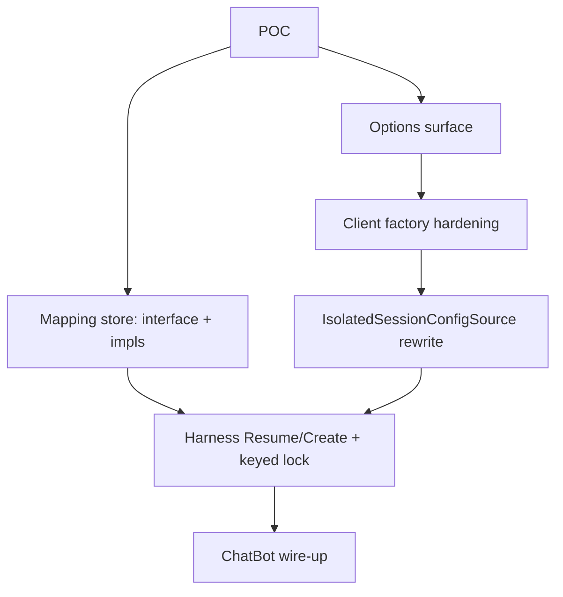

# Conversation-scoped Copilot session store + CopilotClient hardening

## Overview

Two coupled changes to the Copilot harness:

1. **Close the `~/.copilot/session-store.db` leak** by isolating Copilot's `ConfigDir` per Discord conversation, and replace today's 11-tool exclusion stopgap with the targeted set the requirements doc allows (R7-R9, R14-R16).
2. **Give the bot real per-conversation memory** by persisting `(Discord convKey → Copilot sessionId)` and calling `ResumeSessionAsync` on subsequent turns instead of always `CreateSessionAsync` (R10-R13).

Done in the same plan because both depend on the same `CopilotClient` factory hardening (R1-R5) — which is independently table-stakes hygiene (logger, log level, telemetry, GitHub token from `IConfiguration`, `UseLoggedInUser=false`, client-level `SessionFs` config so the existing blob handler is actually invoked).

## Problem Frame

See origin: `docs/brainstorms/2026-04-23-conversation-scoped-session-store-requirements.md` Problem Frame.

Briefly: the bot answered Discord questions with content from the developer's local `~/.copilot/session-store.db` because no `ConfigDir` is set; conversations have no real continuity because every turn calls `CreateSessionAsync`; and the `CopilotClient` factory sets only `AutoStart`+`UseStdio` so logger/telemetry/token/`SessionFs` are all silently defaulted.

## Requirements Trace

Origin requirements (R-numbers preserved; R6 was deliberately dropped):

- R1. `UseLoggedInUser = false` hardcoded.
- R2. `GitHubToken` bound from `IConfiguration`, no opinion on backend; null/empty = unset.
- R3. `TelemetryConfig` bound from `IConfiguration`, no intermediate DTO; missing section = unset (no telemetry emitted).
- R4. `Logger` from host `ILoggerFactory` (category `GitHub.Copilot.SDK`); `LogLevel` from `IConfiguration` (null = SDK default).
- R5. `SessionFs` wired at client level so default-session code paths use blob storage. **Planning correction** below: SDK-level `SessionFs` is a `SessionFsConfig` (paths/conventions), not an `ISessionFsHandler`; the actual handler still attaches per-session.
- R7. `IsolatedSessionConfigSource` sets `SessionConfig.ConfigDir = botConfigRoot/cfg/<convKey>` deterministically.
- R8. Conv-key path segment is filesystem-safe (deterministic mapping if `ToStorageKey()` isn't already safe).
- R9. `botConfigRoot` is bot-owned and survives a Functions instance lifetime (not `~`).
- R10. Persistent `(convKey → sessionId)` mapping store; readable from any Functions instance.
- R11. Harness lookup → `ResumeSessionAsync` if mapped else `CreateSessionAsync` and store the new id.
- R12. Per-conversation serialization for concurrent turns.
- R13. Mapping writes are best-effort; failure logs and degrades to today's behavior on next turn.
- R14. Remove `sql` / `session_store_sql` exclusions.
- R15. Keep `ask_user`, `web_fetch`, `web_search` excluded by policy with documented reason.
- R16. Re-enable `store_memory`, `task`, `read_agent`, `list_agents`, `fetch_copilot_cli_documentation`, `skill`.

Success criteria carried forward from the origin doc's Success Criteria section (leak repro, multi-turn continuity across cold start, cross-channel isolation, three deployment shapes, telemetry-off-by-default, concurrent-turn safety).

## Scope Boundaries

Same as origin: blob container layout unchanged; no GC of stale per-conv `ConfigDir`s or stale mapping rows; prompt-stuffed transcript path (`IncludeConversationHistoryAsContext` / `BuildPrompt`) unchanged; `UseLoggedInUser` stays hardcoded (not exposed).

## Context & Research

### Relevant Code and Patterns

- `services/ChatBot/Diagnostics/IsolatedSessionConfigSource.cs` — the file to modify for R7/R14-R16 (currently holds the 11-tool exclusion stopgap).
- `gpt/src/BC3Technologies.DiscordGpt.Copilot/DiscordGptBuilderCopilotExtensions.cs` lines 55-63 — the `CopilotClient` factory to harden for R1-R5.
- `gpt/src/BC3Technologies.DiscordGpt.Copilot/GitHubCopilotPromptHarness.cs` lines 80-83, 96-98 — per-session `SessionFs` wiring (keep) and `CreateSessionAsync` call site (split into Resume/Create).
- `gpt/src/BC3Technologies.DiscordGpt.Copilot/DiscorgGptOptions.cs` — where `GitHubToken`, `Telemetry`, `CliLogLevel` options hang.
- `gpt/src/BC3Technologies.DiscordGpt.Storage.Blob/BlobSessionFsHandler.cs` — existing `ISessionFsHandler` impl, used unchanged.
- `gpt/src/BC3Technologies.DiscordGpt.Core/ConversationKey.cs` — `ToStorageKey()` returns `"{(int)Scope}:{Id}"` (contains a colon; on Windows the colon is **not** a legal path char, so R8 mapping is mandatory, not optional).
- `services/ChatBot/Diagnostics/TableConversationTraceContextStore.cs` — pattern to mirror for the new table-backed mapping store: `TableServiceClient` injection, lazy `CreateTableIfNotExists`, `ITableEntity` value class, `Sanitize`/`SplitKey` helpers, `LoggerMessage` source-gen, options class with `TableName` + `CreateTableIfNotExists`.
- `gpt/src/BC3Technologies.DiscordGpt.Storage.TableStorage/TableConversationStore.cs` and `TableConversationStoreBuilderExtensions.cs` — pattern for shipping a TableStorage impl that the consumer wires via a `With*` builder extension.
- `services/ChatBot/DependencyInjectionExtensions.cs` lines 117-153 — wire-up site for the new options + mapping store.
- `app/FunctionApp.Tests/ChatBot/DiscordGptIntegrationTests.cs` — existing test project where the POC and DI assertions can live (the only test project in the repo).

### Institutional Learnings

`docs/solutions/` is empty — no prior compounded knowledge to draw from.

### Key SDK Facts (from `D:\.nuget\packages\github.copilot.sdk\0.2.2\lib\net8.0\GitHub.Copilot.SDK.xml`)

- `CopilotClientOptions.SessionFs` is a **`SessionFsConfig`** (line 8290), with `InitialCwd`, `SessionStatePath`, `Conventions`. **Setting it tells the client to register as the FS provider on connect**; the actual `ISessionFsHandler` factory still attaches via `SessionConfig.CreateSessionFsHandler` / `ResumeSessionConfig.CreateSessionFsHandler`. This means today's harness wiring (per-session `CreateSessionFsHandler = _ => _sessionFsHandler`) is necessary but possibly insufficient: if `CopilotClientOptions.SessionFs` is not set, the per-session factory may be silently ignored. R5 done correctly = set both.
- `CopilotClientOptions.GitHubToken` (line 8192): "passed to the CLI server via environment variable. Takes priority over other authentication methods." `Token` (line 8200) is obsolete — use `GitHubToken`.
- `CopilotClientOptions.UseLoggedInUser` (line 8204): "Default: true (but defaults to false when GitHubToken is provided)." We force `false` regardless, per R1.
- `CopilotClientOptions.LogLevel` (line 8167): string — `"info"`, `"debug"`, `"warn"`, `"error"`.
- `TelemetryConfig` (line 8245): plain POCO, props `OtlpEndpoint`, `FilePath`, `ExporterType`, `SourceName`, `CaptureContent`. All settable; binds cleanly via `IConfiguration.Bind()`.
- `ResumeSessionAsync(sessionId, ResumeSessionConfig, ct)` (line 202): throws `InvalidOperationException` when the session does not exist. `ResumeSessionConfig` requires `OnPermissionRequest` (line 207) and supports `Tools`, `ConfigDir`, `EnableConfigDiscovery`, `CreateSessionFsHandler` like `SessionConfig`.

## Key Technical Decisions

- **`CopilotClientOptions.SessionFs` is set unconditionally when an `ISessionFsHandler` is registered** in the DI container. Set it to a default `new SessionFsConfig()` (no `InitialCwd`/`SessionStatePath` overrides). Keeping the per-session `CreateSessionFsHandler` wiring in the harness is required. **This satisfies R5's intent without abandoning the per-session handler factory.** (See origin: R5 implementation note left this open.)
- **`IConversationSessionMap` interface lives in `BC3Technologies.DiscordGpt.Copilot`**, with a default in-memory impl shipped there for libraries-only consumers. The Azure Table Storage impl ships in `BC3Technologies.DiscordGpt.Storage.TableStorage` behind a new `WithTableConversationSessionMap(...)` builder extension. Mirrors the existing `IConversationStore` / `TableConversationStore` shape. The bot wires the Table impl in `services/ChatBot/DependencyInjectionExtensions.cs`.
- **Per-conversation serialization uses an in-process `SemaphoreSlim` keyed on convKey** (held in a `ConcurrentDictionary<string, SemaphoreSlim>` on the harness or a small helper). Acceptable because Discord gateway sharding pins a conversation to one Functions instance for its lifetime; if the assumption breaks, last writer wins on the mapping store but `ResumeSessionAsync` simply succeeds twice on the same `sessionId` (each call yields its own `CopilotSession`, both replay events from blob `SessionFs`). A lease pattern is deferred — revisit only if the pin assumption proves false in production.
- **`botConfigRoot = Path.Combine(Path.GetTempPath(), "frc-bot-copilot")`** — bot-owned, writable on Consumption + Premium plans, not `~/.copilot`. Per-conv subdir: `{botConfigRoot}/cfg/{safeKey}`.
- **`safeKey` mapping**: `{(int)Scope}-{SHA256(Id).TruncateBase32(16)}`. Windows can't use `:` in paths and `Id` may be a long Discord snowflake; hashing also gives uniform width. Collision-resistant within Discord's id space.
- **`GitHubToken` config key**: bind from `DiscordGpt:Copilot:GitHubToken` (the existing `DiscordGptOptions` is bound by the consumer; we add `GitHubToken` as a string property and a sibling `Telemetry` property of type `TelemetryConfig?`, plus `CliLogLevel` string). Library consumers configure via whatever `IConfiguration` chain they want — no library opinion on the secret backend.
- **`CliLogLevel` is a string, not an enum.** SDK takes `"info"`/`"debug"`/`"warn"`/`"error"`. Lower-cased; passes through to SDK as-is. Null/empty = unset = SDK default.
- **`Logger` is wired from `ILoggerFactory` directly in the factory** (not from options), via category `"GitHub.Copilot.SDK"`.
- **The harness is the sole owner of the (lookup → Resume-or-Create → store-id) sequence.** `ICopilotPromptHarness.RunPromptAsync` keeps its current signature; the mapping store is injected as an additional optional ctor arg (DI default = in-memory impl, so tests and library consumers without a real store just get ephemeral behavior matching today).
- **Mapping write happens after `CreateSessionAsync` returns the new session id** (so we don't store an id we never got). Wrapped in try/catch + warning log; never propagates to user (R13).

## High-Level Technical Design

> *This illustrates the intended approach and is directional guidance for review, not implementation specification. The implementing agent should treat it as context, not code to reproduce.*

```
                      Discord turn
                           │
                           ▼
       ┌──────────────────────────────────────────────┐
       │  GitHubCopilotPromptHarness.RunPromptAsync   │
       │                                              │
       │  convKey = ctx.Key.ToStorageKey()            │
       │                                              │
       │  using (await keyedLock.AcquireAsync(convKey)│
       │  {                                           │
       │    sessionId = await map.GetAsync(convKey)   │
       │                                              │
       │    sessionConfig = build SessionConfig:      │
       │      Tools, OnPermissionRequest,             │
       │      CreateSessionFsHandler = _ => blobFs    │
       │      (sources contribute ConfigDir, etc.)    │
       │                                              │
       │    if (sessionId is not null) {              │
       │      session = await client                  │
       │        .ResumeSessionAsync(sessionId, …)     │
       │    } else {                                  │
       │      session = await client                  │
       │        .CreateSessionAsync(sessionConfig)    │
       │      try { await map.SetAsync(convKey,       │
       │              session.Id) }                   │
       │      catch { log warn; continue }            │
       │    }                                         │
       │    … existing event-subscribe + send/await   │
       │  }                                           │
       └──────────────────────────────────────────────┘

       IsolatedSessionConfigSource.ConfigureAsync now:
         sessionConfig.ConfigDir =
           {tmp}/frc-bot-copilot/cfg/{ScopeNum}-{Hash16}
         ExcludedTools = { ask_user, web_fetch, web_search }

       CopilotClient factory now:
         UseLoggedInUser = false
         GitHubToken = opts.GitHubToken (if non-empty)
         LogLevel = opts.CliLogLevel (if non-empty)
         Telemetry = opts.Telemetry  (if non-null)
         Logger = loggerFactory.CreateLogger("GitHub.Copilot.SDK")
         SessionFs = new SessionFsConfig()  (only if any
                     ISessionFsHandler is registered)
```



## Open Questions

### Resolved During Planning

- **Where does `IConversationSessionMap` live?** Interface + in-memory default in `BC3Technologies.DiscordGpt.Copilot`. Table-backed impl in `BC3Technologies.DiscordGpt.Storage.TableStorage` behind a `WithTableConversationSessionMap(...)` extension. Resolution: mirrors existing `IConversationStore` shape and keeps the harness DI-friendly without forcing every library consumer onto Azure Tables.
- **`SessionFs` at client level — handler or config?** It's a `SessionFsConfig` (paths/conventions). The handler factory remains per-session. Resolution: set `CopilotClientOptions.SessionFs = new()` whenever an `ISessionFsHandler` is registered; keep per-session `CreateSessionFsHandler` for both Create and Resume paths.
- **`safeKey` encoding?** `{ScopeInt}-{Base32(SHA256(Id)).Truncate(16)}`. Resolution: Windows cannot use `:` in paths; hashing gives uniform width and removes any chance of `Id` containing reserved chars. Documented in code comment on the helper.
- **`CliLogLevel` enum vs string?** String. SDK takes a string; converting to/from an enum buys nothing and surfaces fewer values than the SDK supports.
- **Mapping store interface shape?** `Task<string?> GetSessionIdAsync(string convKey, CT)` + `Task SetSessionIdAsync(string convKey, string sessionId, CT)` + `Task RemoveAsync(string convKey, CT)`. Mirrors `IConversationTraceContextStore`.

### Deferred to Implementation

- **Does `ResumeSessionAsync` succeed when local `session-store.db` is freshly created (no row for `sessionId`) but blob `SessionFs` has the session events?** Answered by Unit 1 (POC). If yes — plan stands as written. If no — implementation must add an index-row hydration step (read sentinel from blob `SessionFs`, write to local `session-store.db` before resume) or use a `Fork`-style fallback. Either remediation is small and isolated to the harness Resume branch; design it after the POC reports.
- **Whether to remove the per-session `CreateSessionFsHandler` line in the harness once `CopilotClientOptions.SessionFs` is set.** Decision: **keep it**. The SDK docs (line 8225) say the per-session factory is the documented mechanism; client-level `SessionFs` only enables the provider registration. Removing the per-session line is outside R5 and risks regressing blob storage entirely.
- **Concurrency semaphore disposal.** A `ConcurrentDictionary<string, SemaphoreSlim>` grows monotonically. Implementation may use `LazyInitializer` + reference-count + remove on zero, or accept the leak (one `SemaphoreSlim` per active conversation per Functions instance — bounded). Cheap to revisit later.
- **Test harness reach.** The repo's only test project (`app/FunctionApp.Tests`) currently does DI assertion tests, not integration tests against a real `CopilotClient`. The POC (Unit 1) and the leak/continuity verifications in Success Criteria likely run as manual repro scripts or a small `dotnet run` console under `tools/` rather than in xUnit. Pick during implementation; document outcomes in `docs/solutions/` after the fact.

## Implementation Units

- [x] **Unit 1: POC — verify `ResumeSessionAsync` against blob `SessionFs` + empty local index**

**Goal:** Resolve the one deferred-to-implementation question that shapes Unit 5's branch logic.

**Requirements:** R10, R11 (informs implementation; not a behavior unit).

**Dependencies:** None (uses existing `BlobSessionFsHandler` and `CopilotClient` as-is).

**Files:**
- Create: `tools/ResumePoC/Program.cs` (small console; deleted or moved to `docs/solutions/` after POC) **OR** add a `[Trait("Category", "Manual")]` xUnit fact in `app/FunctionApp.Tests/ChatBot/`. Implementer's choice.

**Approach:**
1. With a `BlobSessionFsHandler` (Azurite or a real test container), create a `CopilotClient` configured with `SessionFs = new()` + `ConfigDir = {tempA}`. Call `CreateSessionAsync`, send one message, capture `session.Id`. Dispose.
2. New `CopilotClient` instance, **same** `BlobSessionFsHandler` blob container, **fresh** `ConfigDir = {tempB}` (no row in `session-store.db` for that `sessionId`). Call `ResumeSessionAsync(sessionId, …)`.
3. Record outcome: succeeds (history present?) / throws / silently empty.

**Execution note:** Manual one-off — outcome lands in `docs/solutions/2026-04-XX-resume-session-against-blob-fs.md` so the next person can find it.

**Patterns to follow:** `BlobSessionFsHandler` wiring as it appears in `services/ChatBot/DependencyInjectionExtensions.cs:125`.

**Test scenarios:**
- Test expectation: none — POC artifact, not production code. Outcome is a recorded decision.

**Verification:**
- A written conclusion (in the session checkpoint or `docs/solutions/`) of the form: "ResumeSessionAsync against fresh ConfigDir + populated blob SessionFs: {works | requires index hydration | requires Fork fallback}". Unit 5 reads this before designing its Resume branch.

---

- [x] **Unit 2: Add `GitHubToken`, `Telemetry`, `CliLogLevel` to `DiscordGptOptions`**

**Goal:** Library options surface for R2-R4, so the bot factory can read them via `IOptions<DiscordGptOptions>`.

**Requirements:** R2, R3, R4.

**Dependencies:** None.

**Files:**
- Modify: `gpt/src/BC3Technologies.DiscordGpt.Copilot/DiscorgGptOptions.cs` — add three properties.

**Approach:**
- `public string? GitHubToken { get; set; }` — null/empty means "don't set the SDK property".
- `public TelemetryConfig? Telemetry { get; set; }` — `TelemetryConfig` is `GitHub.Copilot.SDK.TelemetryConfig`. Null means "don't set". Public setter on the property (the SDK type itself is a settable POCO; `IConfiguration.Bind()` constructs and populates it).
- `public string? CliLogLevel { get; set; }` — null/empty means "don't set". Document accepted values (`info`, `debug`, `warn`, `error`) in XML doc comments.
- All three live alongside existing `AutoStart`/`UseStdio`. Add XML doc comments matching the file's house style.

**Patterns to follow:** Existing `string?` properties in the same file (`ProviderApiKey`, `ProviderBearerToken`).

**Test scenarios:**
- Happy path: an `appsettings.json` with `DiscordGpt:GitHubToken: "ghp_xxx"` binds to `options.GitHubToken == "ghp_xxx"`.
- Happy path: `DiscordGpt:Telemetry:OtlpEndpoint: "http://otel:4318"` binds to `options.Telemetry.OtlpEndpoint`.
- Edge case: missing `Telemetry` section → `options.Telemetry == null`.
- Edge case: empty string `GitHubToken` is preserved as empty (factory treats empty as unset, not the options binder).

**Verification:**
- Existing `DiscordGptOptionsValidator` still passes; new properties have no validation rules of their own.

---

- [x] **Unit 3: Harden `CopilotClient` factory in `DiscordGptBuilderCopilotExtensions`**

**Goal:** R1-R5 — the singleton factory sets `UseLoggedInUser=false`, conditionally sets `GitHubToken`/`LogLevel`/`Telemetry`, wires `Logger`, and enables client-level `SessionFs` whenever an `ISessionFsHandler` is registered.

**Requirements:** R1, R2, R3, R4, R5.

**Dependencies:** Unit 2.

**Files:**
- Modify: `gpt/src/BC3Technologies.DiscordGpt.Copilot/DiscordGptBuilderCopilotExtensions.cs` lines 55-63.

**Approach:**
- Replace the `TryAddSingleton<CopilotClient>` factory body. New body:
  - Resolve `IOptions<DiscordGptOptions>`, `ILoggerFactory`, and `IEnumerable<ISessionFsHandler>` (use the enumerable so we can detect "any registered" without forcing one).
  - Build `CopilotClientOptions { AutoStart = options.AutoStart, UseStdio = options.UseStdio, UseLoggedInUser = false, Logger = loggerFactory.CreateLogger("GitHub.Copilot.SDK") }`.
  - Conditionally set `GitHubToken`, `LogLevel`, `Telemetry` only when the corresponding option value is non-null/non-empty.
  - If `sessionFsHandlers.Any()`, set `SessionFs = new SessionFsConfig()` (default config — paths come from per-session `ConfigDir`).
- Do **not** use a synchronous `Logger` of type Microsoft `ILogger` if the SDK takes a different shape — verify the assignment compiles and matches `CopilotClientOptions.Logger`'s type (almost certainly `ILogger`; if not, use the SDK's expected type and adapt).
- `Environment` dictionary is **not** populated. The user explicitly rejected env-var defense-in-depth (see origin Key Decisions: "No process-level env-var defense-in-depth").

**Patterns to follow:** Existing `TryAddSingleton(sp => …)` factory shape in the same method; null-conditional setting of options matches the existing `_allowAll` style elsewhere in the codebase.

**Test scenarios:**
- Happy path: with no `GitHubToken`/`Telemetry`/`CliLogLevel` configured, factory produces a `CopilotClient` with `UseLoggedInUser=false`, `Logger != null`, and `GitHubToken/LogLevel/Telemetry` unset (verifiable by reflecting on the `CopilotClientOptions` passed in — keep options as a captured local for testability).
- Happy path: with `GitHubToken="ghp_xxx"` configured, factory's options have `GitHubToken=="ghp_xxx"`.
- Happy path: with `Telemetry:OtlpEndpoint` configured, factory's options have `Telemetry.OtlpEndpoint != null`.
- Happy path: with one `ISessionFsHandler` registered, factory's options have `SessionFs != null`.
- Edge case: with **zero** `ISessionFsHandler`s registered, `SessionFs == null` (preserves existing default behavior for library consumers without blob storage).
- Integration: real DI graph (mirror `app/FunctionApp.Tests/ChatBot/DiscordGptIntegrationTests.cs:112` style) asserts the factory resolves and the produced client has the expected options.

**Verification:**
- `CopilotClient` resolves from DI without exception under both "no token" and "token present" configurations.
- Existing `DiscordGptIntegrationTests` still pass.

---

- [x] **Unit 4: `IConversationSessionMap` interface + in-memory default + Azure Table impl**

**Goal:** R10 — durable `(convKey → sessionId)` mapping that any Functions instance can read/write.

**Requirements:** R10, R13 (failure-tolerant — covered in this unit by the impl raising typed exceptions; the harness in Unit 5 swallows them).

**Dependencies:** None.

**Files:**
- Create: `gpt/src/BC3Technologies.DiscordGpt.Copilot/IConversationSessionMap.cs` — interface.
- Create: `gpt/src/BC3Technologies.DiscordGpt.Copilot/InMemoryConversationSessionMap.cs` — `ConcurrentDictionary<string,string>` impl, registered as default.
- Modify: `gpt/src/BC3Technologies.DiscordGpt.Copilot/DiscordGptBuilderCopilotExtensions.cs` — `TryAddSingleton<IConversationSessionMap, InMemoryConversationSessionMap>()`.
- Create: `gpt/src/BC3Technologies.DiscordGpt.Storage.TableStorage/TableConversationSessionMap.cs` — table-backed impl mirroring `TableConversationTraceContextStore`.
- Create: `gpt/src/BC3Technologies.DiscordGpt.Storage.TableStorage/TableConversationSessionMapOptions.cs` — `TableName` + `CreateTableIfNotExists`.
- Create: `gpt/src/BC3Technologies.DiscordGpt.Storage.TableStorage/TableConversationSessionMapBuilderExtensions.cs` — `WithTableConversationSessionMap(this CopilotBuilder, Action<TableConversationSessionMapOptions>?)`. `services.Replace(...)` to swap out the in-memory default.

**Approach:**
- Interface (3 methods, all `Task`-returning, all take `CancellationToken`):
  - `Task<string?> GetSessionIdAsync(string convKey, CancellationToken ct)`
  - `Task SetSessionIdAsync(string convKey, string sessionId, CancellationToken ct)`
  - `Task RemoveAsync(string convKey, CancellationToken ct)`
- Table entity: `PartitionKey = ScopeInt`, `RowKey = SanitizedId` (mirror `TableConversationTraceContextStore.SplitKey/SanitizeKey`). Row carries `SessionId` + `CreatedUtc` + `LastUsedUtc`. `LastUsedUtc` is updated on every successful `Get` (best-effort fire-and-forget) so a future GC pass has signal.
- Lazy table-create: same pattern as `TableConversationTraceContextStore.GetTableClientAsync`.
- Default table name: `"copilotsessions"`.
- Source-gen `LoggerMessage` for stored/retrieved/missing.

**Patterns to follow:** `services/ChatBot/Diagnostics/TableConversationTraceContextStore.cs` (whole file). Builder extension mirrors `gpt/src/BC3Technologies.DiscordGpt.Storage.TableStorage/TableConversationStoreBuilderExtensions.cs`.

**Test scenarios:**
- Happy path: `Set` then `Get` returns the stored sessionId.
- Happy path: `Get` for an unknown convKey returns `null` (404 swallowed in impl, like the trace store).
- Happy path: `Remove` then `Get` returns `null`.
- Edge case: convKey containing `:` (the canonical `ToStorageKey` shape) round-trips correctly through `SplitKey`/`SanitizeKey`.
- Edge case: in-memory impl behaves identically to table impl for the basic Set→Get→Remove cycle (parameterized test against both impls).
- Integration: `WithTableConversationSessionMap(...)` extension replaces `IConversationSessionMap` registration so DI returns the table impl, not the in-memory default.

**Verification:**
- Both impls satisfy the same parameterized test fixture.
- DI registration in the bot ends up with the Table impl, not the in-memory default (assertable in `DiscordGptIntegrationTests`).

---

- [x] **Unit 5: Harness `ResumeSessionAsync` path + per-conversation lock**

**Goal:** R11, R12, R13 — harness looks up `sessionId` per turn, calls `Resume` or `Create` accordingly, stores new ids, and serializes per-conversation turns.

**Requirements:** R11, R12, R13.

**Dependencies:** Unit 1 (informs whether the Resume branch needs a hydration step), Unit 4.

**Files:**
- Modify: `gpt/src/BC3Technologies.DiscordGpt.Copilot/GitHubCopilotPromptHarness.cs` — constructor takes new `IConversationSessionMap` (and optional `IKeyedSemaphoreProvider`-style helper, OR a private static `ConcurrentDictionary<string, SemaphoreSlim>`).
- Modify: same file lines 96-98 — replace the unconditional `CreateSessionAsync` call with the lookup → Resume-or-Create branch.

**Approach:**
1. Compute `convKey = context.Key.ToStorageKey()` once at the top (it's already computed for logging at line 87 — hoist).
2. Acquire per-conversation semaphore (fairness not required; just mutual exclusion). Held until the session disposes.
3. `string? existingId = await _sessionMap.GetSessionIdAsync(convKey, cancellationToken);`
4. If `existingId is not null`:
   - Build `ResumeSessionConfig` mirroring `SessionConfig` (Tools, OnPermissionRequest, ConfigDir from sources, CreateSessionFsHandler — `ResumeSessionConfig` has the same surface).
   - `session = await _copilotClient.ResumeSessionAsync(existingId, resumeConfig, cancellationToken);`
   - If `InvalidOperationException` ("session does not exist"): log warn, fall through to Create branch (treats remote session as gone — common after `DeleteSessionAsync` or storage GC).
5. Else (or fall-through): `session = await _copilotClient.CreateSessionAsync(sessionConfig, cancellationToken); try { await _sessionMap.SetSessionIdAsync(convKey, session.Id, cancellationToken); } catch (Exception ex) { LogMappingWriteFailed(_logger, ex, convKey); }`.
6. Continue with the existing event-subscribe + send/await + result construction, **inside** the semaphore.
7. Refactor the `SessionConfig` build into a small helper that produces either `SessionConfig` or `ResumeSessionConfig` to avoid duplication. The two SDK types share the same property surface (`Tools`, `OnPermissionRequest`, `ConfigDir`, `EnableConfigDiscovery`, `CreateSessionFsHandler`); a small private helper can populate both from the same source iteration.
8. **Source iteration question**: `ISessionConfigSource.ConfigureAsync` takes `SessionConfig`, not a base type. Either (a) configure a `SessionConfig`, then mirror its props onto `ResumeSessionConfig`, or (b) define a small internal `ISessionConfigTarget` shim. Pick (a) — simpler, keeps `ISessionConfigSource` API stable.

**Execution note:** Add the per-conversation lock helper as a small private static inside the harness (no new file, no public API). If the implementation chooses a separate `KeyedAsyncLock` helper class, it lives in `BC3Technologies.DiscordGpt.Copilot/Internal/`.

**Patterns to follow:** Existing harness method structure; null-safe optional ctor arg pattern (`ISessionFsHandler? sessionFsHandler = null`).

**Test scenarios:**
- Happy path (turn 1): no mapping → `CreateSessionAsync` called → mapping written → assistant message returned.
- Happy path (turn 2 same conv): mapping present → `ResumeSessionAsync` called with the stored id → assistant message returned.
- Edge case: `ResumeSessionAsync` throws `InvalidOperationException` ("session does not exist") → falls back to `CreateSessionAsync` → new id stored under the same convKey, overwriting old.
- Error path: `_sessionMap.SetSessionIdAsync` throws → log warning, **do not** rethrow, return successful assistant response (R13).
- Concurrency: two near-simultaneous `RunPromptAsync` calls on the same convKey → second waits on the semaphore → both observe a single `Create→Resume` sequence (not two `Create`s).
- Concurrency: two simultaneous calls on **different** convKeys → run in parallel (different semaphores).
- Integration: turn 1 then a second instance (simulating cold start: new harness, new `CopilotClient`, same blob `SessionFs`, same mapping store) issues turn 2 → resume succeeds (assuming Unit 1 POC says yes; otherwise this test exposes the gap and points to the hydration remediation).

**Verification:**
- A multi-turn conversation across a simulated cold start produces a turn-2 response that references turn-1 content **without** the prompt-stuffed transcript.
- Concurrent same-conv turns serialize observably (assert via instrumentation or a deliberate slow `Tools` callback).

---

- [x] **Unit 6: Rewrite `IsolatedSessionConfigSource` for per-conversation `ConfigDir` + reduced exclusions**

**Goal:** R7, R8, R9, R14, R15, R16 — replace the 11-tool stopgap with a per-conversation `ConfigDir` and a 3-tool exclusion set.

**Requirements:** R7, R8, R9, R14, R15, R16.

**Dependencies:** None for compilation; logically depends on Unit 3 (client-level `SessionFs`) so that even if a code path bypasses the source's `WorkingDirectory` change, blob storage still owns session events. Recommend landing after Unit 3.

**Files:**
- Modify: `services/ChatBot/Diagnostics/IsolatedSessionConfigSource.cs`.

**Approach:**
- Rename `s_rootDir` semantics: now `s_botConfigRoot = Path.Combine(Path.GetTempPath(), "frc-bot-copilot")`.
- Add ctor injection of `IConversationContextAccessor` (verify exists; else accept a `ConversationContext` parameter through a different seam — most likely `ISessionConfigSource.ConfigureAsync` only gets a `SessionConfig`, so convKey must reach this source via a different path). **Implementation question**: how does the source get the current `ConversationContext`? Two options:
  - (A) Add a per-call `ISessionConfigSource.ConfigureAsync(SessionConfig, ConversationContext, CT)` overload — breaking interface change.
  - (B) Use an `AsyncLocal<ConversationContext?>` ambient set by the harness before calling the sources, cleared on exit. Non-breaking; matches how `IConversationContextAccessor` patterns work in DI.
  - **Pick (B).** Add `ConversationContextAccessor` (private to the Copilot library or in Core) with `AsyncLocal<ConversationContext?> Current { get; set; }`. Harness sets it before iterating sources, clears in `finally`.
- In `ConfigureAsync`:
  1. Read `ConversationContextAccessor.Current` (must be non-null when called from the harness; throw `InvalidOperationException` otherwise — surfaces misuse early).
  2. Compute `safeKey = $"{(int)ctx.Key.Scope}-{Base32(SHA256(ctx.Key.Id)).Substring(0,16)}"`.
  3. `var convConfigDir = Path.Combine(s_botConfigRoot, "cfg", safeKey); Directory.CreateDirectory(convConfigDir);`
  4. `sessionConfig.ConfigDir = convConfigDir;`
  5. Keep `sessionConfig.WorkingDirectory = perTurnSessionDir` (existing behavior — scratch isolation per turn is still desirable; it's not the leak vector).
  6. Replace `s_excludedBuiltInTools` with `["ask_user", "web_fetch", "web_search"]`. Update the comment block to explain: `ask_user` = no human present; `web_fetch`/`web_search` = policy ban on untrusted outbound from a Discord-triggered turn (R15).
- Update class-level XML doc to reflect the new responsibility (per-conversation `ConfigDir` isolation, not just `WorkingDirectory` scratch).
- Update `LogIsolated` message to include `ConfigDir` and the (smaller) excluded count.

**Patterns to follow:** Existing `IsolatedSessionConfigSource` structure; `LoggerMessage` source-gen.

**Test scenarios:**
- Happy path: ConfigureAsync with a `ConversationContext` for `ConversationKey(DM, "12345")` produces `sessionConfig.ConfigDir == {tmp}/frc-bot-copilot/cfg/0-{hash16}` and the directory exists.
- Happy path: two different convKeys produce two different `ConfigDir`s; the same convKey across turns produces the **same** `ConfigDir`.
- Happy path: `ExcludedTools` contains exactly `ask_user`, `web_fetch`, `web_search` (no more, no less).
- Edge case: `ConversationContextAccessor.Current is null` → throws `InvalidOperationException` with a message naming the source.
- Edge case: extreme `Id` values (very long Discord snowflake, unicode) hash safely; produced path is < 250 chars (Windows path-length safety margin).
- Integration: a turn through the harness on Windows produces a `ConfigDir` that exists on disk and contains a `session-store.db` after the SDK does its first write.

**Verification:**
- After a turn for conv A, `sql session_store` (no longer excluded) returns rows from conv A only — never from a different conversation or from `~/.copilot/session-store.db`.
- The 3-element exclusion list is the only one in code; no other tool names linger.

---

- [x] **Unit 7: Wire-up in `services/ChatBot`**

**Goal:** Bind the new options from `IConfiguration`, register the table-backed mapping store.

**Requirements:** R2, R3, R4, R10 (consumer-side wiring of library capabilities added in Units 2-4).

**Dependencies:** Units 2, 3, 4.

**Files:**
- Modify: `services/ChatBot/DependencyInjectionExtensions.cs` lines 117-153.
- Modify (likely): `services/ChatBot/ChatBot.csproj` (or wherever ChatBot's package refs live) — confirm `BC3Technologies.DiscordGpt.Storage.TableStorage` is a direct ref. Per the **dependency-discipline** rule, don't add a transitive ref; verify with `dotnet list package --include-transitive`. (If TableStorage is already referenced for the conversation store, this is a no-op.)

**Approach:**
- Inside `.UseCopilot(c => c …)`, change `.ConfigureOptions(options => …)` to also `Bind` (or supplement-bind) from `configuration.GetSection("DiscordGpt")` so `GitHubToken`/`Telemetry`/`CliLogLevel` flow through `IConfiguration`. Confirm the existing call doesn't already do this; if it does, just ensure new keys are recognized.
- Add `.WithTableConversationSessionMap(options => options.TableName = ChatBotConstants.ServiceKeys.TableClient_ConversationSessionMap)` on the builder chain (or nearest equivalent location).
- Add the constant `TableClient_ConversationSessionMap = "copilotconversationsessions"` (or similar) to `ChatBotConstants.ServiceKeys`.
- Verify: this bot's deployment doesn't currently set `GitHubToken` and shouldn't start needing it. Plan = library reads `DiscordGpt:GitHubToken` from config; bot doesn't put it there → SDK uses its own auth (CLI logged-in user, etc.). With `UseLoggedInUser=false` (R1) **and** no `GitHubToken`, what does the SDK do? **Verify in Unit 3 testing** that this does not regress the bot's existing auth path. If it does, treat that as a deployment-config item (set `DiscordGpt:GitHubToken` via app settings/Key Vault for production).

**Execution note:** This unit is the integration seam. Land last; `dotnet build` + the existing `DiscordGptIntegrationTests` should pass before merging.

**Patterns to follow:** Existing `services.Configure<DiscordGptCoreOptions>` shape (lines 108-113); existing `WithTableConversationStore` chained call (line 123).

**Test scenarios:**
- Integration: `DiscordGptIntegrationTests` (or its sibling) asserts that `IConversationSessionMap` resolves to `TableConversationSessionMap` (not the in-memory default).
- Integration: `IOptions<DiscordGptOptions>.Value.GitHubToken` reflects an `appsettings.json` value (provide via `IConfigurationBuilder.AddInMemoryCollection` in test setup).
- Integration: `IOptions<DiscordGptOptions>.Value.Telemetry?.OtlpEndpoint` is set/unset based on test config presence.

**Verification:**
- `dotnet build` clean.
- Existing `app/FunctionApp.Tests/ChatBot/DiscordGptIntegrationTests.cs` still passes; new assertions for the mapping store + options binding pass.

## System-Wide Impact

- **Interaction graph:** harness `RunPromptAsync` ⇄ `IConversationSessionMap` (new); `IsolatedSessionConfigSource` ⇄ `ConversationContextAccessor` (new ambient). The harness gains one extra constructor parameter; downstream consumers using the default in-memory map won't notice.
- **Error propagation:** `IConversationSessionMap.SetSessionIdAsync` failures are swallowed in the harness and logged at `Warning`. `Get`/`Resume` failures surface as today: `Get` returning `null` is normal (no mapping yet); `ResumeSessionAsync`'s `InvalidOperationException` is caught and the harness falls back to `Create` (this is a planning decision worth flagging in the diff for review).
- **State lifecycle risks:** (a) Mapping rows accumulate forever — accepted (origin scope boundary). (b) Per-conv `ConfigDir`s on Functions instances accumulate until cold start — accepted. (c) `SemaphoreSlim` per-convKey accumulates — bounded by active conv count per instance; document and revisit if unbounded. (d) **Race**: instance A creates session for convKey, mapping write succeeds. Cold-start instance B reads mapping, calls `Resume`, succeeds. If A is still alive and gets the next turn, both instances now hold concurrent `CopilotSession`s on the same `sessionId`. SDK behavior under this is unverified — flag for production observation.
- **API surface parity:** library API is purely additive: `DiscordGptOptions` gains 3 properties, `CopilotBuilder` gains `IConversationSessionMap` registration + `WithTableConversationSessionMap` extension. No breaking changes; existing consumers compile unchanged.
- **Integration coverage:** Cross-instance continuity (Unit 5 final test scenario) is the headline integration test — unit tests on the mapping store and harness alone don't prove blob `SessionFs` actually round-trips events. Manual repro acceptable; document in `docs/solutions/`.
- **Unchanged invariants:** `ICopilotPromptHarness.RunPromptAsync` signature unchanged; `BlobSessionFsHandler` unchanged; `BlobConversationStoreOptions` unchanged; existing `IConversationStore` / `TableConversationStore` (different concept — high-level Discord chat history) unchanged; `ConversationKey.ToStorageKey()` unchanged (R8 hashes its output rather than altering it).

## Risks & Dependencies

| Risk | Mitigation |
|------|------------|
| `ResumeSessionAsync` doesn't work against a fresh local index even with blob `SessionFs` populated | Unit 1 POC verifies before Unit 5 implements; remediation (index hydration or `Fork` fallback) is a small, isolated change to the Resume branch. |
| `CopilotClientOptions.SessionFs` set without `ISessionFsHandler` properly registered → cryptic CLI errors | Factory only sets `SessionFs` when `IEnumerable<ISessionFsHandler>` resolves to ≥1 handler. |
| `UseLoggedInUser=false` + no `GitHubToken` configured breaks the bot's existing auth path | Unit 3 testing in the bot's actual config shape; if it breaks, deployment owner sets `DiscordGpt:GitHubToken` via app settings or Key Vault. Document this as a production checklist item. |
| Two Functions instances hold concurrent `CopilotSession`s on the same `sessionId` after a cold start race | Flagged for production observation. Mitigation deferred to a future iteration if it actually misbehaves; SDK semantics under this case are unverified. |
| `SemaphoreSlim` dictionary leaks one entry per active convKey forever | Bounded per-instance; cold start clears. Add a periodic prune only if observed to matter. |
| Per-conv `ConfigDir` proliferation hits temp-disk quota on Premium plans | Accepted (origin scope); cold start clears. Add cleanup hook only if observed. |
| Adding a transitive package reference in `services/ChatBot` violates the dependency-discipline rule | Run `dotnet list package --include-transitive` before adding any new direct ref; only declare what `services/ChatBot` directly uses **and** isn't already provided transitively. |

## Documentation / Operational Notes

- Update `services/ChatBot/README.md` (if present) or `docs/` with a note on the new `DiscordGpt:GitHubToken`, `DiscordGpt:Telemetry:*`, and `DiscordGpt:CliLogLevel` configuration keys.
- After Unit 1 POC completes, write the outcome to `docs/solutions/2026-04-XX-resume-session-against-blob-fs.md` so future maintainers don't re-derive it.
- After landing Unit 6 + Unit 7, manually re-run the **leak repro** from the original failure log (`session-state/620136c4-…/files/paste-1776914785250.txt`) and confirm the `sql session_store` tool no longer returns developer history. Record the verification in the same `docs/solutions/` file.
- No new metrics or alerts are introduced; existing OpenTelemetry plumbing now has a path to be **disabled** (per R3) if a deployment doesn't configure `Telemetry`.

## Sources & References

- **Origin document:** `docs/brainstorms/2026-04-23-conversation-scoped-session-store-requirements.md`
- Stopgap to revise: `services/ChatBot/Diagnostics/IsolatedSessionConfigSource.cs`
- Factory to harden: `gpt/src/BC3Technologies.DiscordGpt.Copilot/DiscordGptBuilderCopilotExtensions.cs`
- Harness to extend: `gpt/src/BC3Technologies.DiscordGpt.Copilot/GitHubCopilotPromptHarness.cs`
- Pattern source: `services/ChatBot/Diagnostics/TableConversationTraceContextStore.cs`, `gpt/src/BC3Technologies.DiscordGpt.Storage.TableStorage/TableConversationStore.cs`
- SDK XML (authoritative API surface): `D:\.nuget\packages\github.copilot.sdk\0.2.2\lib\net8.0\GitHub.Copilot.SDK.xml`
  - `ResumeSessionAsync` (line 202), `SessionConfig.ConfigDir` (9497), `ResumeSessionConfig.ConfigDir` (9748), `CopilotClientOptions.{LogLevel,Logger,GitHubToken,UseLoggedInUser,SessionFs,Telemetry}` (8167-8232), `TelemetryConfig` (8245-8290), `SessionFsConfig` (8290-8310).
- Dependency-discipline rule: `D:\.copilot\installed-plugins\brandonh-private-marketplace\digital-twin\skills\dependency-discipline\SKILL.md`
