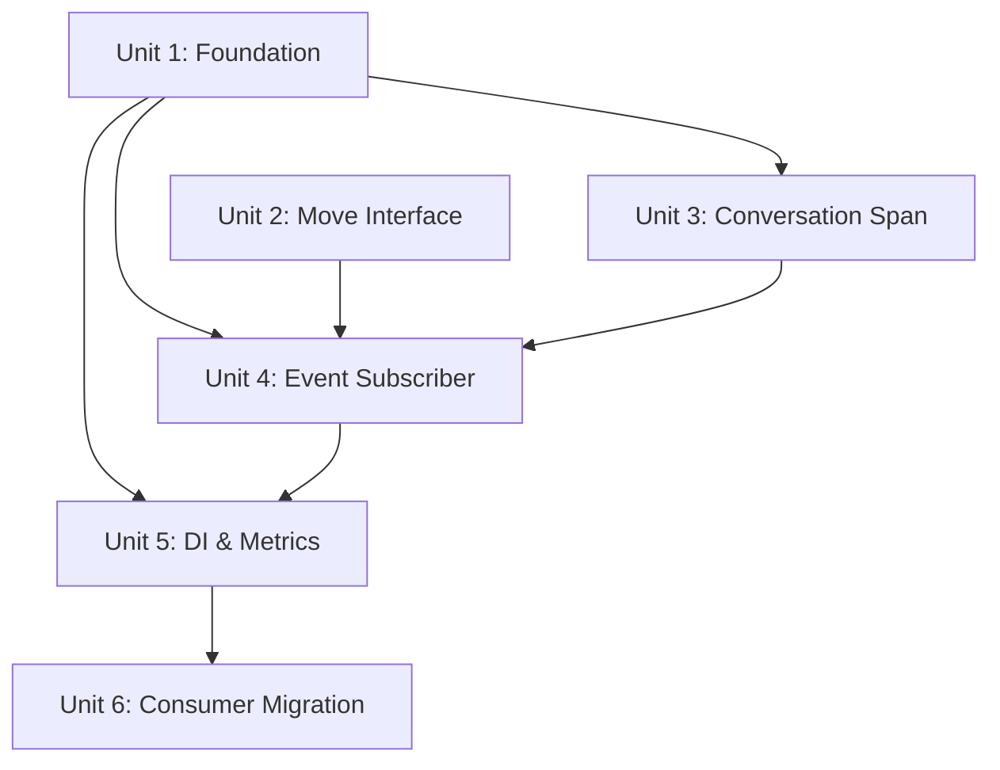

# refactor: Telemetry Span Hierarchy Overhaul

## Overview

Rewrite the `CopilotSdk.OpenTelemetry` library to produce correct, hierarchical OpenTelemetry spans that render properly in Azure Application Insights and Azure Foundry. Today the library emits flat, mislabeled spans with orphaned tool calls and missing agent spans. After this work, a conversation trace will show the correct `conversation → chat → invoke_agent → execute_tool` hierarchy with full GenAI OTel spec attributes.

## Problem Frame

The library produces five classes of telemetry defects (see origin: `docs/brainstorms/2026-04-24-telemetry-span-hierarchy-requirements.md`):

1. Root and turn spans both named `chat` with `ActivityKind.Server` — identical rendering in App Insights
2. Tool spans orphaned as root-level spans due to stale `Activity.Current` capture bug
3. No agent/sub-agent spans despite SDK firing the events
4. Tool spans lack useful attributes (no tool name, MCP server, external dependency correlation)
5. No `conversation` span type — Azure Foundry's special rendering never activates

## Requirements Trace

All 25 requirements (R1–R25) from the origin document are addressed. Key groupings:

- **Span naming/kind**: R1–R4, R9, R14
- **Hierarchy/parenting**: R5–R8
- **Attributes**: R10–R13
- **Token usage**: R15–R16
- **Sensitive data**: R17–R18
- **Library self-containment**: R19–R21
- **Event coverage**: R22–R25

## Scope Boundaries

- **In scope**: All changes to `lib/CopilotSdk.OpenTelemetry/`, moving `ISessionEventSubscriber` into the library, removing bridge class from `services/ChatBot/Diagnostics/`, OTel Metrics for token usage
- **Out of scope**: KQL dashboard migration, custom AI evaluator integration, cost/billing metrics, prompt caching telemetry, changes to the Copilot SDK itself
- **Deployment risk**: Turns moving from `requests` to `dependencies` table will silently break any existing KQL alerts on deploy day (see origin: Key Decisions)

## Context & Research

### Relevant Code and Patterns

| File | Role |
|------|------|
| `lib/CopilotSdk.OpenTelemetry/CopilotSdkOpenTelemetry.cs` | Constants: ActivitySource, attribute names, operation names |
| `lib/CopilotSdk.OpenTelemetry/ConversationTracer.cs` | Creates root + turn spans. Root is zero-duration-and-dispose (the bug). Turn uses wrong kind/name |
| `lib/CopilotSdk.OpenTelemetry/CopilotSessionTelemetry.cs` | Rx subscriber for SDK events → spans. Captures `Activity.Current` once at subscribe time (the stale parent bug). Only handles 4 of 12+ event types |
| `lib/CopilotSdk.OpenTelemetry/ConversationTraceContext.cs` | Record persisting W3C trace context (TraceId, SpanId, TraceFlags) |
| `lib/CopilotSdk.OpenTelemetry/ServiceCollectionExtensions.cs` | DI registration — TryAddSingleton for store + tracer, AddSource on TracerProviderBuilder |
| `gpt/src/BC3Technologies.DiscordGpt.Copilot/SessionDiagnosticsLogger.cs` | Proves all SDK events are available with their data properties |
| `services/ChatBot/Diagnostics/CopilotTelemetrySessionSubscriber.cs` | Bridge class to remove |
| `services/ChatBot/MessageHandler.cs` | Opens turn scopes via `ConversationTracer.BeginTurnAsync()` |

### Reference Patterns (Semantic Kernel)

- **Span hierarchy**: Uses .NET's implicit `Activity.Current` stack — `using var activity = ...` automatically sets parent/child. No explicit span stack needed.
- **Long-lived spans**: Activity kept alive via `using` block scope. Duration captured automatically from start to `Dispose()`.
- **Metrics**: `Meter` + `Histogram<double>` with `TagList`. No custom bucket boundaries — uses defaults. Registered via `AddMeter("Prefix*")` wildcard.
- **Sensitive data**: Two-tier AppContext switch pattern. We'll use `IOptions<T>` instead per DI-everywhere principle.

### Institutional Learnings

- The `gpt` layer's `CopilotSession` fires events via Rx `Observable`. The harness supports `IEnumerable<ISessionEventSubscriber>` — a built-in telemetry subscriber composes naturally alongside `SessionDiagnosticsLogger`.
- The library already references `GitHub.Copilot.SDK` NuGet — no circular dependency when moving the interface in.
- `ConversationTraceContext` and both store implementations (in-memory + Azure Table) only persist `TraceId/SpanId/TraceFlags`. Long-lived root span will need `StartTimestamp` added to the record + store schema.

## Key Technical Decisions

- **Activity.Current implicit stack for hierarchy** (resolves origin Q on R6): No explicit span stack. The `ConversationTracer` keeps the conversation Activity alive via `using` block. Turn, agent, and tool Activities are created as children via `Activity.Current` propagation. The event subscriber tracks `_currentAgentActivity` to parent tools correctly under agents. (Rationale: this is the standard .NET OTel pattern, validated by Semantic Kernel reference)

- **Per-invocation conversation span with persisted trace context** (resolves origin Q on R1): Each Azure Function invocation creates a `conversation` Activity that stays alive for the invocation duration (not zero-duration-dispose). The trace context is persisted so subsequent invocations share the same TraceId. The conversation span from the first invocation has real duration; subsequent turns are parented via `isRemote: true` reconstituted context. `ConversationTraceContext` gains a `StartTimestamp` field.

- **IOptions<T> for sensitive data control** (R17–R18): `CopilotSdkOpenTelemetryOptions` class with `RecordSensitiveData` bool, registered via standard options pattern. Preferred over AppContext switches per DI-everywhere principle.

- **Custom `mcp.server.name` attribute** (resolves origin Q on R12): Neither the GenAI OTel spec nor Azure Foundry define an MCP server attribute. Use `mcp.server.name` following OTel naming conventions (`{protocol}.{concept}.{attribute}`).

- **SubagentSelectedEvent → attributes on agent span** (resolves origin Q on R3/R22): Buffer `SubagentSelectedEvent` data (tools list) and apply as attributes when `SubagentStartedEvent` creates the `invoke_agent` span. No separate span.

- **Move `ISessionEventSubscriber` directly into library** (resolves origin Q on R19): Accept that `gpt` layer gains a dependency on the library. This is acceptable because: the interface is telemetry-specific, the library is already a required dependency for any instrumented consumer, and a separate abstractions package would be YAGNI.

- **Default histogram boundaries for token metrics** (resolves origin Q on R16): Use .NET Meter defaults per Semantic Kernel reference. No custom boundaries needed.

## Open Questions

### Resolved During Planning

- **Stale parent fix mechanism**: Use `Activity.Current` implicit stack + `_currentAgentActivity` field on subscriber state. No explicit span stack.
- **Conversation span duration**: Per-invocation conversation Activity kept alive via `using`, not zero-duration-dispose.
- **MCP attribute name**: `mcp.server.name` (custom, OTel naming convention).
- **Histogram boundaries**: Use defaults.
- **Interface move strategy**: Direct move into library, accept gpt → library dependency.
- **SubagentSelectedEvent**: Buffer and apply as attributes on agent span.

### Deferred to Implementation
- **HTTP auto-parenting verification**: Confirm that tool Activities being `Activity.Current` during MCP/HTTP calls is sufficient for dependency auto-parenting. May need explicit `Activity.Current` threading if Rx event dispatch crosses async contexts.
- **Rx async context behavior**: Verify that `Observable.Subscribe` callbacks run in the same async context as the event source, so `Activity.Current` is meaningful. If not, the subscriber may need to explicitly set `Activity.Current` from stored state before creating child Activities.

## High-Level Technical Design

> *This illustrates the intended approach and is directional guidance for review, not implementation specification. The implementing agent should treat it as context, not code to reproduce.*

```
┌─────────────────────────────────────────────────────────┐
│ ConversationTracer (rewritten)                          │
│                                                         │
│ CreateOrResumeConversation(key, tags)                   │
│   → Creates/resumes conversation Activity (Internal)    │
│   → Persists trace context + StartTimestamp             │
│   → Returns IDisposable scope (closes Activity)         │
│                                                         │
│ BeginTurn(tags)                                         │
│   → Creates chat Activity (Client) as child of          │
│     conversation Activity.Current                       │
│   → Returns IDisposable scope                           │
├─────────────────────────────────────────────────────────┤
│ TelemetrySessionSubscriber (new, replaces                │
│   CopilotSessionTelemetry; bridge class removed in U6)  │
│                                                         │
│ Implements ISessionEventSubscriber                      │
│                                                         │
│ State per session:                                      │
│   _currentAgentActivity: Activity?                      │
│   _bufferedAgentSelection: SubagentSelectedData?        │
│                                                         │
│ Event → Span mapping:                                   │
│   SubagentSelectedEvent  → buffer selection data        │
│   SubagentStartedEvent   → start invoke_agent Activity  │
│                            (apply buffered selection)   │
│   SubagentCompleted/Failed → stop invoke_agent Activity │
│   ToolExecutionStartEvent → start execute_tool Activity │
│     parent = _currentAgentActivity ?? Activity.Current  │
│   ToolExecutionCompleteEvent → stop execute_tool        │
│   AssistantUsageEvent    → add attributes to turn span  │
│                            + record histogram metric    │
│   SkillInvokedEvent      → add event to agent span      │
│   SessionErrorEvent      → set error status on current  │
├─────────────────────────────────────────────────────────┤
│ CopilotSdkOpenTelemetryOptions                          │
│   RecordSensitiveData: bool = false                     │
├─────────────────────────────────────────────────────────┤
│ ServiceCollectionExtensions                             │
│   AddCopilotSdkOpenTelemetry(services, configure?)      │
│     → registers ConversationTracer                      │
│     → registers TelemetrySessionSubscriber              │
│     → registers options                                 │
│   AddCopilotSdkOpenTelemetry(TracerProviderBuilder)     │
│     → adds ActivitySource                               │
│   AddCopilotSdkOpenTelemetry(MeterProviderBuilder)      │
│     → adds Meter                                        │
└─────────────────────────────────────────────────────────┘
```

## Implementation Units



- [x] **Unit 1: Foundation — Constants, Options, Meter Definition**

**Goal:** Establish the attribute constants, operation names, options class, and Meter that all other units depend on.

**Requirements:** R9, R14, R17, R18

**Dependencies:** None

**Files:**
- Modify: `lib/CopilotSdk.OpenTelemetry/CopilotSdkOpenTelemetry.cs`
- Create: `lib/CopilotSdk.OpenTelemetry/CopilotSdkOpenTelemetryOptions.cs`
- Test: `tests/CopilotSdk.OpenTelemetry.Tests/CopilotSdkOpenTelemetryOptionsTests.cs`

**Approach:**
- Add operation name constants: `Conversation = "conversation"`, `InvokeAgent = "invoke_agent"` alongside existing `Chat` and `ExecuteTool`
- Add missing attribute constants to `GenAiAttributes`: `ProviderName` (replacing `System`), `RequestModel`, `ResponseModel`, `ResponseFinishReasons`, `AgentName`, `AgentId`, `ConversationId`, `ToolCallId`, `ContentPrompt`, `ContentCompletion`, `UsageInputTokens`, `UsageOutputTokens`
- Remove/rename `GenAiAttributes.System` → `ProviderName` with the value `gen_ai.provider.name`
- Add custom attribute constant: `McpServerName = "mcp.server.name"`
- Create `CopilotSdkOpenTelemetryOptions` record/class with `RecordSensitiveData` bool defaulting to `false`
- Add static `Meter` field alongside existing `ActivitySource`
- Add `Histogram<long>` for `gen_ai.client.token.usage`

**Patterns to follow:**
- Existing `CopilotSdkOpenTelemetry` static constants pattern
- Standard `IOptions<T>` pattern used throughout the codebase

**Test scenarios:**
- Happy path: `CopilotSdkOpenTelemetryOptions` defaults `RecordSensitiveData` to `false`
- Happy path: All GenAI attribute constants match the OTel GenAI spec string values exactly
- Happy path: Operation constants include `Conversation`, `Chat`, `InvokeAgent`, `ExecuteTool`
- Edge case: `ProviderName` constant value is `gen_ai.provider.name` (not the deprecated `gen_ai.system`)

**Verification:**
- Library compiles with new constants
- Options class is instantiable with default values
- No references to `gen_ai.system` string remain in the library

---

- [x] **Unit 2: Move ISessionEventSubscriber into Library**

**Goal:** Move the `ISessionEventSubscriber` interface from the `gpt` layer into the library so the library can provide its own implementation.

**Requirements:** R19

**Dependencies:** None (can parallel with Unit 1)

**Files:**
- Create: `lib/CopilotSdk.OpenTelemetry/ISessionEventSubscriber.cs` (moved from gpt layer)
- Modify: `gpt/src/BC3Technologies.DiscordGpt.Copilot/BC3Technologies.DiscordGpt.Copilot.csproj` (add ProjectReference to library)
- Modify: `gpt/src/BC3Technologies.DiscordGpt.Copilot/SessionDiagnosticsLogger.cs` (update using/namespace)
- Modify: `gpt/src/BC3Technologies.DiscordGpt.Copilot/CopilotBuilderDiagnosticsExtensions.cs` (update `using` for moved interface)
- Modify: `gpt/src/BC3Technologies.DiscordGpt.Copilot/GitHubCopilotPromptHarness.cs` (update `using` for moved interface)
- Test: `tests/CopilotSdk.OpenTelemetry.Tests/ISessionEventSubscriberTests.cs`

**Approach:**
- Copy the interface definition into the library under its namespace
- Remove the original from the gpt layer
- Add a `ProjectReference` from gpt → library (the library already references `GitHub.Copilot.SDK` NuGet, so no circular dependency)
- Update all `using` statements and namespace references in the gpt layer
- Verify that `SessionDiagnosticsLogger` and any other implementations still compile

**Patterns to follow:**
- Existing interface definitions in the library
- The gpt layer's existing project reference patterns

**Test scenarios:**
- Happy path: Interface is resolvable from the library's namespace
- Integration: `SessionDiagnosticsLogger` in the gpt layer compiles against the moved interface
- Integration: `CopilotTelemetrySessionSubscriber` in ChatBot compiles (it will be removed in Unit 6, but should still compile at this point)

**Verification:**
- Full solution builds without errors
- No duplicate interface definitions remain

---

- [x] **Unit 3: Conversation Span Lifecycle**

**Goal:** Rewrite `ConversationTracer` so the root span is named `conversation` with `ActivityKind.Internal`, has real duration, and correctly parents turn spans.

**Requirements:** R1, R2, R5, R10, R13

**Dependencies:** Unit 1 (constants)

**Files:**
- Modify: `lib/CopilotSdk.OpenTelemetry/IConversationTracer.cs` (update interface: rename methods, add `CreateOrResumeConversation`)
- Modify: `lib/CopilotSdk.OpenTelemetry/ConversationTracer.cs`
- Modify: `lib/CopilotSdk.OpenTelemetry/ConversationTraceContext.cs`
- Modify: `lib/CopilotSdk.OpenTelemetry/InMemoryConversationTraceContextStore.cs`
- Modify: `services/ChatBot/Diagnostics/TableConversationTraceContextStore.cs` (add `StartTimestamp` to `TraceContextEntity`)
- Modify: `services/ChatBot/MessageHandler.cs` (caller — adjust to new API)
- Modify: `tests/FunctionApp.Tests/ChatBot/DiscordGptIntegrationTests.cs` (update `IConversationTracer` mocks)
- Test: `tests/CopilotSdk.OpenTelemetry.Tests/ConversationTracerTests.cs`

**Approach:**
- `CreateAndPersistRoot` → `CreateOrResumeConversation`: Creates a `conversation` Activity with `ActivityKind.Internal`. For first invocation, persists trace context + `StartTimestamp`. For subsequent invocations, reconstitutes as remote parent and creates a new local conversation Activity as child. Returns an `IDisposable` scope that closes the Activity on dispose (giving it real duration).
- `BeginTurnAsync` → `BeginTurn`: Creates a `chat` Activity with `ActivityKind.Client` as a child of the conversation Activity (via `Activity.Current`). Display name set to `chat` initially; model name appended when usage data arrives.
- Add `StartTimestamp` field to `ConversationTraceContext` record
- Update `InMemoryConversationTraceContextStore` to handle the new field
- Add `gen_ai.conversation.id`, `gen_ai.operation.name`, `gen_ai.provider.name` attributes to conversation span
- Add `gen_ai.operation.name`, `gen_ai.provider.name`, `server.address` attributes to turn span. `server.address` is set at turn creation time (static endpoint). `gen_ai.response.finish_reasons` is applied later via `AssistantUsageEvent` (same deferred-attribute pattern as model name)
- Detach from Azure Functions host ambient Activity before creating conversation Activity (preserve existing behavior at `ConversationTracer.cs:55-56`)

**Patterns to follow:**
- Semantic Kernel's `using var activity = ...` pattern for long-lived spans
- Existing `ConversationTracer` pattern for detaching from ambient Activity

**Test scenarios:**
- Happy path: First invocation creates a `conversation` Activity with `ActivityKind.Internal` and operation name `conversation`
- Happy path: First invocation creates a `chat` turn Activity as child of the conversation Activity with `ActivityKind.Client`
- Happy path: Conversation Activity has non-zero duration after scope dispose
- Happy path: Turn Activity has `gen_ai.operation.name = "chat"` and `server.address` attributes
- Happy path: Conversation Activity has `gen_ai.conversation.id` attribute matching the conversation key
- Edge case: Second invocation reconstitutes persisted context and creates turn parented to original conversation
- Edge case: `ConversationTraceContext` round-trips `StartTimestamp` through in-memory store
- Edge case: `TableConversationTraceContextStore` entity persists and retrieves `StartTimestamp`
- Edge case: Existing Azure Table rows without `StartTimestamp` field are handled gracefully (null = first-invocation behavior)
- Integration: `IConversationTracer` mock in integration tests compiles against the updated interface
- Error path: Missing persisted context (first invocation) creates new conversation span without error

**Verification:**
- Exported spans show `conversation` root with `chat` children
- Conversation span has measurable duration (> 0ms)
- Turn spans appear as dependencies (not requests) in App Insights attribute check

---

- [x] **Unit 4: Hierarchy-Aware Event Subscriber**

**Goal:** Replace `CopilotSessionTelemetry` with a new `TelemetrySessionSubscriber` that handles all SDK events, creates correctly-parented agent/tool spans, and applies GenAI spec attributes.

**Requirements:** R3, R4, R6, R7, R8, R11, R12, R15, R22, R23, R24, R25

**Dependencies:** Unit 1 (constants), Unit 2 (interface), Unit 3 (conversation tracer provides turn Activity)

**Files:**
- Create: `lib/CopilotSdk.OpenTelemetry/TelemetrySessionSubscriber.cs`
- Delete: `lib/CopilotSdk.OpenTelemetry/CopilotSessionTelemetry.cs` (replaced)
- Test: `tests/CopilotSdk.OpenTelemetry.Tests/TelemetrySessionSubscriberTests.cs`

**Approach:**
- Implement `ISessionEventSubscriber` directly in the library
- Per-session state: `_currentAgentActivity` (nullable Activity for the active agent span), `_bufferedAgentSelection` (data from `SubagentSelectedEvent`), `_activeToolActivities` (dictionary of ToolCallId → Activity for concurrent tools)
- Event mapping:
  - `SubagentSelectedEvent` → buffer `AgentName`, `Tools` in `_bufferedAgentSelection`
  - `SubagentStartedEvent` → create `invoke_agent {name}` Activity (Internal), apply buffered selection data as attributes, set `_currentAgentActivity`
  - `SubagentCompletedEvent` → stop `_currentAgentActivity`, clear it
  - `SubagentFailedEvent` → set error status on `_currentAgentActivity`, stop it, clear it
  - `ToolExecutionStartEvent` → create `execute_tool {name}` Activity (Internal). Parent: if `_currentAgentActivity` is set, explicitly parent under it; otherwise let `Activity.Current` (the turn) be the parent. Add `gen_ai.tool.name`, `gen_ai.tool.call.id`, `mcp.server.name` (when MCP tool) attributes. Track in `_activeToolActivities`
  - `ToolExecutionCompleteEvent` → look up Activity by ToolCallId, set status (OK or Error), stop it, remove from dictionary
  - `AssistantUsageEvent` → find the turn Activity (via `Activity.Current` or stored reference), add `gen_ai.usage.input_tokens`, `gen_ai.usage.output_tokens`, `gen_ai.request.model`, `gen_ai.response.model`, `gen_ai.response.finish_reasons` attributes. When `RecordSensitiveData` is enabled (via injected `IOptions<CopilotSdkOpenTelemetryOptions>`), also record `gen_ai.content.prompt` and `gen_ai.content.completion` attributes. Update turn display name to `chat {model}`
  - `SkillInvokedEvent` → add OTel event to `_currentAgentActivity` with skill name, plugin name, allowed tools
  - `SessionErrorEvent` → set error status on current Activity
- Key fix for R6: Do NOT capture `Activity.Current` at subscribe time. Each event handler resolves the parent dynamically using `_currentAgentActivity` or `Activity.Current`.

**Patterns to follow:**
- Existing `SessionDiagnosticsLogger.cs` event switch pattern (proves all event data properties available)
- Semantic Kernel's `ModelDiagnostics` attribute-setting patterns

**Test scenarios:**
- Happy path: `SubagentStartedEvent` creates `invoke_agent` span with `gen_ai.agent.name` attribute, parented under turn
- Happy path: `ToolExecutionStartEvent` creates `execute_tool` span with `gen_ai.tool.name` and `gen_ai.tool.call.id`
- Happy path: Tool span within active agent is child of agent span (R7)
- Happy path: Tool span without active agent is child of turn span (R7)
- Happy path: MCP tool span has `mcp.server.name` attribute
- Happy path: `AssistantUsageEvent` adds token count, model, and `finish_reasons` attributes to turn span and updates display name
- Happy path: When `RecordSensitiveData = true`, `AssistantUsageEvent` records `gen_ai.content.prompt` and `gen_ai.content.completion` on turn span
- Edge case: When `RecordSensitiveData = false` (default), prompt/completion content is NOT recorded
- Happy path: `SkillInvokedEvent` adds OTel event to agent span with skill name and plugin name
- Edge case: `SubagentSelectedEvent` data is buffered and applied when `SubagentStartedEvent` fires
- Edge case: Multiple concurrent tool executions tracked independently by ToolCallId
- Edge case: `SubagentFailedEvent` sets error status on agent span
- Error path: `ToolExecutionCompleteEvent` with `Success=false` sets error status on tool span
- Error path: `SessionErrorEvent` sets error status on whatever span is current
- Integration: Tool span created during agent scope nests under agent, not under turn

**Verification:**
- Exported trace shows `conversation → chat → invoke_agent → execute_tool` hierarchy
- No orphaned root-level tool spans
- Agent spans carry name and ID attributes
- Tool spans carry name, call ID, and MCP server attributes when applicable

---

- [x] **Unit 5: DI Registration and Token Metrics**

**Goal:** Wire up all new components via DI and add OTel Metrics histogram for token usage.

**Requirements:** R16, R20

**Dependencies:** Unit 1 (constants/Meter), Unit 4 (subscriber)

**Files:**
- Modify: `lib/CopilotSdk.OpenTelemetry/ServiceCollectionExtensions.cs`
- Test: `tests/CopilotSdk.OpenTelemetry.Tests/ServiceCollectionExtensionsTests.cs`

**Approach:**
- Extend `AddCopilotSdkOpenTelemetry(IServiceCollection)` to:
  - Register `TelemetrySessionSubscriber` as `ISessionEventSubscriber` via `TryAddEnumerable` (composes with `SessionDiagnosticsLogger`)
  - Register `CopilotSdkOpenTelemetryOptions` via options pattern with optional `Action<CopilotSdkOpenTelemetryOptions>` configure delegate
- Add `AddCopilotSdkOpenTelemetry(MeterProviderBuilder)` extension for Meter registration (parallel to existing `TracerProviderBuilder` extension)
- Token metrics: In `TelemetrySessionSubscriber`, when `AssistantUsageEvent` fires, also record to the `gen_ai.client.token.usage` histogram with tags: `gen_ai.operation.name`, `gen_ai.request.model`, `gen_ai.provider.name`

**Patterns to follow:**
- Existing `ServiceCollectionExtensions.AddCopilotSdkOpenTelemetry(TracerProviderBuilder)` pattern
- `TryAddEnumerable` pattern from the harness for composable subscribers
- Semantic Kernel's `Meter` + `TagList` pattern for metrics

**Test scenarios:**
- Happy path: `AddCopilotSdkOpenTelemetry(services)` registers `TelemetrySessionSubscriber` as `ISessionEventSubscriber`
- Happy path: `AddCopilotSdkOpenTelemetry(services, opts => opts.RecordSensitiveData = true)` configures options
- Happy path: `AddCopilotSdkOpenTelemetry(MeterProviderBuilder)` registers the library's Meter
- Happy path: Token usage event records histogram metric with model and operation tags
- Edge case: Multiple calls to registration are idempotent (TryAddEnumerable)
- Integration: Resolving `IEnumerable<ISessionEventSubscriber>` returns both `TelemetrySessionSubscriber` and `SessionDiagnosticsLogger`

**Verification:**
- DI container resolves all telemetry components
- Token usage appears as both span attributes and histogram metric data points
- Metric has correct dimensions (model, operation name, provider)

---

- [x] **Unit 6: Consumer Migration**

**Goal:** Remove the ChatBot bridge class, update service registration, and verify end-to-end.

**Requirements:** R21

**Dependencies:** Unit 5 (DI registration complete)

**Files:**
- Delete: `services/ChatBot/Diagnostics/CopilotTelemetrySessionSubscriber.cs`
- Modify: `services/ChatBot/Program.cs` or DI setup file (remove manual subscriber registration, ensure `AddCopilotSdkOpenTelemetry` is called)
- Modify: `services/ChatBot/ChatBot.csproj` (verify no orphaned references)

**Approach:**
- Remove `CopilotTelemetrySessionSubscriber` class entirely
- Remove its DI registration from the ChatBot service startup
- Ensure `AddCopilotSdkOpenTelemetry(services)` is called in the ChatBot service setup (it now handles subscriber registration internally)
- If the ChatBot had a `MeterProviderBuilder` setup, add `AddCopilotSdkOpenTelemetry(meterBuilder)` call
- Verify the ChatBot still compiles and the DI container resolves correctly

**Patterns to follow:**
- ChatBot's existing DI setup patterns in `Program.cs`

**Test scenarios:**
- Happy path: ChatBot service starts without errors after bridge class removal
- Happy path: Telemetry spans are still emitted (no regression from removing bridge)
- Integration: Full conversation produces the target hierarchy in exported spans

**Test expectation: none** — verification is via build success and manual/integration test of the deployed service. Unit tests for the bridge class itself don't exist and aren't needed for a deletion.

**Verification:**
- Solution builds clean
- ChatBot starts successfully
- No references to `CopilotTelemetrySessionSubscriber` remain in the codebase

## System-Wide Impact

- **Interaction graph:** `ConversationTracer` is called from `MessageHandler.cs`. The new `TelemetrySessionSubscriber` receives events from `CopilotSession` via Rx Observable. `ServiceCollectionExtensions` is called from ChatBot's DI setup. The Azure Table store (`TableConversationTraceContextStore`) will need schema update for `StartTimestamp`.
- **Error propagation:** `SessionErrorEvent` now sets error status on the current span instead of orphaning. `SubagentFailedEvent` marks agent spans with error status. Tool failures propagate via `ToolExecutionCompleteEvent.Success=false`.
- **State lifecycle risks:** `_currentAgentActivity` and `_activeToolActivities` are per-session state on the subscriber. If events arrive out of order (e.g., `SubagentCompletedEvent` without prior `SubagentStartedEvent`), the subscriber must handle gracefully without throwing.
- **API surface parity:** The `ConversationTracer` public API changes (method renames, new parameters). `MessageHandler.cs` and any other callers must be updated.
- **KQL migration:** Turns move from `requests` to `dependencies` table. Existing dashboards and alerts built on `requests | where name == "chat"` will break silently on deploy.
- **Unchanged invariants:** The Rx subscription model for SDK events is unchanged. `SessionDiagnosticsLogger` continues to function independently. The InMemory and Azure Table stores remain the persistence implementations — only their schema adds a field.

## Risks & Dependencies

| Risk | Mitigation |
|------|------------|
| Rx event callbacks may not preserve `Activity.Current` async context | Verify during implementation. If broken, subscriber sets `Activity.Current` explicitly from stored hierarchy state before creating child Activities |
| Azure Table store schema change (adding `StartTimestamp`) breaks existing rows | New field is nullable/optional. Existing rows without it are treated as having no persisted start time (first-invocation behavior) |
| KQL alerts silently break on deploy | Out of scope per origin decision, but document the breaking change in deploy notes |
| MCP attribute rename (`gen_ai.tool.mcp.server_name` → `mcp.server.name`) breaks existing queries | Document in deploy notes alongside the `requests`→`dependencies` table migration |
| `gpt` layer gaining dependency on library creates tighter coupling | Accepted per origin decision — interface is telemetry-specific, library is already a required dependency for instrumented consumers |
| Out-of-order SDK events (e.g., tool complete without tool start) | Subscriber handles missing state gracefully — log warning, don't create orphaned spans |

## Documentation / Operational Notes

- **Deploy note**: After deploying, any KQL queries or alerts referencing `requests | where name == "chat"` must be migrated to `dependencies | where name startswith "chat"`. This is a known, accepted breaking change.
- **Deploy note**: MCP tool attribute changes from `gen_ai.tool.mcp.server_name` to `mcp.server.name`. Any KQL queries filtering on the old attribute name must be updated.
- **Consumer upgrade guide**: Replace manual `CopilotTelemetrySessionSubscriber` registration with `services.AddCopilotSdkOpenTelemetry()`. Add `builder.AddCopilotSdkOpenTelemetry()` to `MeterProviderBuilder` setup if metrics are desired.

## Sources & References

- **Origin document:** [docs/brainstorms/2026-04-24-telemetry-span-hierarchy-requirements.md](docs/brainstorms/2026-04-24-telemetry-span-hierarchy-requirements.md)
- **Reference implementation:** Semantic Kernel OTel patterns (`ModelDiagnostics`, `PlannerInstrumentation`, `ChatCompletionAgent`)
- **GenAI OTel spec:** [gen-ai-spans.md](https://github.com/open-telemetry/semantic-conventions/blob/main/docs/gen-ai/gen-ai-spans.md)
- **Related prior plan:** `docs/plans/2026-04-22-001-feat-copilot-tool-call-sub-spans-plan.md` (earlier attempt at tool sub-spans, superseded by this comprehensive overhaul)
