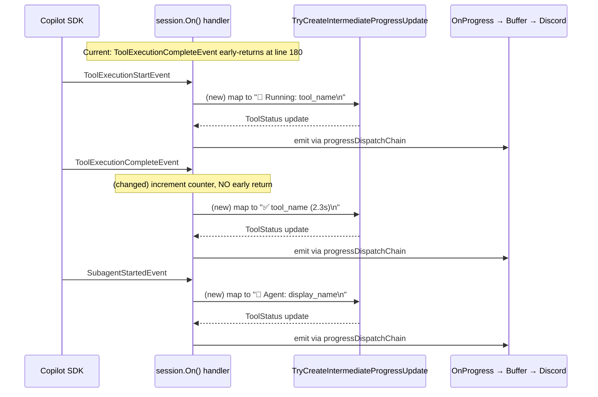
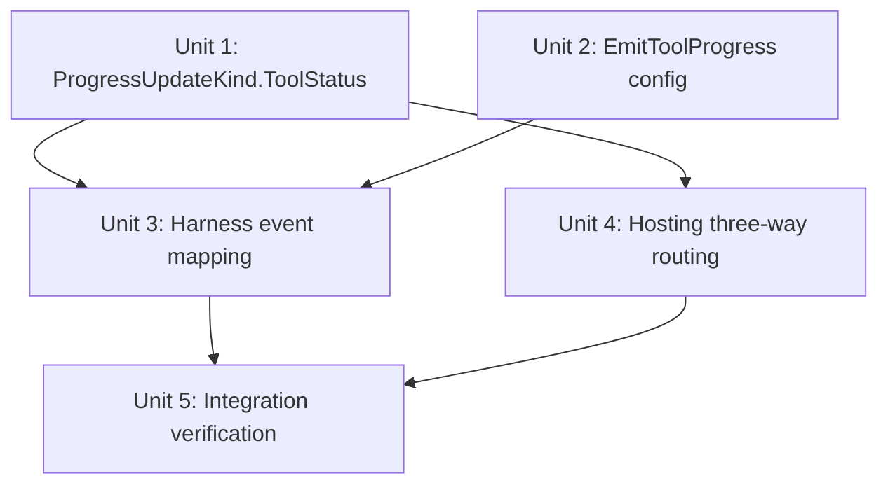

# feat: Tool & Agent Progress Feedback to Discord

## Overview

Surface tool execution and agent lifecycle events as Discord subtext messages during long-running queries. This mirrors the GitHub Copilot CLI's dual feedback channels: reasoning text (thinking) and tool/agent status indicators (pink dot). The existing progress pipeline handles routing — this plan extends event mapping and adds a third buffer kind.

## Problem Frame

Users see nothing for 1–5 minutes during complex queries. The typing indicator says "alive" but not "making progress." The full progress pipeline exists and works for reasoning deltas, but `ToolExecutionStartEvent`, `ToolExecutionCompleteEvent`, `SubagentStartedEvent`, and `SubagentCompletedEvent` are never routed to it despite firing reliably. (see origin: `docs/brainstorms/2026-04-24-tool-agent-progress-feedback-requirements.md`)

## Requirements Trace

- R1. Default `EmitReasoningProgress` to `true`
- R2. Existing reasoning pipeline requires no other changes (verified in Unit 5)
- R3–R6. Map tool start/complete and agent start/complete events to progress updates
- R7, R18. New `ProgressUpdateKind.ToolStatus` for distinct formatting/buffering
- R8. Newline-terminated messages for line-based flush
- R9–R11. `EmitToolProgress` config option, default `true`, bindable from `IConfiguration`
- R12–R13. Extend `TryCreateIntermediateProgressUpdate`; restructure `ToolExecutionCompleteEvent` early-return
- R14–R15. Timestamp tracking with cleanup
- R16–R17. Display name mapping with null fallbacks
- R19–R20. Hosting layer three-way routing with separate ToolStatus buffer

## Scope Boundaries

- No message editing, reaction indicators, or summary footers
- No per-channel verbosity control
- No changes to `ISessionEventSubscriber` or `TelemetrySessionSubscriber`
- No changes to `DiscordAgentProgressUpdate` structure (only new enum value)

## Context & Research

### Relevant Code and Patterns

- **Event subscription**: `GitHubCopilotPromptHarness.RunPromptCoreAsync` lines 178–214 — inline `session.On()` handler
- **Progress translation**: `TryCreateIntermediateProgressUpdate` lines 403–455 — switch-based event-to-progress mapping
- **Hosting progress pipeline**: `DiscordGptEventHandler.SendProgressUpdateAsync` lines 195–236 — buffer routing by kind
- **ProgressState**: Nested class with dual buffers (`PendingNormalBuffer`, `PendingReasoningBuffer`) and dual dedup slots
- **Telemetry subscriber tool handling**: `TelemetrySessionSubscriber.OnToolStart/OnToolComplete` lines 219–297 — reference for event data access and `_activeToolActivities` cleanup pattern
- **DiscordGptOptions**: `EmitReasoningProgress` at line 167 — pattern to follow for `EmitToolProgress`

### Institutional Learnings

- **Span parenting fix** (this session): `Activity.Current` must be restored in try/finally — applicable pattern awareness for concurrent event handling
- **Trinity's ordering**: Flush ordering (Reasoning → Normal) is an existing convention with inline comment in `FlushProgressBufferCoreAsync`

## Key Technical Decisions

- **Extend harness `TryCreateIntermediateProgressUpdate`, not new subscriber**: The `OnProgress` callback lives on `ConversationContext`, accessible only in the harness's inline handler. A new `ISessionEventSubscriber` would need `ConversationContext` threaded through, breaking the singleton registration pattern. (see origin)
- **Separate `ToolStatus` buffer**: Tool status messages have independent dedup needs from reasoning. A shared buffer would cause false dedup suppression between reasoning text and status indicators. Adding a third buffer follows the established dual-buffer pattern.
- **Remove `ToolExecutionCompleteEvent` early-return**: Currently line 180–184 increments counter and returns, bypassing `TryCreateIntermediateProgressUpdate`. The restructuring moves the counter increment to fire unconditionally in the inline handler (`if (@event is ToolExecutionCompleteEvent) Interlocked.Increment(ref toolCallsExecuted);`) **without returning**, then lets the event flow to `TryCreateIntermediateProgressUpdate`. The counter increment must stay **outside** the `TryCreate` call so it fires regardless of `EmitToolProgress` setting. The counter is checked post-loop for "no tools executed" warning — this behavior is preserved.
- **Timestamp tracking via `ToolProgressContext`**: Tool/agent start timestamps and display names need to be accessible from `TryCreateIntermediateProgressUpdate`, which is currently an instance method. Rather than passing method-local dictionaries through parameters, refactor `TryCreateIntermediateProgressUpdate` into a **local function** inside `RunPromptCoreAsync` that captures the timestamp dictionaries. Use `ConcurrentDictionary<string, (long Ticks, string DisplayName)>` for both tools and agents, keyed by `ToolCallId` (not agent name — concurrent same-named agents would collide). Store the resolved display name at start time so it's available at complete time without re-resolution.
- **Elapsed time format**: Fixed seconds with 1 decimal (e.g., "2.3s"). Simple, predictable, sufficient for typical tool durations (sub-second to ~30s). No adaptive minutes formatting needed for initial implementation.
- **Both defaults to `true`**: Reasoning and tool progress are core UX signals. The ChatBot service already sets `EmitReasoningProgress = true` via DI override, so changing the library default is a no-op for the bot. New library consumers get the right behavior out of the box.

## Open Questions

### Resolved During Planning

- **R13 restructuring approach**: Remove the early return on line 180–184. In the inline handler, increment `toolCallsExecuted` for `ToolExecutionCompleteEvent` without returning, then let it fall through to `TryCreateIntermediateProgressUpdate`. The `TryCreate` method handles the event-to-progress mapping.
- **ToolStatus buffer separation**: Separate buffer. Same pattern as Normal/Reasoning. Independent dedup prevents cross-kind false suppression.
- **Elapsed time format**: Fixed "X.Xs" format. Adaptive minutes adds complexity without proportional value.
- **MCP display names**: Use `ToolName` as primary. Prepend `McpServerName/` only when both `McpServerName` and `McpToolName` are non-empty — this gives context like "statbotics/get_team_stats" vs bare "get_team_stats".

### Deferred to Implementation

- **Exact MCP field values**: What `McpServerName`/`McpToolName` resolve to for the bot's configured tools needs runtime verification. The display name logic handles both cases (with and without MCP fields).
- **Subagent event availability**: `SubagentStartedEvent`/`SubagentCompletedEvent` are wired in telemetry subscriber but may not fire for all agent types. The progress handler gracefully no-ops if events don't arrive.

## High-Level Technical Design

> *This illustrates the intended approach and is directional guidance for review, not implementation specification. The implementing agent should treat it as context, not code to reproduce.*

## Implementation Units

- [ ] **Unit 1: Add `ProgressUpdateKind.ToolStatus` enum value**

**Goal:** Extend the progress update kind enum with a third value for tool/agent status messages.

**Requirements:** R7, R18

**Dependencies:** None

**Files:**
- Modify: `gpt/src/BC3Technologies.DiscordGpt.Core/ProgressUpdateKind.cs`

**Approach:**
- Add `ToolStatus = 2` to the enum with XML doc describing it as tool/agent lifecycle status, rendered as Discord subtext

**Patterns to follow:**
- Existing `Reasoning = 1` entry with XML doc comment

**Test expectation:** none — pure enum extension, no behavioral change until consumers use it

**Verification:**
- Solution compiles with no warnings

---

- [ ] **Unit 2: Add `EmitToolProgress` option and default `EmitReasoningProgress` to `true`**

**Goal:** Add the config toggle for tool progress and change reasoning default.

**Requirements:** R1, R9, R10, R11

**Dependencies:** None

**Files:**
- Modify: `gpt/src/BC3Technologies.DiscordGpt.Copilot/DiscorgGptOptions.cs`
- Modify: `services/ChatBot/DependencyInjectionExtensions.cs`
- Test: `gpt/tests/BC3Technologies.DiscordGpt.Copilot.Tests/DiscordGptOptionsTests.cs` (create if needed)

**Approach:**
- Add `EmitToolProgress` property to `DiscordGptOptions` with `= true` default, following `EmitReasoningProgress` pattern
- Change `EmitReasoningProgress` default from `false` to `= true`
- Remove the now-redundant `options.EmitReasoningProgress = true;` line from ChatBot's DI config (line 136)
- Both remain bindable from `IConfiguration` — no special binding code needed since they're simple bool properties

**Patterns to follow:**
- `EmitReasoningProgress` declaration at line 167 of `DiscorgGptOptions.cs`
- ChatBot DI config at `services/ChatBot/DependencyInjectionExtensions.cs` line 133–136

**Test scenarios:**
- Happy path: `EmitToolProgress` defaults to `true` on a fresh `DiscordGptOptions` instance
- Happy path: `EmitReasoningProgress` defaults to `true` on a fresh `DiscordGptOptions` instance
- Happy path: `EmitToolProgress` can be set to `false` and retains the value
- **Update existing test**: `DiscordGptOptionsTests.EmitReasoningProgress_DefaultsToFalse` must be renamed and updated to assert `true` (guaranteed test failure otherwise)

**Verification:**
- Solution compiles; option defaults verified by test

---

- [ ] **Unit 3: Extend harness to map tool/agent events to progress updates**

**Goal:** Wire `ToolExecutionStartEvent`, `ToolExecutionCompleteEvent`, `SubagentStartedEvent`, and `SubagentCompletedEvent` through `TryCreateIntermediateProgressUpdate` with elapsed-time tracking and display name resolution.

**Requirements:** R3, R4, R5, R6, R8, R12, R13, R14, R15, R16, R17

**Dependencies:** Unit 1 (ToolStatus kind), Unit 2 (EmitToolProgress option)

**Files:**
- Modify: `gpt/src/BC3Technologies.DiscordGpt.Copilot/GitHubCopilotPromptHarness.cs`
- Test: `gpt/tests/BC3Technologies.DiscordGpt.Copilot.Tests/GitHubCopilotPromptHarnessProgressTests.cs` (create)

**Approach:**

*Inline handler restructuring (lines 178–214):*
- Remove the `ToolExecutionCompleteEvent` early-return block (lines 180–184)
- Add: `if (@event is ToolExecutionCompleteEvent) { Interlocked.Increment(ref toolCallsExecuted); }` — increment happens unconditionally **outside** `TryCreate`, then execution continues to `TryCreateIntermediateProgressUpdate`. This ensures the counter fires even when `EmitToolProgress=false`.
- `ToolExecutionStartEvent` falls through to `TryCreate` naturally (it was already reaching the default case and returning false)

*Timestamp tracking:*
- Refactor `TryCreateIntermediateProgressUpdate` into a **local function** inside `RunPromptCoreAsync` that captures timestamp dictionaries from the enclosing scope
- Use `ConcurrentDictionary<string, (long Ticks, string DisplayName)>` for both tools and agents, keyed by `ToolCallId` (not agent name — concurrent same-named agents would collide)
- Store the resolved display name at start time so complete events don't need to re-resolve
- Both dictionaries are method-local, so cleanup happens naturally when `RunPromptCoreAsync` returns
- When `EmitToolProgress` is `false`, the gate fires **before** recording timestamps — no pointless state mutation

*`TryCreateIntermediateProgressUpdate` extensions:*
- Add cases for `ToolExecutionStartEvent`: gate on `EmitToolProgress` first (return false if disabled, **before** recording timestamp), then record `(Stopwatch.GetTimestamp(), displayName)` in tool dictionary, build display name per R16, emit `"🔧 Running: {displayName}\n"` with `ToolStatus` kind
- Add cases for `ToolExecutionCompleteEvent`: gate on `EmitToolProgress` first, look up and remove entry from tool dictionary (try-remove — may not exist if EmitToolProgress was toggled), compute elapsed from stored ticks, check `data.Success` (bool): emit `"✅ {storedDisplayName} ({elapsed})\n"` when true or `"❌ {storedDisplayName} failed\n"` when false (error detail in `data.Error?.Message` — not surfaced to user), with `ToolStatus` kind. If no stored entry, emit without elapsed time.
- Add cases for `SubagentStartedEvent`: gate on `EmitToolProgress` first, record `(Stopwatch.GetTimestamp(), displayName)` in agent dictionary keyed by `data.ToolCallId` (confirmed available on `SubagentStartedData`), resolve display name per R17 (prefer `data.AgentName`, fallback `"agent"`), emit `"🤖 Agent: {displayName}\n"` with `ToolStatus` kind
- Add cases for `SubagentCompletedEvent`: gate on `EmitToolProgress` first, look up entry by `data.ToolCallId`, compute elapsed, emit `"🤖 {storedDisplayName} completed ({elapsed})\n"` with `ToolStatus` kind
- All cases gated by `if (!_options.Value.EmitToolProgress) return false;`
- Display name helper: `ToolName` primary; prepend `McpServerName/` when both MCP fields present; fallback "unknown tool" for null/empty. Agent: `AgentDisplayName` → `AgentName` → "sub-agent"

*Note:* `TryCreateIntermediateProgressUpdate` is refactored from an instance method to a **local function** inside `RunPromptCoreAsync`. This lets it capture the method-local timestamp dictionaries, `_options`, and the `EmitToolProgress` gate naturally. The counter increment stays in the inline handler, outside `TryCreate`.

**Patterns to follow:**
- `TelemetrySessionSubscriber.OnToolStart` lines 219–272 — event data access, null checks, display name building
- `TelemetrySessionSubscriber._activeToolActivities` — concurrent dictionary for tracking active operations
- Existing `AssistantReasoningDeltaEvent` case in `TryCreateIntermediateProgressUpdate` — gating by options flag

**Test scenarios:**
- Happy path: `ToolExecutionStartEvent` with `ToolName="search"` produces `"🔧 Running: search\n"` update with `ToolStatus` kind when `EmitToolProgress=true`
- Happy path: `ToolExecutionCompleteEvent` with success produces `"✅ search (X.Xs)\n"` with elapsed time and `ToolStatus` kind
- Happy path: `ToolExecutionCompleteEvent` with failure produces `"❌ search failed\n"` with `ToolStatus` kind
- Happy path: `SubagentStartedEvent` with `AgentDisplayName="Reasoning Agent"` produces `"🤖 Agent: Reasoning Agent\n"` with `ToolStatus` kind
- Happy path: `SubagentCompletedEvent` produces `"🤖 Reasoning Agent completed (X.Xs)\n"` with `ToolStatus` kind
- Edge case: `EmitToolProgress=false` — tool/agent events return `false` from `TryCreate` (no progress emitted)
- Edge case: `ToolName` is null/empty — uses "unknown tool" fallback
- Edge case: `AgentDisplayName` empty, `AgentName` populated — falls back to `AgentName`
- Edge case: Both agent names empty — uses "sub-agent" fallback
- Edge case: `ToolExecutionCompleteEvent` without matching start timestamp — emits progress without elapsed time (no crash)
- Integration: `ToolExecutionCompleteEvent` still increments `toolCallsExecuted` counter (regression test for removed early-return)
- Edge case: MCP fields present — display name uses `McpServerName/McpToolName` format

**Verification:**
- All new tests pass
- Existing harness tests still pass
- `toolCallsExecuted` counter correctly reflected in `DiscordAgentResult`

---

- [ ] **Unit 4: Extend hosting layer for three-way `ToolStatus` routing**

**Goal:** Add `ToolStatus` buffer, dedup slot, and subtext formatting to `DiscordGptEventHandler`.

**Requirements:** R19, R20

**Dependencies:** Unit 1 (ToolStatus kind)

**Files:**
- Modify: `gpt/src/BC3Technologies.DiscordGpt.Hosting/DiscordGptEventHandler.cs`
- Test: `gpt/tests/BC3Technologies.DiscordGpt.Hosting.Tests/DiscordGptEventHandlerProgressTests.cs` (create if needed)

**Approach:**

*ProgressState extension:*
- Add `LastToolStatusMessage` dedup slot
- Add `PendingToolStatusBuffer` StringBuilder

*Three-way routing conversion — 7 branch points:*
1. `SendProgressUpdateAsync` (line 215–224): Convert `if/else` to switch on `update.Kind` routing to three buffers
2. `EmitCompleteProgressLinesAsync` (line 266–268): Convert ternary buffer selection to switch
3. `FlushProgressBufferCoreAsync` (line 276–284): Add `FlushSingleBufferAsync(ToolStatus)` between Reasoning and Normal. Update "Trinity's ordering" comment to include ToolStatus
4. `FlushSingleBufferAsync` (line 292–294): Convert ternary buffer selection to switch
5. `SendProgressLineAsync` (line 326–328): Convert ternary dedup selection to switch
6. `SendProgressLineAsync` (line 336–343): Convert dedup slot update to switch
7. `SendProgressLineAsync` (line 346–348): Convert formatting selection to switch — `ToolStatus` gets the same `-# ` prefix as `Reasoning` via `ApplyReasoningPrefix`

All `switch` expressions/statements should include a `default` or `_` arm throwing `ArgumentOutOfRangeException` to ensure future enum additions fail loudly instead of silently dropping messages.

**Patterns to follow:**
- Existing Reasoning/Normal routing throughout `DiscordGptEventHandler`
- `ApplyReasoningPrefix` helper at line 420

**Test scenarios:**
- Happy path: `ToolStatus` update with `"🔧 Running: search\n"` routes through ToolStatus buffer and emits as `-# 🔧 Running: search`
- Happy path: Flush ordering is Reasoning → ToolStatus → Normal
- Edge case: Consecutive identical `ToolStatus` messages are deduplicated
- Edge case: Same text arriving as `Normal` and `ToolStatus` is NOT deduplicated (independent slots)
- Edge case: `FlushBuffer=true` flushes all three buffers in correct order

**Verification:**
- All new tests pass
- Existing hosting tests still pass

---

- [ ] **Unit 5: Integration verification**

**Goal:** Verify end-to-end behavior: tool events flow from harness through hosting to Discord message emission.

**Requirements:** All (including R2 — verify existing reasoning pipeline is unaffected)

**Dependencies:** Units 1–4

**Files:**
- Test: `gpt/tests/BC3Technologies.DiscordGpt.Hosting.Tests/ProgressIntegrationTests.cs` (create if needed)

**Approach:**
- Integration test that wires a mock `ConversationContext.OnProgress` callback, simulates a sequence of SDK events (tool start → reasoning delta → tool complete → assistant message), and verifies the progress updates arrive in correct order with correct kinds and formatting
- Verify `toolCallsExecuted` count in `DiscordAgentResult` still reflects tool completions

**Patterns to follow:**
- Existing test patterns in `gpt/tests/BC3Technologies.DiscordGpt.Copilot.Tests/` and `gpt/tests/BC3Technologies.DiscordGpt.Hosting.Tests/`

**Test scenarios:**
- Integration: Multi-tool sequence (start A, start B, complete A, complete B) produces correct interleaved progress messages with elapsed times
- Integration: Mixed reasoning + tool status + normal content arrives in correct channel ordering
- Integration: `EmitToolProgress=false` suppresses tool/agent events but reasoning and normal still flow
- Integration: `EmitReasoningProgress=false` suppresses reasoning but tool status still flows
- Regression: Reasoning progress (R2) flows unchanged — same format, same subtext prefix, no double-prefix
- Assertion: All emitted tool/agent messages end with `\n` (R8 newline termination)

**Verification:**
- All integration tests pass
- Full `dotnet test` across both test projects passes with zero failures

## System-Wide Impact

- **Interaction graph:** `GitHubCopilotPromptHarness.TryCreateIntermediateProgressUpdate` → `ConversationContext.OnProgress` → `DiscordGptEventHandler.SendProgressUpdateAsync` → Discord REST API. The new events follow the exact same path as existing reasoning/delta events.
- **Error propagation:** If a tool/agent event has null/empty data, the harness returns `false` from `TryCreate` and no progress is emitted. No exceptions propagate.
- **State lifecycle risks:** Timestamp dictionaries are method-scoped locals — they cannot leak across sessions. If a tool starts but never completes (timeout), the dictionary entry is abandoned when the method returns.
- **API surface parity:** `DiscordAgentProgressUpdate` and `ProgressUpdateKind` are consumed by both the Copilot harness and the Hosting layer. Both must handle the new `ToolStatus` value.
- **Unchanged invariants:** `ISessionEventSubscriber` interface, `TelemetrySessionSubscriber`, and `SessionDiagnosticsLogger` are not modified. The `DiscordAgentResult` record structure is unchanged — `ToolCallsExecuted` continues to be populated from the counter.

## Risks & Dependencies

| Risk | Mitigation |
|------|------------|
| Discord rate limits during burst tool execution (10+ parallel tools) | Discord.Net handles HTTP 429 with automatic retry/backoff. Worst case is delayed delivery, not failures. Coalescing is a future optimization if users report noise. |
| `EmitReasoningProgress` default change affects other library consumers | ChatBot already sets `true`. Any other consumer not overriding would start seeing reasoning — this is intentional per origin doc. |
| `ToolExecutionCompleteEvent` counter regression from removing early-return | Explicit regression test in Unit 3 verifies counter still increments correctly. |
| Three-way routing conversion introduces bugs in existing Normal/Reasoning flow | Unit 4 tests cover existing routing behavior alongside new ToolStatus routing. |

## Sources & References

- **Origin document:** [docs/brainstorms/2026-04-24-tool-agent-progress-feedback-requirements.md](docs/brainstorms/2026-04-24-tool-agent-progress-feedback-requirements.md)
- Related code: `gpt/src/BC3Technologies.DiscordGpt.Copilot/GitHubCopilotPromptHarness.cs` (harness event handler)
- Related code: `gpt/src/BC3Technologies.DiscordGpt.Hosting/DiscordGptEventHandler.cs` (hosting progress pipeline)
- Related code: `lib/CopilotSdk.OpenTelemetry/TelemetrySessionSubscriber.cs` (event data reference)
- Related solution: `docs/solutions/logic-errors/opentelemetry-incorrect-span-hierarchy-2026-04-24.md` (concurrent event handling patterns)
