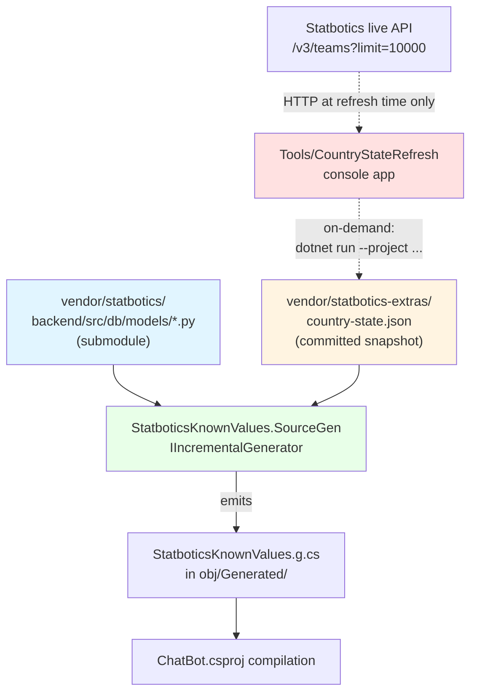
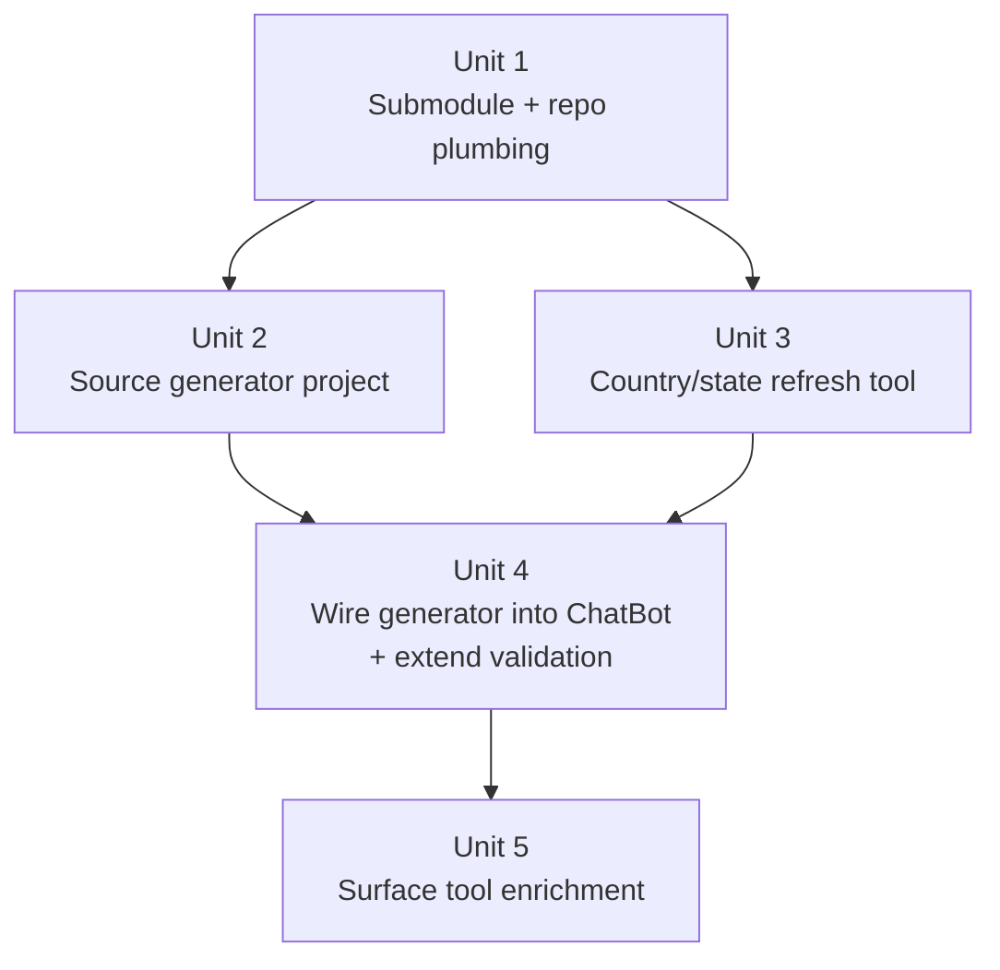

# feat: Statbotics Known-Value Validation from OSS Source

## Overview

Extend the Statbotics tool's pre-call validation (shipped 2026-04-26) to cover the three "vague" query parameters the OpenAPI spec doesn't constrain — `metric`, `country`, `state`. Source the legal value sets from Statbotics' own OSS repo (`avgupta456/statbotics`) brought in as a sparse-shallow git submodule, parsed at build time by a Roslyn `IIncrementalGenerator` that emits a static C# dictionary. Reuses the existing 400 envelope shape; adds proactive teaching of legal metric columns to `statbotics_api_surface` discovery output.

## Problem Frame

Per origin: the model recovers from enum/numeric/range violations cleanly (prior PR), but still fumbles `metric=` on `/v3/team_events` and 6 other list endpoints. The OpenAPI description is "any column in the table is valid" — true at the upstream ORM layer but not derivable from the response shape (Statbotics' `to_dict()` restructures heavily, e.g., the model is sorted by `epa` but the response shows `epa.total_points.mean`). The legal `metric` set is mechanically derivable from `backend/src/db/models/*.py` ORM declarations; `country`/`state` are snapshot-able from the live `/v3/teams` endpoint.

## Requirements Trace

(Origin requirements R1-R22; success criteria S1-S3.)

- **R1-R3** (Submodule + no runtime fallback) → Unit 1
- **R4-R8** (Source generator + diagnostics + endpoint mapping) → Unit 2
- **R9-R11** (Country/state refresh tool + JSON snapshot) → Unit 3
- **R12-R15, R17, R18** (Validation behavior + new EventId 37 + edge cases) → Unit 4
- **R16** (`statbotics_api_surface` enrichment with `legalMetricColumns`) → Unit 5
- **R19** (Generator unit tests with hermetic .py fixtures) → Unit 2
- **R20** (StatboticsTool integration tests) → Unit 4 + Unit 5
- **R21-R22** (CI workflow + README submodule docs) → Unit 1

Success criteria (origin):
- **S1** Model makes valid `/v3/team_events?metric=epa` calls without first guessing invalid names — verified via Discord trace observation post-deploy
- **S2** Stale-submodule scenario visible as repeated EventId 35 firings; resolves with `git submodule update --remote vendor/statbotics && git commit`
- **S3** Build is offline-deterministic — fresh clone + `--recurse-submodules` + `dotnet build` produces same `.g.cs` on any machine without network

## Scope Boundaries

- Per origin: `event=` and `match=` keys are NOT validated (cardinality too high).
- No runtime GitHub fallback — explicit forcing-function design.
- No auto-refresh of country/state snapshot on a schedule — manual refresh only.
- The source generator is internal to this repo; not packaged as a NuGet analyzer.
- Comparisons are case-sensitive ordinal, mirroring 2026-04-26 enum validation.

## Context & Research

### Relevant Code and Patterns

- **`services/ChatBot/Tools/StatboticsTool.cs`** — current host. The new validation slots into the existing `TryBuildQueryValidationError` (lines 128-242) right where the per-parameter loop lives, after the unknown-parameter check at line 172 and the enum check at lines 174-185. Each new validator (metric/country/state) runs before falling through to the existing numeric type/range check.
- **`services/ChatBot/Tools/StatboticsTool.cs:46-77`** — `DescribeApiSurfaceAsync` builds the surface projection. Unit 5 enriches the projection by adding a `legalMetricColumns` field per endpoint (sourced from `StatboticsKnownValues.MetricColumns`).
- **`services/ChatBot/Tools/StatboticsTool.cs:91-103`** — canonical 400 envelope shape: `{ apiRequest, statusCode, ok, error, guidance, suggestions? }`. New violations follow the same shape, adding `violations[]` and per-parameter `legalMetricColumns` / `legalCountries` / `legalStates` arrays.
- **`services/ChatBot/Log.cs`** — existing source-generated logging pattern. EventIds 35/36 already exist for the prior validation work; Unit 4 adds EventId 37 (`StatboticsValidationSkipped`).
- **`tests/FunctionApp.Tests/HttpGetToolBaseTests.cs`** — existing test patterns for `StatboticsTool` (uses `StubHttpMessageHandler`, asserts on JSON envelope shape via `JsonDocument`). Unit 4 extends this file with new metric/country/state scenarios; Unit 5 adds surface-tool assertions.
- **`.gitmodules`** — existing `gpt` submodule entry as a template:
  ```
  [submodule "gpt"]
  path = gpt
  url = https://git.bc3.tech/bc3tech/discord-gpt.git
  ```
  New entry follows the same shape; no sparse/shallow config in `.gitmodules` (the brainstorm chose plain shallow per `git clone --depth 1` semantics handled at clone time, not in `.gitmodules`).
- **`.github/workflows/build.yml`** — two `actions/checkout@v4` steps (lines 17 and 32) need `with: { submodules: recursive }`.
- **`FRCDiscordBot.slnx`** — solution folder structure: `/APIs/`, `/Libraries/`, `/Tests/`, `/Tools/`, `/_Solution Items/`. The new analyzer + refresh tool can co-locate under a new `/Build/` folder, or under `/APIs/` next to `Statbotics.csproj`. Plan: new `/Build/` folder for clarity (build-time codegen ≠ APIs).

### Institutional Learnings

- **`docs/solutions/integration-issues/statbotics-openapi-enum-must-be-surfaced-to-agent-2026-04-26.md`** — the prior validation work that this plan extends. Same envelope shape, same `s_statboticsApiSurface` static, same overall pattern.
- The 2026-04-26 PR (`fix(chatbot): validate Statbotics queries and rewrite opaque 500s`) ships EventIds 35 and 36, both referenced by this plan.

### External References

- Microsoft Learn: [Source Generators Cookbook](https://github.com/dotnet/roslyn/blob/main/docs/features/source-generators.cookbook.md) — canonical `IIncrementalGenerator` + `AdditionalFiles` pattern.
- Microsoft Learn: [Incremental generators](https://github.com/dotnet/roslyn/blob/main/docs/features/incremental-generators.md) — pipeline composition, `RegisterSourceOutput`, `Diagnostic` reporting from generators.

## Key Technical Decisions

- **Use the OSS submodule as ground truth, not response inference**: ORM column names are the legal `metric` set; response keys (e.g., `epa.total_points.mean`) are a restructured projection that would teach the model the wrong vocabulary. *(Origin Key Decisions, see origin: docs/brainstorms/2026-04-27-statbotics-known-values-from-oss-source-requirements.md)*
- **Plain shallow submodule, no sparse-checkout**: ~10 MB clone is acceptable; sparse adds setup steps `.gitmodules` can't natively express. Matches existing `gpt` pattern. *(Origin Key Decisions)*
- **Roslyn `IIncrementalGenerator` over console-app + MSBuild target**: Inputs are local on disk after submodule init, so the source-generator path eliminates a console project + `<Exec>` invocation, gives IDE-time IntelliSense after submodule bumps, and surfaces parser regressions as build errors with diagnostic IDs. *(Origin Key Decisions)*
- **Hardcoded endpoint→ORM mapping table inside the generator (7 entries)**: Adding a new Statbotics list endpoint should be deliberate; a build-time hard-fail when someone forgets to update the mapping is preferable to silent gaps. *(Origin Key Decisions)*
- **Two projects, one folder** (`StatboticsKnownValues.SourceGen.csproj` analyzer + sibling `Tools/CountryStateRefresh.csproj` console): different runtimes (analyzer = `netstandard2.0`; refresh = `net10.0`), different invocation patterns (every build vs on-demand). *(Origin Key Decisions)*
- **No runtime GitHub fallback**: stale submodule = forcing function for human review. A self-healing runtime would hide the very signal that prompts the maintainer to bump the submodule. *(Origin Key Decisions)*
- **Diagnostic IDs `STATBOT001` / `STATBOT002`**: hard-fail on zero-column model file or missing country/state JSON. No prior diagnostic-ID registry in the repo, so define them in the generator's `DiagnosticDescriptor` static fields and document the prefix as Statbotics-specific in the generator's README.
- **Solution folder placement**: create new `/Build/` folder in `FRCDiscordBot.slnx` for the analyzer + refresh tool. Distinct from `/Tools/` (which is for runtime tools like `DataDumper`) and `/APIs/` (which is for shipped service projects).
- **Envelope field naming**: `legalMetricColumns` (per-endpoint), `legalCountries`, `legalStates` — aligned with the existing `legalQueryParameters` field on the prior PR's envelope. Mirrors the established pattern.

## Open Questions

### Resolved During Planning

- **Roslyn `netstandard2.0` ↔ generated code shape**: `System.Collections.Immutable` ships in the BCL since .NET Core 2.0 and is available on `netstandard2.0` (NuGet: [System.Collections.Immutable](https://www.nuget.org/packages/System.Collections.Immutable)). Generated code can use `ImmutableHashSet<string>` and `IReadOnlyDictionary<string, ImmutableHashSet<string>>` without issue. The generator project itself targets `netstandard2.0` (Roslyn analyzer host requirement); generated code lives inside the consuming project (`services/ChatBot/`) which targets `net10.0`, so the generated symbols use the consumer's BCL — no version mismatch.
- **Solution folder placement**: new `/Build/` folder added to `FRCDiscordBot.slnx`. Decision recorded above.
- **Envelope field names**: chosen above (`legalMetricColumns`, `legalCountries`, `legalStates`).
- **Existing `gpt` submodule does NOT use shallow** (verified during recon — no `shallow = true` in `.gitmodules`). Plain `[submodule]` entry is the convention; shallow happens at clone time only. Documented in Unit 1 to set the right contributor expectation.
- **Test framework convention**: all 5 existing `tests/*.csproj` projects use xUnit (`CopilotSdk.OpenTelemetry.Tests`, `FIRST.Test`, `FunctionApp.Tests`, `Statbotics.Test`, `TheBlueAlliance.Test`). The new `tests/StatboticsKnownValues.SourceGen.Tests/` project follows the same convention. Tests do NOT need to share `tests/FunctionApp.Tests/` infrastructure (`StubHttpMessageHandler`, etc.) since the source generator has no HTTP surface.

### Deferred to Implementation

- **Exact regex patterns for parsing `mapped_column(...)`**: choose between line-based regex and Python AST after seeing real `.py` files post-submodule-add (Unit 1). Recommended starting point: regex matching `^\s*(\w+):\s*\w+\s*=\s*mapped_column\s*\(` per ORM class block. Refine after empirical fixture testing.
- **Statbotics live API rate limits**: empirical — test by running `CountryStateRefresh` once during Unit 3. Add throttling/backoff only if 429s observed.
- **Case sensitivity of Statbotics `country`/`state` values**: empirical — confirm via `CountryStateRefresh` output (does it return `USA` or `usa`?). Plan defaults to case-sensitive ordinal per Scope Boundaries; revisit only if observed values are inconsistent.
- **R15 frequency**: in steady-state production R15 (empty `KnownCountries`/`KnownStates`) should never trigger — Unit 3's snapshot guarantees non-empty sets. R15 exists as defensive coverage for: (a) the JSON file accidentally deleted, (b) a fresh clone build before Unit 3 has been run during local dev, or (c) a failed refresh that produced an empty file. STATBOT002 hard-fails on case (a); cases (b) and (c) are implicitly handled by R15. No telemetry alarm is needed; if EventId 37 starts firing repeatedly in production the maintainer investigates manually.

## High-Level Technical Design

> *This illustrates the intended approach and is directional guidance for review, not implementation specification. The implementing agent should treat it as context, not code to reproduce.*

**Build-time data flow:**



**Generated artifact shape** (directional):

```csharp
// services/ChatBot/obj/Generated/StatboticsKnownValues.g.cs
internal static class StatboticsKnownValues
{
    public static readonly IReadOnlyDictionary<string, ImmutableHashSet<string>> MetricColumns =
        new Dictionary<string, ImmutableHashSet<string>>(StringComparer.Ordinal)
        {
            ["/v3/team_events"] = ImmutableHashSet.Create(StringComparer.Ordinal,
                "team", "year", "event", "epa", "epa_mean", "epa_max", "auto_epa",
                "teleop_epa", "endgame_epa", "winrate", "rank", "wins", /* ... */),
            ["/v3/team_years"] = ImmutableHashSet.Create(StringComparer.Ordinal, /* ... */),
            // 5 more entries
        };

    public static readonly ImmutableHashSet<string> KnownCountries =
        ImmutableHashSet.Create(StringComparer.Ordinal, "USA", "Canada", "Mexico", /* ... */);

    public static readonly ImmutableHashSet<string> KnownStates =
        ImmutableHashSet.Create(StringComparer.Ordinal, "NC", "CA", "TX", /* ... */);
}
```

**Validation slot in `StatboticsTool.TryBuildQueryValidationError`** (directional):

```csharp
// existing code at line 161-172 finds the parameter; existing enum check at 174
// NEW slot here, before the numeric check at line 187:
if (StatboticsKnownValues.MetricColumns.TryGetValue(endpoint.Template, out var columns)
    && parameter.Name == "metric"
    && !columns.Contains(pair.Value))
{
    violations.Add(new {
        name = parameter.Name,
        suppliedValue = pair.Value,
        problem = $"'{pair.Value}' is not a valid sort column for '{endpoint.Template}'.",
        legalMetricColumns = columns,
    });
    continue;
}

if (parameter.Name == "country" && !StatboticsKnownValues.KnownCountries.Contains(pair.Value))
{
    // similar shape with legalCountries
}
// likewise for state
```

## Implementation Units



- [ ] **Unit 1: Submodule + repository plumbing**

**Goal:** Establish `vendor/statbotics` as a shallow git submodule, update CI to recurse submodules, document the contributor setup step in the README.

**Requirements:** R1, R2, R3, R21, R22

**Dependencies:** None

**Files:**
- Modify: `.gitmodules` (add `vendor/statbotics` entry)
- Modify: `.github/workflows/build.yml` (add `with: { submodules: recursive }` to both `actions/checkout@v4` steps at lines 17 and 32)
- Modify: `README.md` (add submodule init instruction to Development Environment section)
- Modify: `.gitignore` if needed (verify `vendor/` isn't accidentally ignored)
- New directory at clone time: `vendor/statbotics/` (submodule root; not a tracked file in this repo's tree)

**Approach:**
- Add submodule via `git submodule add --depth 1 https://github.com/avgupta456/statbotics.git vendor/statbotics`. The `--depth 1` only affects the clone command for this contributor; persists in submodule's local config but NOT in `.gitmodules` (per existing `gpt` precedent).
- Pin the submodule SHA to whatever `--depth 1` resolves at add-time. Document the refresh ritual in Unit 1's commit message and in the source generator README (Unit 2).
- README section addition (illustrative):
  > After cloning, run `git submodule update --init --recursive` to populate the `gpt` and `vendor/statbotics` submodules. Optionally set `git config --global submodule.recurse true` to make this automatic on future operations.

**Patterns to follow:**
- Existing `[submodule "gpt"]` entry in `.gitmodules` — use the same minimal shape (path + url only, no shallow/sparse keys).

**Test scenarios:**
- *Test expectation: none — this unit is pure repository plumbing (submodule registration, CI YAML, README prose). Verification is end-to-end: a fresh clone with `--recurse-submodules` populates `vendor/statbotics/backend/src/db/models/*.py`, and a CI build run completes the checkout step without "missing submodule" errors. No automated test is meaningful here.*

**Verification:**
- `git submodule status` shows `vendor/statbotics` registered with the pinned SHA.
- `vendor/statbotics/backend/src/db/models/team_event.py` exists on disk after `git submodule update --init --recursive`.
- A CI run on the branch reaches the build step (no "submodule contents missing" failure).
- `README.md` Development Environment section mentions the submodule init step.

---

- [ ] **Unit 2: Source generator analyzer project + hermetic fixture tests**

**Goal:** Implement the Roslyn `IIncrementalGenerator` that parses `vendor/statbotics/backend/src/db/models/*.py` and `vendor/statbotics-extras/country-state.json` (provided as `<AdditionalFiles>` by the consumer csproj) and emits `StatboticsKnownValues.g.cs`. Generator hard-fails as `STATBOT001` (zero columns extracted from any expected ORM file) or `STATBOT002` (country-state JSON missing).

**Requirements:** R4, R5, R6, R7, R8, R19

**Dependencies:** Unit 1 (submodule must exist for fixture-derived smoke testing; can implement against fixtures alone before submodule is wired into ChatBot)

**Files:**
- Create: `services/Statbotics/SourceGen/StatboticsKnownValues.SourceGen.csproj` (`netstandard2.0`, references `Microsoft.CodeAnalysis.CSharp` analyzer-only)
- Create: `services/Statbotics/SourceGen/StatboticsKnownValuesGenerator.cs` (the `IIncrementalGenerator` implementation)
- Create: `services/Statbotics/SourceGen/PyOrmParser.cs` (extracts ORM class name + `mapped_column` declarations from a Python file's text content)
- Create: `services/Statbotics/SourceGen/EndpointMapping.cs` (the hardcoded 7-entry `ORM class → endpoint template` table)
- Create: `services/Statbotics/SourceGen/Diagnostics.cs` (`DiagnosticDescriptor` static fields for STATBOT001 and STATBOT002)
- Create: `services/Statbotics/SourceGen/README.md` (documents the generator, refresh ritual, diagnostic ID list, and how to debug source generators with `EmitCompilerGeneratedFiles`)
- Create: `tests/StatboticsKnownValues.SourceGen.Tests/StatboticsKnownValues.SourceGen.Tests.csproj`
- Create: `tests/StatboticsKnownValues.SourceGen.Tests/PyOrmParserTests.cs`
- Create: `tests/StatboticsKnownValues.SourceGen.Tests/StatboticsKnownValuesGeneratorTests.cs`
- Create: `tests/StatboticsKnownValues.SourceGen.Tests/Fixtures/team_event.py` (hand-rolled minimal ORM fixture — 1 class, 4-5 column declarations)
- Create: `tests/StatboticsKnownValues.SourceGen.Tests/Fixtures/team_event_multiline.py` (fixture covering multi-line `mapped_column(...)` declarations)
- Create: `tests/StatboticsKnownValues.SourceGen.Tests/Fixtures/team_event_zero_columns.py` (degenerate fixture for STATBOT001 hard-fail test)
- Modify: `FRCDiscordBot.slnx` (add new `/Build/` folder containing `StatboticsKnownValues.SourceGen.csproj`; add the test project under `/Tests/`)

**Approach:**
- Generator pipeline (directional):
  1. `context.AdditionalTextsProvider` → filter to `.py` files whose path contains `backend/src/db/models/`
  2. Separate filter for `country-state.json`
  3. `Combine()` both providers; `Collect()` so the generator sees the full set on each invocation
  4. `RegisterSourceOutput` → for each invocation: parse all ORM files, parse JSON, validate (no zero-column files, JSON exists), emit `StatboticsKnownValues.g.cs` via `context.AddSource(...)`. On validation failure: `context.ReportDiagnostic(...)` with STATBOT001 / STATBOT002.
  5. **Determinism is critical for S3.** Before emitting any collection literal, sort the column lists, country list, and state list using `StringComparer.Ordinal`. Sort `MetricColumns` dictionary entries by endpoint template (key) for stable iteration. This guarantees re-running the generator with unchanged inputs produces a byte-for-byte identical `.g.cs`. Even though `.py` parser output and JSON deserialization happen to be order-preserving today, do not rely on that — sort explicitly at emission time.
- `PyOrmParser` is regex-based per Open Questions decision (start there; can swap for Python AST in a follow-up if regex proves fragile in real-world fixtures). Public API: `IReadOnlyDictionary<string, ImmutableArray<string>> Parse(string fileContent, string fileName)` returning ORM class name → column names. Hand-rolls a small state machine: track current class context (lines starting with `class FooORM(...)`), capture `mapped_column(...)` declarations within the class block.
- `EndpointMapping`: a `static readonly IReadOnlyDictionary<string, string>` mapping ORM class name → endpoint template (`"TeamEventORM" → "/v3/team_events"`, etc., 7 entries total). Documented inline that adding a new endpoint requires updating this file and the generator will hard-fail if a parsed ORM class doesn't appear here.
- `Diagnostics.cs` defines:
  - `STATBOT001` (DiagnosticSeverity.Error): "Statbotics ORM file '{0}' produced zero columns; upstream conventions may have changed"
  - `STATBOT002` (DiagnosticSeverity.Error): "Statbotics country/state snapshot file not found at '{0}'; run `dotnet run --project services/Statbotics/SourceGen/Tools/CountryStateRefresh` to generate it"
- Tests assert against the parser directly (unit-scope) and against the generator's emitted source (integration-scope, using `CSharpGeneratorDriver`).
- Generated output lives in `obj/Generated/StatboticsKnownValues.SourceGen/StatboticsKnownValues.g.cs` (Roslyn convention; the path includes the generator type's full name as a sub-folder). The file is transient and not committed. To inspect it during development, the consumer csproj can temporarily set `<EmitCompilerGeneratedFiles>true</EmitCompilerGeneratedFiles>`. Unit 2's README documents this.

**Execution note:** Test-first for the parser. Write fixture-based tests asserting expected column extraction, then implement the parser to satisfy them.

**Patterns to follow:**
- Microsoft Learn [Source Generators Cookbook](https://github.com/dotnet/roslyn/blob/main/docs/features/source-generators.cookbook.md) — `IIncrementalGenerator` skeleton, `AdditionalFiles` consumption, `DiagnosticDescriptor` reporting.
- Existing test project conventions in `tests/` (xUnit assumed; verify against `tests/Statbotics.Test/Statbotics.Test.csproj` or similar at implementation time).

**Test scenarios:**
- *Happy path*: PyOrmParser given a fixture with `class TeamEventORM(Base, ModelORM):` containing 4 `mapped_column` declarations → returns dict with key `"TeamEventORM"` mapping to those 4 column names.
- *Happy path (multiple classes)*: parser given a file with two ORM classes → returns dict with both class entries.
- *Edge case (multi-line declarations)*: parser given a fixture where `mapped_column(...)` spans 3 lines → still extracts the column name.
- *Edge case (comments)*: parser given a fixture with `# old_column: MS = mapped_column(...)` (commented-out declaration) → does NOT extract the commented column.
- *Edge case (type aliases)*: parser given declarations using `MOF`, `MS`, `MOS` aliases → still extracts the column name (aliases don't matter; only `mapped_column(` substring after `=` matters).
- *Error path (STATBOT001)*: generator given a fixture file that produces zero columns → reports `STATBOT001` diagnostic and does NOT emit `StatboticsKnownValues.g.cs`.
- *Error path (STATBOT002)*: generator given `.py` fixtures but no `country-state.json` → reports `STATBOT002` diagnostic.
- *Integration*: full generator driver run with valid fixtures + a fixture `country-state.json` produces a compilable `.g.cs` whose `MetricColumns["/v3/team_events"]` contains the expected fixture columns.
- *Integration (incrementality)*: re-running the generator with unchanged inputs reports zero new outputs (validates `IIncrementalGenerator` cache behavior).
- *Integration (determinism)*: running the generator twice on the same inputs produces a byte-for-byte identical `.g.cs` (validates the explicit sort step described in Approach). This is the unit test for Success Criterion S3.

**Verification:**
- `dotnet build services/Statbotics/SourceGen/StatboticsKnownValues.SourceGen.csproj` succeeds.
- `dotnet test tests/StatboticsKnownValues.SourceGen.Tests/StatboticsKnownValues.SourceGen.Tests.csproj` — all scenarios pass.
- Generator project appears in `FRCDiscordBot.slnx` under `/Build/`.

---

- [ ] **Unit 3: Country/state refresh tool + initial JSON snapshot**

**Goal:** Build the on-demand console tool that maintainers run to populate `vendor/statbotics-extras/country-state.json` from Statbotics' live `/v3/teams` endpoint. Run it once during this unit to seed the initial snapshot.

**Requirements:** R9, R10, R11

**Dependencies:** Unit 1 (needs `vendor/` directory tree to exist)

**Files:**
- Create: `services/Statbotics/SourceGen/Tools/CountryStateRefresh/CountryStateRefresh.csproj` (`net10.0` console app)
- Create: `services/Statbotics/SourceGen/Tools/CountryStateRefresh/Program.cs`
- Create: `services/Statbotics/SourceGen/Tools/CountryStateRefresh/README.md` (when to run, expected output)
- Create (committed snapshot): `vendor/statbotics-extras/country-state.json`
- Modify: `FRCDiscordBot.slnx` (add the refresh tool under `/Build/` folder)
- Verify: `vendor/statbotics-extras/` is NOT covered by `.gitignore`

**Approach:**
- `Program.cs` (directional): use `HttpClient` to GET `https://api.statbotics.io/v3/teams?limit=1000&offset=N` in a loop, accumulating distinct `country` and `state` values into two `HashSet<string>` instances. Stop when a page returns < 1000 records or N exceeds a safety cap (e.g., 50000).
- Output JSON shape:
  ```json
  {
    "lastRefreshedAt": "2026-04-27T...Z",
    "sourceEndpoint": "https://api.statbotics.io/v3/teams",
    "countries": ["Australia", "Brazil", "Canada", "USA", ...],
    "states": ["AB", "AK", "AL", "BC", "CA", "NC", ...]
  }
  ```
  Sort both arrays alphabetically for deterministic diffs.
- `lastRefreshedAt` field is informational — the source generator doesn't read it (no staleness check in v1 per origin Scope Boundaries).
- Write to a path passed via CLI arg, defaulting to `vendor/statbotics-extras/country-state.json` relative to the repo root.
- Empirical Statbotics API testing happens during this unit — if rate limits are observed, add exponential backoff with jitter; document max safe pagination window in `README.md`.
- Use `System.Text.Json` for both fetch parsing and snapshot emission.
- Ship the initial snapshot as part of this unit's commit.

**Execution note:** Run the tool once against the live API as part of unit verification. Commit the resulting JSON snapshot in the same PR.

**Patterns to follow:**
- Existing console-app project shape: `tools/datadumper/DataDumper.csproj` (referenced from `FRCDiscordBot.slnx` `/Tools/` folder) — small standalone executable, minimal dependencies.

**Test scenarios:**
- *Test expectation: none for the console tool itself.* This is a maintainer-only on-demand utility; the entire codepath is exercised manually during the initial snapshot run, and the output is committed to the repo where its content (not its production process) is what matters at build time. If the tool breaks after a Statbotics API change, the maintainer running it will see an exception immediately. Adding a unit test would require either mocking the live API (which proves nothing about whether the tool works against the real API) or writing an integration test that hits the live API on every test run (which would flake).
- *Snapshot validation*: the committed `country-state.json` file must parse as valid JSON and contain non-empty `countries` and `states` arrays. This is verified implicitly by Unit 2's STATBOT002 diagnostic at build time.

**Verification:**
- `dotnet run --project services/Statbotics/SourceGen/Tools/CountryStateRefresh -- --output vendor/statbotics-extras/country-state.json` exits 0 and produces a JSON file with non-empty `countries` (≥10 entries) and `states` (≥40 entries).
- The committed JSON snapshot includes recognizable values: `"USA"` and `"Canada"` in `countries`; `"NC"` and `"CA"` in `states`.
- Refresh tool project appears in `FRCDiscordBot.slnx` under `/Build/`.

---

- [ ] **Unit 4: Wire generator into ChatBot + extend StatboticsTool validation**

**Goal:** Reference the source generator and additional files from `services/ChatBot/ChatBot.csproj`, extend `TryBuildQueryValidationError` to validate `metric`/`country`/`state` against `StatboticsKnownValues`, add EventId 37 (`StatboticsValidationSkipped`), implement the R14/R15 graceful-skip edge cases, and ship integration tests.

**Requirements:** R12, R13, R14, R15, R17, R18, R20

**Dependencies:** Unit 2 (analyzer must build), Unit 3 (snapshot must exist)

**Files:**
- Modify: `services/ChatBot/ChatBot.csproj` (add analyzer ProjectReference + `<AdditionalFiles>` for both the .py model files and the country-state.json)
- Modify: `services/ChatBot/Tools/StatboticsTool.cs` (extend `TryBuildQueryValidationError` with the new metric/country/state checks; add the R14/R15 graceful-skip with logging)
- Modify: `services/ChatBot/Log.cs` (add EventId 37 `StatboticsValidationSkipped`)
- Modify: `tests/FunctionApp.Tests/HttpGetToolBaseTests.cs` (extend with metric/country/state validation scenarios)

**Approach:**
- `ChatBot.csproj` additions (directional):
  ```xml
  <ItemGroup>
    <ProjectReference Include="..\Statbotics\SourceGen\StatboticsKnownValues.SourceGen.csproj"
                      OutputItemType="Analyzer"
                      ReferenceOutputAssembly="false" />
    <AdditionalFiles Include="..\..\vendor\statbotics\backend\src\db\models\*.py" />
    <AdditionalFiles Include="..\..\vendor\statbotics-extras\country-state.json" />
  </ItemGroup>
  ```
- New validation slot in `TryBuildQueryValidationError` (directional, after line 172 unknown-parameter check, before the existing enum check at line 174):
  ```csharp
  // Source-generated known-value validation for vague-description params
  if (parameter.Name == "metric")
  {
      if (StatboticsKnownValues.MetricColumns.TryGetValue(endpoint.Template, out var columns))
      {
          if (!columns.Contains(pair.Value))
          {
              violations.Add(new {
                  name = parameter.Name, suppliedValue = pair.Value,
                  problem = $"'{pair.Value}' is not a valid sort column for '{endpoint.Template}'. ...",
                  legalMetricColumns = columns,
              });
              continue;
          }
      }
      else
      {
          // R14: endpoint not in mapping — skip metric validation
          logger.StatboticsValidationSkipped("metric", endpoint.Template, "endpoint not in known mapping");
      }
  }
  else if (parameter.Name == "country")
  {
      if (StatboticsKnownValues.KnownCountries.IsEmpty)
      {
          // R15: empty set — skip
          logger.StatboticsValidationSkipped("country", endpoint.Template, "known set is empty");
      }
      else if (!StatboticsKnownValues.KnownCountries.Contains(pair.Value))
      {
          violations.Add(new {
              name = parameter.Name, suppliedValue = pair.Value,
              problem = $"'{pair.Value}' is not a known country in Statbotics' team data.",
              legalCountries = StatboticsKnownValues.KnownCountries,
          });
          continue;
      }
  }
  // similarly for "state"
  ```
- The new check runs BEFORE the existing enum check (line 174) — but since `metric`/`country`/`state` aren't enum-declared in the OpenAPI spec, the existing enum check is a no-op for them anyway. Safe ordering.
- Skip is logged at `Information` level (per R17). Log message should be specific: parameter name, endpoint, reason (e.g., "endpoint not in known mapping" or "known set is empty").
- Log entry shape (mirror existing pattern in `Log.cs`):
  ```csharp
  [LoggerMessage(EventId = 37, Level = LogLevel.Information,
      Message = "Skipped {ParameterName} validation for {Path} ({Reason})")]
  internal static partial void StatboticsValidationSkipped(
      this ILogger logger, string parameterName, string path, string reason);
  ```

**Execution note:** Test-first for the new validation behavior. Write failing integration tests asserting the new envelope shape (with `legalMetricColumns` etc.) before extending `TryBuildQueryValidationError`.

**Patterns to follow:**
- The existing 400 envelope shape at `services/ChatBot/Tools/StatboticsTool.cs:91-103`.
- The existing per-violation object shape at lines 152-225 (name, suppliedValue, problem, optional legal* arrays).
- The existing logging pattern in `services/ChatBot/Log.cs` (source-generated `[LoggerMessage]`).
- Existing test scenarios in `tests/FunctionApp.Tests/HttpGetToolBaseTests.cs` for the prior validation work — same `StubHttpMessageHandler`, same `JsonDocument` assertion pattern.

**Test scenarios:**
- *Happy path (metric)*: `QueryStatboticsAsync("/v3/team_events", "metric=epa")` where `epa` is in `StatboticsKnownValues.MetricColumns["/v3/team_events"]` → no validation error, request reaches HTTP layer (verify via `StubHttpMessageHandler.LastRequestUri`).
- *Error path (metric)*: `QueryStatboticsAsync("/v3/team_events", "metric=bogus")` → 400 envelope, `violations[0].name == "metric"`, `violations[0].legalMetricColumns` array contains expected column names like `"epa"`, `"epa_mean"`.
- *Edge case (R14: endpoint not in mapping)*: simulate by mocking `StatboticsKnownValues.MetricColumns` lookup to miss (or pick an endpoint deliberately omitted from the test fixture's mapping) → no validation error, EventId 37 fires, request proceeds.
- *Happy path (country)*: `QueryStatboticsAsync("/v3/team_events", "country=USA")` → no validation error.
- *Error path (country)*: `QueryStatboticsAsync("/v3/team_events", "country=Atlantis")` → 400 envelope, `violations[0].legalCountries` contains `"USA"`.
- *Edge case (R15: empty country set)*: deliberately empty `KnownCountries` (via test-only override or mocking) → EventId 37 fires, no validation error, request proceeds.
- *Happy path (state)*: `QueryStatboticsAsync("/v3/team_events", "state=NC")` → no validation error.
- *Error path (state)*: `QueryStatboticsAsync("/v3/team_events", "state=ZZ")` → 400 envelope with `legalStates`.
- *Integration (mixed query)*: `QueryStatboticsAsync("/v3/team_events", "metric=bogus&country=Atlantis&year=2026")` → both violations surface in the same envelope; `year=2026` does NOT contribute a violation.
- *Integration (no metric supplied)*: `QueryStatboticsAsync("/v3/team_events", "year=2026")` → no validation error from the new code paths; request proceeds.
- *Regression (existing behavior)*: prior 2026-04-26 scenarios (enum violation on `type=3`, unknown query param, range violation on `year=1899`) still produce the expected 400 envelopes.

**Verification:**
- `dotnet build services/ChatBot/ChatBot.csproj` succeeds and `obj/Generated/StatboticsKnownValues.g.cs` is present (verify by enabling `<EmitCompilerGeneratedFiles>true</EmitCompilerGeneratedFiles>` temporarily during dev, or by inspecting build output).
- `dotnet test tests/FunctionApp.Tests/FunctionApp.Tests.csproj --filter HttpGetToolBaseTests` — all new scenarios pass; existing scenarios still pass.

---

- [ ] **Unit 5: `statbotics_api_surface` enrichment with `legalMetricColumns`**

**Goal:** Augment `DescribeApiSurfaceAsync`'s per-endpoint projection to include a `legalMetricColumns` field for endpoints with known column sets, so the model learns legal values at discovery time, not just on validation failure.

**Requirements:** R16, R20 (surface tool tests)

**Dependencies:** Unit 4 (consumes the same generated `StatboticsKnownValues.MetricColumns`)

**Files:**
- Modify: `services/ChatBot/Tools/StatboticsTool.cs` (extend the projection in `DescribeApiSurfaceAsync` at lines 57-77)
- Modify: `tests/FunctionApp.Tests/HttpGetToolBaseTests.cs` (extend with surface-tool assertions for `legalMetricColumns`)

**Approach:**
- The existing projection at `services/ChatBot/Tools/StatboticsTool.cs:57-77` shapes a list of endpoint objects, each with fields like `Template`, `Description`, `OperationId`, `Tags`, `PathParameters`, `QueryParameters`. **The new `legalMetricColumns` field is added to each endpoint object inline** (not as a top-level field on the response). When `StatboticsKnownValues.MetricColumns.TryGetValue(endpoint.Template, out var cols)` succeeds, the endpoint object gets `legalMetricColumns = cols`. When it fails (e.g., singular endpoints like `/v3/team_event/{team}/{event}` that don't accept `metric`), the field is set to `null` (so it serializes as JSON `null` and the model can tell "no known columns" apart from "empty set of legal columns").
- For endpoints without a known column set, the field is `null` (or omitted). Don't add empty arrays — the model would interpret an empty array as "no legal values exist."
- Keep the existing fields untouched. The new field is purely additive.

**Patterns to follow:**
- Existing projection at `services/ChatBot/Tools/StatboticsTool.cs:57-77`.
- Existing surface-tool test pattern in `tests/FunctionApp.Tests/HttpGetToolBaseTests.cs` ("DescribeStatboticsApiSurfaceShowsEventsYearAsQueryParameter").

**Test scenarios:**
- *Happy path*: `DescribeApiSurfaceAsync("team_event")` → response includes endpoint `/v3/team_events` with `legalMetricColumns` array containing `"epa"`.
- *Edge case (no metric support)*: `DescribeApiSurfaceAsync("team_event")` → singular endpoint `/v3/team_event/{team}/{event}` (if returned) has `legalMetricColumns` as null or absent (NOT an empty array).
- *Integration*: response is valid JSON; `legalMetricColumns` field, when present, is an array of strings that matches the entries in the generated `StatboticsKnownValues.MetricColumns` for the corresponding template.

**Verification:**
- `dotnet test tests/FunctionApp.Tests/FunctionApp.Tests.csproj --filter "DescribeStatboticsApiSurface"` — new scenarios pass.
- Manual smoke: `dotnet run` the bot locally, invoke a Discord query that triggers `statbotics_api_surface`, observe `legalMetricColumns` in the returned envelope.

## System-Wide Impact

- **Interaction graph:** The source generator runs every `dotnet build` of `services/ChatBot/ChatBot.csproj`. It does not affect runtime behavior beyond providing a static class. Validation runs on every `QueryStatboticsAsync` call but is cheap (hash set lookups). Surface-tool enrichment runs on every `DescribeApiSurfaceAsync` call — same hash set lookups, marginal cost.
- **Error propagation:** Build-time errors (`STATBOT001`/`STATBOT002`) are visible as compiler errors in IDE and CI. Validation errors at runtime follow the existing 400-envelope contract; the model receives structured guidance and can self-correct in the same turn (as observed with the prior validation work).
- **State lifecycle risks:** None — `StatboticsKnownValues` is fully static, generated at build time. The committed `country-state.json` snapshot is the only piece of "state" that drifts, and the design accepts that drift per origin Scope Boundaries.
- **API surface parity:** No public API changes. The 400 envelope adds optional fields (`legalMetricColumns`, `legalCountries`, `legalStates`) that consumers (the LLM tool-calling layer) ignore if absent. The surface-tool response adds an optional `legalMetricColumns` field per endpoint.
- **Integration coverage:** Unit 4's mixed-query test (`metric=bogus&country=Atlantis&year=2026`) verifies the new validators integrate correctly with the existing duplicate-key, unknown-name, enum, and numeric-range checks in `TryBuildQueryValidationError`.
- **Unchanged invariants:** The existing 400 envelope's required fields (`apiRequest`, `statusCode`, `ok`, `error`, `guidance`) are unchanged. Existing EventIds 35/36 continue to fire in the same conditions. The 500-rewrite path (shipped 2026-04-26) is unchanged. The existing `s_statboticsApiSurface` static is unchanged. The OpenAPI spec at `app/Apis/statbotics.json` is unchanged (still the source of truth for path templates, enum-declared params, and numeric ranges).

## Risks & Dependencies

| Risk | Mitigation |
|------|------------|
| Statbotics restructures their backend (renames `*ORM`, switches off SQLAlchemy) | STATBOT001 hard-fails the next build that consumes the new submodule SHA. Maintainer reviews and updates `EndpointMapping.cs` / `PyOrmParser.cs`. Acknowledged as forcing-function design per origin. |
| Regex parser misses edge cases in real ORM files | Hermetic fixture tests in Unit 2 cover the patterns we know about; if production ORM files have surprising patterns, STATBOT001 surfaces zero-column files at the next build. Can swap to Python AST parser as a follow-up if regex proves fragile. |
| Country/state snapshot becomes stale (Statbotics adds a new state/country) | Validation rejects valid value → EventId 35 fires repeatedly → maintainer notices and re-runs `CountryStateRefresh`. Acknowledged drift per origin Scope Boundaries; document-review surfaced this as a P1 finding the user explicitly chose not to address in v1. |
| Hardcoded endpoint→ORM mapping silently lags new Statbotics endpoints | R14 graceful-skip with EventId 37 surfaces the gap. Document-review surfaced this; user explicitly chose silent-skip behavior. Could be tightened in a follow-up by adding a STATBOT003 diagnostic that hard-fails when generator finds an `*ORM` class not in the mapping. |
| Statbotics live API rate-limits CountryStateRefresh on first run | Empirical — Unit 3 tests against the live API once. Add backoff if 429s observed. |
| Source generator runs on every IDE keystroke; slow generator slows IDE | Generator is bounded (parses ~10 small .py files, ~50KB JSON). `IIncrementalGenerator` caches by input — re-runs only when AdditionalFiles change. |
| Submodule clone fails in CI | Unit 1 adds `submodules: recursive` to both checkout steps. STATBOT001/STATBOT002 hard-fail the build with clear error messages if the submodule contents are missing. |
| Contributor clones without `--recurse-submodules` | Unit 1 adds README instructions. STATBOT001/STATBOT002 surface a clear actionable error when the build fails. |

## Documentation / Operational Notes

- **README:** Unit 1 adds the submodule init instruction.
- **Generator README:** Unit 2 ships `services/Statbotics/SourceGen/README.md` documenting: when/how to refresh the submodule, the diagnostic ID list, how to debug source generators (`<EmitCompilerGeneratedFiles>true</EmitCompilerGeneratedFiles>`).
- **Refresh tool README:** Unit 3 ships `services/Statbotics/SourceGen/Tools/CountryStateRefresh/README.md` documenting: when to run, what the output looks like, how to commit a refresh.
- **Solutions log:** After deploy, write a `docs/solutions/best-practices/statbotics-known-values-source-gen-2026-04-XX.md` capturing the architectural pattern (submodule + source generator + forcing-function design) for future reference.
- **No production rollout work:** This is a pure code change with no migration, no feature flag, no monitoring dashboard work needed. Behavior change is observable via existing EventId 35 firings (now richer because of `legalMetricColumns` in the envelope).
- **Post-deploy validation:** Watch Discord traces for 7 days. Success criterion S1 met when the model issues `metric=epa` (or any other valid column) without first guessing an invalid name.

## Sources & References

- **Origin document:** `docs/brainstorms/2026-04-27-statbotics-known-values-from-oss-source-requirements.md`
- **Prior PR (foundation):** `fix(chatbot): validate Statbotics queries and rewrite opaque 500s` (2026-04-26)
- **Related code:**
  - `services/ChatBot/Tools/StatboticsTool.cs` — host for new validation
  - `services/ChatBot/Log.cs` — host for new EventId 37
  - `tests/FunctionApp.Tests/HttpGetToolBaseTests.cs` — test extensions
- **External:**
  - https://github.com/avgupta456/statbotics — submodule source
  - https://api.statbotics.io/v3/teams — refresh tool data source
  - [Roslyn Source Generators Cookbook](https://github.com/dotnet/roslyn/blob/main/docs/features/source-generators.cookbook.md)
  - [Roslyn Incremental Generators](https://github.com/dotnet/roslyn/blob/main/docs/features/incremental-generators.md)
