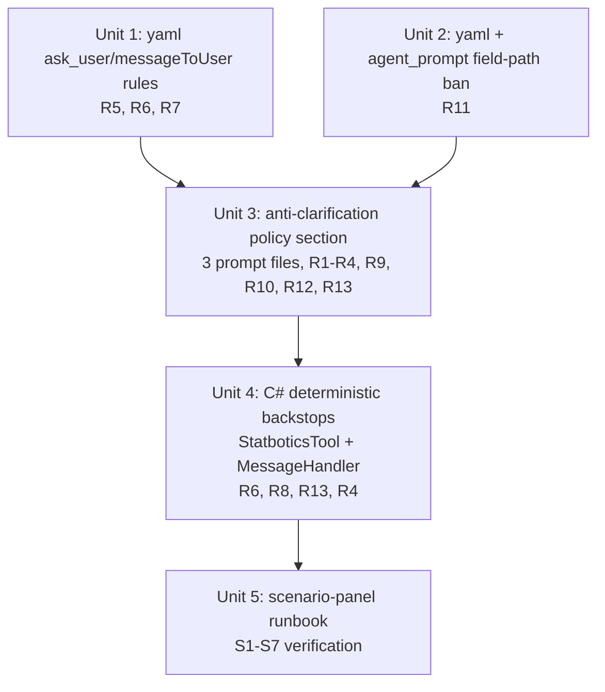

# feat: Agent Anti-Clarification Policy (Statbotics v1)

## Overview

Bear Metal Bot is taking 5+ minutes per turn to ask clarifying questions that its existing tool-discovery framing should have pre-empted, and is emitting "promise + ask" messages (action-language paired with a clarifying question) after data is already in hand. This plan applies thirteen additive prompt-surface rules (R1-R13) across the three lockstep prompt files plus the StatboticsTool guidance string, flipping the agent's default from "ask first" to "act with named assumptions" while reserving `ask_user` for irreducible semantic ambiguity. v1 scope is Statbotics only; TBA and MealSignup extension is v2 (see origin: `docs/brainstorms/2026-04-27-agent-anti-clarification-policy-requirements.md`).

v1 ships small, targeted C# deterministic backstops alongside the prompt rules: payload assembly for the R13 `matrix_match` block (StatboticsTool), a regex check for R6 footer-bearing messages with no preceding `ask_user` (MessageHandler), and an `IsFrcCompetitionWindow` boolean injected into Statbotics tool responses (R4). These code-level checks turn three otherwise probabilistic prompt-rules into deterministic guarantees and resolve a cluster of reviewer findings about verification asymmetry. No JSON schema refactor, no telemetry instrumentation, no broader workflow-orchestrator changes — verification is still a manual scenario-panel runbook.

## Problem Frame

Two observed failures (see origin Problem Frame):

1. **"Top 10 teams in our division at worlds"** (Worlds 2026 = Upcoming) → bot asked *"by Statbotics' projected EPA or by TBA / qualification rankings?"* TBA quals are ❌ in the field-validity matrix that landed in the 2026-04-27 Statbotics work. There was only one valid answer; the bot asked anyway.
2. **User answers "epa"** → bot showed a `query_local` "Fetching Statbotics EPA" progress card, then emitted *"Thanks — I'll pull Statbotics' projected EPA for Newton Division and give you the top 10 by epa.total_points.mean. One quick check: team numbers only or numbers + names?"* — three failures in one message: action-language promise, leaked internal field path (`epa.total_points.mean`), and a blocking cosmetic question after the data was already retrieved.

Latency math: `MaxLocalAgentHandoffs=6`, `MaxWorkflowSteps=24`, `MaxAnswerEvaluationRetries=1`, plus 15s soft / 20s hard workflow timeouts (`services/ChatBot/Configuration/AiOptions.cs:48-70`). A 5-minute turn ≈ 3-4 hosted↔local cycles + evaluator. Each avoided clarification round eliminates one full cycle plus user think-time gap, though the magnitude depends on round mix (clarification rounds are typically short on bot-side compute but long on user think-time, while data-fetch rounds are the reverse) and per-round duration is not yet measured.

## Requirements Trace

All requirement IDs match the origin document. v1 implements R1-R13 against Statbotics only.

- **R1** Use tool-discovery guidance to pre-empt clarifications (single-valid-metric → use it, name assumption inline)
- **R2** Never offer options the agent already knows are invalid for row state
- **R3** Cosmetic preferences default with one-line correction prompt; never blocking `ask_user`
- **R4** Prefer "act with named assumptions" over "ask first" (decision-grade carve-out for Ongoing FRC events)
- **R5** Never combine action-language with a clarifying question in the same user-facing message
- **R6** Ban action-language verbs in `ask_user.messageToUser` (Approach A: prompt rule + worked-example pairs)
- **R7** Bundle clarifications into one focused question + stated-assumption block; verb policy ("Defaulting to:" not "I'll")
- **R8** v1 = Statbotics only (TBA + MealSignup deferred to v2)
- **R9** No `ask_user` after successful `query_local` in same turn (carve-out: genuinely ambiguous data, multi-candidate referent)
- **R10** Default-with-opt-out footer for cosmetic defaults; coordinated with R1 per-defaulted-dimension (R1 inline names semantic defaults; R10 footer names cosmetic defaults; a single answer may carry both when separate dimensions are defaulted, but each defaulted dimension surfaces exactly once)
- **R11** No internal field paths / schema names / endpoint slugs in any user-facing slot (extends existing yaml `:186-196` ban to `ask_user.question`, `ask_user.messageToUser`, `final.answer`, `final.messageToUser`)
- **R12** Question-must-reduce-work test (skip `ask_user` if both answers lead to the same lookup)
- **R13** Stated assumption values (metric name, year, division) must derive from resolved tool-call params or `statbotics_api_surface` guidance labels — not free-form

**Success criteria** (origin Success Criteria — full panel S1-S7 carried verbatim into Unit 5 runbook):

- Headline scenario panel S1-S7 produces expected `next_step` and answer-shape, with each scenario reaching PASS (3/3 paraphrased-input runs satisfy the answer-shape checklist) or WARN (2/3) per the Unit 5 sampling protocol; FAIL (<2/3) blocks release
- Per-rule observable criteria: no action-language paired with clarifying questions; no field paths in user-facing strings; no `ask_user` after `query_local` outside the R9 carve-out (objective triggers enumerated in Unit 3); assumption-derivation match (matrix human-readable name appears verbatim) in 100% of sampled cases
- **Goodhart guard (qualitative, v1):** maintainer reviews last ~50 production Discord turns weekly for re-ask phrasing ("no I meant…", "that's wrong", explicit re-asks within 2 turns). v1 has no telemetry — quantitative "statistically meaningful" measurement is a v2 success criterion gated on telemetry instrumentation. v1 trigger for rollback: any visible clustering of re-asks following a release.

## Scope Boundaries

Carried from origin (verbatim where material):

- **Latency engineering is out of scope.** No model swap, context-window pruning, tool-discovery caching, or concurrency changes.
- **Workflow orchestrator changes are limited to three small, named additions** (per the C# deterministic-backstops decision, ~40 LOC total): payload assembly for the R13 `matrix_match` block in `StatboticsTool.QueryStatboticsAsync`; a regex check for R6 footer-bearing assistant messages in `MessageHandler.cs`; and an `IsFrcCompetitionWindow` boolean computed in `StatboticsTool` and surfaced via `statbotics_api_surface` for R4. The agent loop, `Workflows/` graph nodes, and other `MessageHandler.cs` paths are NOT modified. Foundry-agent JSON schema STRUCTURE is NOT modified (instruction TEXT is).
- **No JSON schema structure changes.** Approach B (oneOf discriminated union for `ask_user` branch) was rejected during deepening — schema is `strict: true` single-object with `messageToUser` in `required` (`foundry-agent.yaml:298-306`); refactor exceeds scope. R6 lands as Approach A.
- **No Discord button flow changes** for `ask_user`.
- **No automated telemetry instrumentation in v1.** Manual scenario-panel runbook is the verification surface. SDK telemetry hook investigation is deferred to implementation as an optional v2 enhancement.
- **TBA + MealSignup extension is v2.** R8 v1 ships against the Statbotics surface only.

## Context & Research

### Relevant Code and Patterns

- `services/ChatBot/Agents/foundry-agent.yaml` — Foundry-portal agent definition (manual sync per `:14-15`). Carries JSON-shape rules. Critical lines: `:17-20` LOCKSTEP comment header; `:31-33` voice; `:154-164` `ask_user` JSON example; `:166-170` existing `ask_user` rules ("If data is already fetched or fetchable, go straight to `final`"); `:186-196` existing `messageToUser` rules (cover query_local/final, silent on ask_user — structural cause of screenshot-2 failure); `:256-307` JSON schema (do NOT modify structure).
- `services/ChatBot/agent_prompt.txt` — In-process system prompt loaded at runtime by `DependencyInjectionExtensions.cs:155, 199`. Critical lines: `:17-21` "ONE response per user message" rule; `:23-27` "When you already HAVE the data… do NOT say 'I'll extract/compute/sort'" — sibling of R5; `:186-194` STATBOTICS FUTURE-EVENT FRAMING (lockstep target).
- `services/ChatBot/local_agent_prompt.txt` — Local in-process agent prompt loaded by `DependencyInjectionExtensions.cs:171`. Critical lines: `:89-122` STATBOTICS FUTURE-EVENT FRAMING with `:121-122` lockstep footer.
- `services/ChatBot/Tools/StatboticsTool.cs:71-95` — guidance string SSOT for the field-validity matrix. Already returns ✅/⚠️/❌ classifications via `*_api_surface` discovery on every call. R1/R2/R12/R13 reference this surface.
- `services/ChatBot/Configuration/AiOptions.cs:48-70` — Workflow caps (`MaxLocalAgentHandoffs=6`, `MaxWorkflowSteps=24`, `MaxAnswerEvaluationRetries=1`, soft/hard timeouts). Reference only — not modified.
- `services/ChatBot/MessageHandler.cs` — Orchestration entry point. v1 adds a small post-response regex check (~15 LOC) for R6 footer-without-ask_user detection (Unit 4); other paths NOT modified.

### Institutional Learnings

- `docs/solutions/best-practices/prompt-ssot-via-discovery-with-lockstep-2026-04-27.md` — The pattern this plan extends. Three reinforcing techniques: (1) discovery-as-SSOT for the matrix (StatboticsTool guidance), (2) refuse-and-redirect with examples (kills the "currently 0" loophole), (3) lockstep markers + "Keep this in sync" footers (prevent drift). v1 here adds a fourth use of the same matrix: pre-empting clarifications.

### External References

None — strong local pattern; no novel territory.

## Key Technical Decisions

- **Three C# deterministic backstops eliminate three otherwise-probabilistic prompt rules.** Reviewer convergence on a meta-pattern: each critical prompt rule whose verification surface was itself a prompt rule (R6, R13, R4) had a probabilistic asymmetry. Resolution: small targeted code-level checks turn each into a deterministic guarantee.
  1. **R13 `matrix_match` payload assembly in C#** (`Tools/StatboticsTool.cs.QueryStatboticsAsync`, ~10 LOC). The Statbotics tool's existing query-resolution code knows the field path, the matched matrix row, and the row-state classification. It emits the structured `matrix_match` block (field path, human-readable name, ✅/⚠️/❌ classification, row state) directly into the `query_local` response payload. Removes the prompt-only "local-agent must verbatim-echo this contract" requirement (probabilistic) and replaces with a deterministic block the hosted agent reads. Also resolves R13's diagnostic-attribution gap (hosted vs local paraphrase failure modes are no longer indistinguishable — the block is either present and well-formed or it isn't).
  2. **R6 deterministic regex check in `MessageHandler.cs`** (~15 LOC). After the agent loop emits a final-shape response, a regex pass detects assistant-message bodies ending with parenthesized opt-out hints (R10 footer pattern) when no preceding `ask_user` was emitted in the same workflow turn — the screenshot-2 originating bug shape. Logs at Warning level; does NOT block the response (v1 is observation-only). Closes the sub-30% drift detection blind spot Approach B's 30% threshold could not catch.
  3. **`IsFrcCompetitionWindow` boolean injection** (`Tools/StatboticsTool.cs`, ~5 LOC). Compute the boolean in C# (current month ∈ {February, March, April}) and surface it through the `statbotics_api_surface` discovery response. R4's prompt rule consumes the boolean directly ("if `is_frc_competition_window=true` AND user references current/imminent event, lean toward stated assumptions") instead of asking the model to perform the month-name comparison.
- **Approach A for R6 (prompt rule + worked-example pairs), with C# regex as deterministic backstop, not schema constraint.** Origin rejected Approach B during deepening — `foundry-agent.yaml:256-307` is `strict: true` single object with `messageToUser` in `required`. A `oneOf` discriminated-union refactor would touch the schema contract that every code path under `services/ChatBot/Workflows/` deserializes against (≥10 call sites by grep), plus `FrcSystemPromptChatClient` plumbing. **Acknowledged asymmetry, now mitigated:** Approach A is still probabilistic at the schema level, but the new `MessageHandler.cs` regex check (above) provides the structural detection surface for the specific footer-without-ask_user failure shape. **v1 drift-detection trigger:** the maintainer informally scans the bot's own Discord channel weekly for "promise + ask" or action-language regressions; the C# regex check provides a logged signal even when the maintainer scan misses an instance. Sub-threshold drift that escapes both surfaces remains a v2-telemetry concern.
- **Canonical home for new JSON-shape rules: `foundry-agent.yaml`.** The yaml is the Foundry-deployed agent's instructions and is the only file that talks about `next_step`/`messageToUser`/`ask_user` JSON keys. R5/R6/R7 (action-language ban + verb policy + structural template) extend the existing `:166-170` and `:186-196` blocks.
- **Canonical home for general writing rules: `agent_prompt.txt` AND `foundry-agent.yaml`.** R11 (no field paths in user-facing strings) is a writing-quality rule, not a JSON-shape rule. It lands in `foundry-agent.yaml:186-196` (extending the existing "Do not mention JSON, schemas, tools…" paragraph to cover all four user-facing slots) AND in `agent_prompt.txt` (sibling of `:23-27` — broader assistant tone/style surface).
- **R1/R2/R3/R4/R9/R10/R12/R13 land as one new section, not scattered rules.** A single `=== ANTI-CLARIFICATION POLICY ===` section in `foundry-agent.yaml`'s instructions block, mirrored verbatim into `agent_prompt.txt` under a new top-level numbered section, and referenced (not duplicated) from `local_agent_prompt.txt` since the local agent doesn't emit `ask_user`. Lockstep markers extend the existing pattern: a comment header in yaml + a "Keep this section in lockstep" footer in `agent_prompt.txt`.
- **R13 is a prompt rule keyed to a new "human-readable name" column in the StatboticsTool matrix, with the `matrix_match` block emitted by C#.** The matrix returns field paths like `epa.total_points.mean`, but inline-assumption strings need natural-language names like "Statbotics' projected EPA". Without a name table, R13's "must derive from matrix labels" rule is unverifiable — the canonical good output ("by Statbotics' projected EPA") doesn't substring-match the matrix. **Resolution:** Unit 4 extends the matrix to carry a human-readable name column alongside each field path, AND `StatboticsTool.QueryStatboticsAsync` programmatically attaches a `matrix_match` block (field path, human-readable name, ✅/⚠️/❌, row state) to every `query_local` response payload. R13's "must derive from matrix labels" rule then reads from a deterministic structured block, not a model paraphrase. Makes the rule actually checkable.
- **Hosted/local visibility split for R13 — bridged by C#.** `StatboticsTool.DescribeApiSurfaceAsync` is registered only as a *local-agent* tool (`DependencyInjectionExtensions.cs:172-179`); the hosted Foundry agent that emits `ask_user` never directly reads the StatboticsTool guidance string. Matrix tokens reach the hosted agent only via `query_local` response payloads. **Resolution (revised):** Unit 4's C# `matrix_match` block-emission ensures the `query_local` response payload always carries the structured row, regardless of local-agent paraphrase fidelity. Unit 3's `local_agent_prompt.txt` reference paragraph still notes the contract for documentation purposes, but enforcement is in C#.
- **StatboticsTool guidance string gets a short anti-clarification pointer paragraph (R8 v1).** Append to `services/ChatBot/Tools/StatboticsTool.cs:71-95` a paragraph saying "USING THIS MATRIX FOR ANTI-CLARIFICATION: when row state narrows the answer to one valid metric, use it directly and name the assumption inline; don't ask the user to choose between metrics when one is invalid for the row state." This makes the discovery surface itself self-describing about its dual use (refuse-and-redirect + clarification pre-emption) and is the v1 toehold for R8.
- **Manual scenario-panel runbook is v1's verification surface — with explicit sampling protocol.** No `next_step` telemetry exists in C# (SDK orchestrates). Adding telemetry instrumentation would expand scope. **Sampling protocol (Unit 5):** each S1-S7 scenario is run 3 times against the live bot using 3 paraphrased input variants (e.g., S1: "top 10 in our division at worlds" / "give me the top ten Newton teams" / "rank Newton this year top-to-bottom"). Pass criterion: 3/3 runs satisfy the per-scenario answer-shape checklist. Warn (proceed but flag): 2/3. Fail (block release): <2/3. This converts "model happened to comply once" into a small-sample compliance estimate. v1 acknowledges this is sampling, not exhaustive verification — quantitative compliance measurement is a v2 telemetry deliverable.

## Open Questions

### Resolved During Planning

- **Where do R5/R11 land — `agent_prompt.txt` only, `foundry-agent.yaml` only, or both?** Both, by category: JSON-shape rules (R5/R6/R7) are yaml-canonical; field-path-leakage (R11) lands in both as it's a general writing rule. See Key Technical Decisions.
- **R13 implementation mechanism — prompt rule or code constants?** Prompt rule. The matrix is already delivered via `statbotics_api_surface` discovery; the rule says inline-assumption strings must match matrix labels. No code constants.

### Deferred to Implementation

- **R9 telemetry shape.** v1 verifies R9 via the manual scenario-panel runbook (S1-S2 specifically). If the maintainer wants automated monitoring, it requires either an SDK telemetry hook or a small response-observation wrapper in `MessageHandler.cs`. Out of scope for v1; the runbook is sufficient. Reopen as a separate task if v1 metrics motivate it.
- **R8 v2 inventory.** TBA event status and MealSignup past/future filter row-state validity surfaces need explicit enumeration (in `Tools/TbaApiSurfaceTool.cs` / `Tools/MealSignupInfoTool.cs` discovery strings) before R1/R2/R12 can extend to those tools. v2-only — explicitly out of v1 scope.
- **Foundry portal sync friction.** The yaml header (`:14-15`) notes the manual copy-paste workflow. After landing yaml changes, a maintainer must paste `definition.instructions` into the Foundry portal. Existing process, not new for this plan, but every prompt-touching unit must call out the sync step in its Verification.

## Implementation Units

Units 1-3 edit the same set of three prompt files; sequencing matters because Unit 3's lockstep markers reference the rule blocks Units 1 and 2 add. Unit 4 lands the StatboticsTool guidance pointer that Unit 3 references. Unit 5 is the verification surface for all prior units.

**Recommended sequencing for the implementer:** complete yaml edits for U1 + U2 + U3 in a single feature branch and sync to the Foundry portal *once* before running U5; iterate yaml edits in-branch and re-sync per iteration rather than per-unit. U4 (C# change in StatboticsTool.cs) requires a separate container build and deploy; verify U4 independently against the local-agent path before re-running the full S1-S7 panel against the redeployed system. **Token-window measurement gate:** before syncing U3 to the Foundry portal, the implementer measures the resulting `definition.instructions` block character count and notes it in the unit's verification step (the model context limit for `gpt-5.4-mini` is the upper bound; if the new section pushes the block above ~70% of the limit, trim worked-example tables before sync rather than after a panel regression).

- [ ] **Unit 1: Foundry-yaml — `ask_user` action-language ban + `messageToUser` rule extension + R7 verb policy**

**Goal:** Close the structural gap that allowed screenshot-2's "Thanks — I'll pull X. One quick check…" message. Extend the existing yaml `ask_user` rules (`:166-170`) and `messageToUser` rules (`:186-196`) to cover the `ask_user` branch with explicit action-language prohibition, R7 verb policy ("Defaulting to:" not "I'll"), and R7 structural template separating stated-assumption block from question.

**Requirements:** R5, R6, R7

**Dependencies:** None.

**Files:**
- Modify: `services/ChatBot/Agents/foundry-agent.yaml` (extend `:166-170` `ask_user` rules; extend `:186-196` `messageToUser` rules to cover the `ask_user` branch; add the worked-example pairs table from origin R6)
- Test: `docs/runbooks/anti-clarification-scenario-panel.md` covers the verification surface for this unit (created in Unit 5; this unit's changes are validated against scenario S4 — disambiguation question with no action-language)

**Approach:**
- Add a sub-bullet to `:166-170` `ask_user` rules: explicit ban on action-language verbs ("I'll", "Let me", "Thanks — I'll", "Coming right up", "Pulling…", "Fetching…", or any verb naming a tool the bot is about to call) in either `question` or `messageToUser` when `next_step=ask_user`.
- Extend `:186-196` `messageToUser` rules with a sub-section "When `next_step=ask_user`:" listing what's allowed (stated assumptions per R7, short context-setting like "Quick clarification:") and what's forbidden (action-language, naming the tool the bot is about to call).
- Add R7 verb policy: present-tense default verbs ONLY ("Defaulting to:", "Going with:", "Using:", "Assuming:"); explicit ban on future-tense action verbs ("I'll go with", "I'll use", "Let me default to") with the rationale ("those read as action-language and violate R5/R6").
- Add R7 structural template: when `messageToUser` carries stated assumptions, format as a labeled block ("Defaulting to: numbers + names; current 2026 season.") with the actual clarifying question in the `question` field; never bundle assumptions and question into one paragraph.
- Add the three worked-example pairs from origin R6 (❌ Bad / ✅ Good / `question`) verbatim as a table inside `definition.instructions` (NOT inside YAML comments — comments are invisible to the model). Verification confirms the table line range falls within the instructions block.

**Patterns to follow:**
- Existing `:186-196` `messageToUser` rules — copy the bullet style, the "Good examples / Bad examples" pattern, and the matter-of-fact tone.
- Lockstep marker pattern from `:17-20`: when adding new rules cross-referenced by other prompt files, add a `LOCKSTEP:` comment header naming the sibling files and rule numbers.

**Test scenarios:**
- Happy path: An `ask_user` payload with `messageToUser: null` and a single targeted `question` (e.g., "Did you mean Brandon Hurlburt or Brandon Smith?") — verified via scenario S4 in Unit 5.
- Happy path: An `ask_user` payload with `messageToUser: "Defaulting to top 10 by Statbotics projected EPA — that's the only valid metric for an Upcoming event."` + `question: "Want me to include team names alongside numbers, or numbers only?"` — verified via the worked-example pairs table.
- Error path: An `ask_user` payload with `messageToUser: "Thanks — I'll pull EPA in a sec."` MUST NOT be emitted — verified by reading the rules out loud against scenario S4 and confirming the rule explicitly bans this string.
- Error path: An `ask_user` payload with `messageToUser: "I'll go with numbers only."` MUST NOT be emitted (R7 verb policy violation) — same verification path.

**Verification:**
- The yaml's `ask_user` and `messageToUser` rule blocks contain explicit, non-paraphrasable rules covering the action-language ban for the `ask_user` branch.
- The worked-example pairs table is present and matches origin R6 verbatim.
- The Foundry portal has been re-synced (manual copy of `definition.instructions` per yaml `:14-15`).
- Scenario S4 in Unit 5's runbook passes when manually executed.

- [ ] **Unit 2: Field-path-leakage ban (R11) — yaml + agent_prompt.txt**

**Goal:** Extend the existing prohibition on internal field paths / schema names / endpoint slugs in user-facing strings from its current scope (`messageToUser` on `query_local`/`final` per `foundry-agent.yaml:186-196`) to all four user-facing slots: `ask_user.question`, `ask_user.messageToUser`, `final.answer`, `final.messageToUser`. The screenshot-2 failure leaked `epa.total_points.mean` in a `final.answer`-style string; the existing rule didn't catch it because `final.answer` wasn't explicitly enumerated.

**Requirements:** R11

**Dependencies:** Unit 1 (R11 lives in the same yaml `:186-196` block Unit 1 extends and additionally lands in `agent_prompt.txt` where R5/R6/R7 do not — separated for documentation clarity since they are different rule clusters; in practice ships in the same feature branch as Unit 1 per the sequencing guidance below, so "independently revertible" is an organizational property rather than an operational one).

**Files:**
- Modify: `services/ChatBot/Agents/foundry-agent.yaml` (extend `:186-196` rules to enumerate all four user-facing slots; expand the "Do not mention JSON, schemas, tools, APIs, endpoints, payloads…" list with concrete banned-example tokens)
- Modify: `services/ChatBot/agent_prompt.txt` (add a sibling general-purpose rule near `:23-27` titled "INTERNAL FIELD PATHS NEVER APPEAR IN USER-FACING TEXT" with concrete examples)
- Test: `docs/runbooks/anti-clarification-scenario-panel.md` (Unit 5) — every scenario S1-S7 includes a "no field paths in answer" check.

**Approach:**
- yaml `:186-196`: extend the "Do not mention JSON, schemas, tools, APIs, endpoints, payloads, routers, or internal agent boundaries" sentence with a concrete banned-token list — `epa.total_points.mean`, `team_event.event_status`, `tba_api`, `/v3/team_events`, `statbotics_api_surface`, `fetch_meal_signup_info`, etc. — and explicitly call out that the ban applies to ALL FOUR user-facing slots (`ask_user.question`, `ask_user.messageToUser`, `final.answer`, `final.messageToUser`), not just `messageToUser`.
- yaml: add a "translation table" sub-section illustrating banned → allowed substitutions (e.g., `epa.total_points.mean` → "Statbotics' projected EPA"; `team_event.event_status` → "the event's current status"; `/v3/team_events` → "Statbotics").
- `agent_prompt.txt`: insert a new rule block near `:23-27` titled "INTERNAL FIELD PATHS NEVER APPEAR IN USER-FACING TEXT" with the same banned-token list and translation examples. Cross-reference the yaml `:186-196` rule via a "Keep this in lockstep with rule X in `Agents/foundry-agent.yaml`" footer.

**Patterns to follow:**
- Lockstep marker pattern (yaml `:17-20` and `local_agent_prompt.txt:121-122`) — add the same style of cross-reference footer.
- Translation-table pattern from the existing Statbotics field-validity matrix in `Tools/StatboticsTool.cs:71-95` (concrete examples > abstract rules).

**Test scenarios:**
- Happy path: A `final.answer` saying "Top 10 by Statbotics' projected EPA…" passes — verified via S1, S2 in Unit 5.
- Edge case: A `final.answer` containing the literal string `epa.total_points.mean` MUST NOT be emitted — verified by inspection across all panel scenarios in Unit 5.
- Edge case: An `ask_user.question` saying "Did you mean by `epa.unitless` or `epa.norm`?" MUST NOT be emitted — verified via S4 (the disambiguation scenario).
- Error path: The `messageToUser` rule's banned-token list explicitly includes the screenshot-2 leaked string `epa.total_points.mean` — verified by reading the yaml rule block.

**Verification:**
- Banned-token list in yaml `:186-196` enumerates the screenshot-2 failure string (`epa.total_points.mean`) and at least 4 other concrete examples drawn from each tool surface (Statbotics, TBA, MealSignup).
- Translation table is present in yaml or `agent_prompt.txt` with at least 3 banned → allowed examples.
- `agent_prompt.txt` carries the sibling rule with the lockstep footer.
- Foundry portal re-synced.
- Manual review of all S1-S7 scenarios in Unit 5 confirms no field-path tokens appear in any user-facing slot.

- [ ] **Unit 3: Anti-clarification policy section — `=== ANTI-CLARIFICATION POLICY ===` across three prompt files**

**Goal:** Land the substantive behavior change (R1, R2, R3, R4, R9, R10, R12, R13) as one cohesive policy section in `foundry-agent.yaml`'s instructions block, mirrored verbatim into `agent_prompt.txt`, and referenced (not duplicated) from `local_agent_prompt.txt` since the local agent doesn't emit `ask_user`. Add lockstep markers cross-referencing all three files.

**Requirements:** R1, R2, R3, R4, R9, R10, R12, R13

**Dependencies:** Units 1 and 2 (this section references the JSON-shape and field-path rules they install).

**Files:**
- Modify: `services/ChatBot/Agents/foundry-agent.yaml` (add new `=== ANTI-CLARIFICATION POLICY ===` section in `definition.instructions` block; add `LOCKSTEP:` comment header at top of file naming the sibling files and section title)
- Modify: `services/ChatBot/agent_prompt.txt` (add new top-level numbered section `N) ANTI-CLARIFICATION POLICY` with the same content; add "Keep this section in lockstep with `Agents/foundry-agent.yaml` and the matching reference in `local_agent_prompt.txt`" footer)
- Modify: `services/ChatBot/local_agent_prompt.txt` (add a short reference paragraph noting that the local agent's role per the policy is to surface field-validity classifications via tool-discovery responses so the hosted agent can pre-empt clarifications; explicitly note local agent does NOT emit `ask_user`; cross-reference the canonical policy section in the other two files)
- Test: `docs/runbooks/anti-clarification-scenario-panel.md` (Unit 5) — every scenario S1-S7 validates one or more rules from this unit.

**Approach:**

The `=== ANTI-CLARIFICATION POLICY ===` section structure (verbatim shape across yaml and `agent_prompt.txt`):

1. **Pre-empt clarifications using tool-discovery guidance (R1, R2, R12).** When `statbotics_api_surface` (or any other discovery tool's matrix) narrows the valid answer for the user's question to a single path, use that path directly and name the assumption inline. Never offer a question whose options include any path the agent already knows is invalid for the row state. Apply the question-must-reduce-work test before any `ask_user`: if both possible answers lead the agent to perform the same lookup (e.g., resolve "our division at worlds" → Newton), skip the question.

2. **Default-and-correct beats ask-and-block for cosmetic preferences (R3, R4, R10).** Cosmetic and formatting preferences (numbers-only vs numbers+names, list vs table, short vs long form, language register) MUST default to a sensible choice with a one-line correction prompt — never a blocking `ask_user`. Default = include team numbers AND names when both are cheaply available; if user wants only numbers, they can say so. **R10 footer pattern:** when defaulting under R3/R4 for cosmetic preferences, append a brief one-line opt-out hint at the end of the `final.answer` (e.g., "(Numbers only if you'd prefer.)"). The footer is a prompt-for-next-message, not a clarifying question. **R10 footer voice/persistence:** the footer must match the bot's plain Bear Metal voice (no em-dash filler, no "Coming right up" phrasing) and MUST NOT repeat across consecutive turns of the same conversation thread — if the prior bot turn already carried an R10 footer, suppress on this turn even if a new cosmetic default applies. **R10 / R1 coordination (per-default-instance, not per-message):** R1's inline assumption-naming covers semantic defaults; R10's footer covers cosmetic defaults. **Canonical defaulted dimensions (the finite list reviewers check against):** *metric* (which Statbotics field), *time-window* (which year, which event), *event-scope* (which division, which regional), *sort* (by what column), *count* (top-N), *name-inclusion* (numbers only vs numbers+names), *format* (list vs table). Semantic dimensions (metric, time-window, event-scope) belong to R1 inline; cosmetic dimensions (sort, count, name-inclusion, format) belong to R10 footer. A single `final.answer` may carry BOTH an R1 inline AND an R10 footer when separate dimensions are defaulted — the constraint is per-default-instance: each defaulted dimension gets exactly one user-facing surface (inline OR footer), never both for the same dimension. **Worked example (mixed case, hypothetical S-mixed scenario):** an answer combining a semantic default and a cosmetic default — body "Since Worlds hasn't started, this is by Statbotics' projected EPA — Newton's top 10 by projected EPA: …" (R1 inline for the *metric* dimension) AND footer "(Numbers only if you'd prefer.)" (R10 for the *name-inclusion* dimension). Forbidden: an R10 footer that re-states the metric ("(Use qual rankings instead?)" — that's an R1-equivalent, redundant with the inline clause for the same dimension). The S1 test scenario in Unit 5 deliberately tests the strict suppression case (footer omitted for narrative simplicity), not the mixed case — see Unit 5 for the test rationale.

3. **Decision-grade carve-out (R4).** When the user's question is plausibly being used for live competition decisions (alliance selection, pit-strategy, "next match" prep) and the wrong default could materially mislead the decision in seconds-to-minutes, fall back to R7-style stated-assumption + ask. **Trigger (deterministic, surfaced from C#):** Unit 4's `IsFrcCompetitionWindow` boolean is computed in `StatboticsTool` (current month ∈ {February, March, April}) and attached to every `statbotics_api_surface` discovery response. R4's rule consumes the boolean directly: "if `is_frc_competition_window=true` AND the user's question references a current/imminent event, lean toward stating assumptions explicitly inline and inviting correction in the same `final`, rather than pure silent defaulting." No prompt-side month-name comparison, no calendar artifact, no embedded constant in the agent's instructions, no `query_local` round-trip beyond the existing one — the boolean is already in the discovery payload the agent reads.

4. **No `ask_user` after `query_local` in the same workflow turn (R9).** If `query_local` returned data successfully, route directly to `final` — DO NOT emit `ask_user` for cosmetic refinement. **Carve-out — objective triggers ONLY:** legitimate post-fetch ambiguity is allowed exclusively when one of these is true: (a) the `query_local` response payload contains >1 candidate row matching the user's referent AND no in-context tie-breaker exists in the prior 3 turns; (b) the `query_local` response is empty AND the user must choose a different referent for any answer to be possible; (c) the user's message contains a pronoun whose referent cannot be resolved from the prior 3 conversation turns. The phrase "the agent cannot resolve from context" is NOT by itself a sufficient justification — one of (a)/(b)/(c) must apply. Cosmetic preferences (formatting, sort order, count, name-inclusion) NEVER qualify under this carve-out — those route to defaults per R3/R4. **Borderline worked example (route to defaults, not carve-out):** user asks "what about scores?" after a previous answer about Team 2046 — the pronoun "scores" has multiple plausible referents (qual, playoff, last event) but the prior 3 turns named Team 2046 and a specific event; the agent has enough context to default to that event's most recent scores with an inline R1 assumption ("for Team 2046's last event, …"), NOT to emit `ask_user`. Trigger (a) requires multi-candidate row data, not just multi-interpretable wording.

5. **Stated assumptions must use the matrix's human-readable name verbatim (R13) — backed by a deterministic `matrix_match` block.** When R1, R7, or R10 produce an inline assumption string referencing a Statbotics metric, the metric name MUST appear verbatim as the human-readable name in the `statbotics_api_surface` matrix's name column for the row state being queried — NOT a paraphrase, NOT the raw field path, NOT a free-form generation. **Enforcement:** Unit 4 modifies `StatboticsTool.QueryStatboticsAsync` to programmatically attach a structured `matrix_match` block (field path, human-readable name, ✅/⚠️/❌ classification, row state) to every `query_local` response payload. The hosted agent reads this block deterministically — there is no paraphrase step between the matrix lookup and the agent. R13's "must derive from matrix labels" check then reads from the structured block, not from a model paraphrase. Year and division values must come from the same input that drove the local-agent call (year from the `IsFrcCompetitionWindow`-aware date inference or explicit user mention; division/event from `query_local` parameters). Forbidden: paraphrases like "Statbotics EPA prediction" when the matrix says "Statbotics' projected EPA".

The `local_agent_prompt.txt` reference paragraph (short, ~5 lines):

> "ANTI-CLARIFICATION POLICY (REFERENCE ONLY): The hosted agent's anti-clarification policy (see `Agents/foundry-agent.yaml` `=== ANTI-CLARIFICATION POLICY ===` and the matching section in `agent_prompt.txt`) depends on the local agent surfacing complete row-state classifications via `statbotics_api_surface` discovery responses. The local agent does NOT emit `ask_user` itself, but its returned data shape and field-validity matrix are what the hosted agent uses to pre-empt clarifications. **`query_local` response payload contract (mandatory for R13):** for every Statbotics query you execute, your response payload MUST include a structured `matrix_match` block alongside the data, containing — verbatim from the StatboticsTool matrix — the matched field path (e.g., `epa.total_points.mean`), the human-readable name (e.g., 'Statbotics' projected EPA'), the ✅/⚠️/❌ classification, and the row state (e.g., `team_event` Upcoming). Do NOT paraphrase or summarize these tokens — echo them exactly so the hosted agent's R13 verifier has a checkable signal. When responding to `query_local` calls, always include this block, not just the raw values."

**Patterns to follow:**
- yaml section structure: `=== SECTION TITLE ===` headers (see existing `=== ROLE ===`, `=== IDENTITY & PRONOUN RESOLUTION ===` blocks).
- `agent_prompt.txt` numbered-section structure: numbered top-level sections with all-caps titles (see `1) TIME HANDLING`, `2) AVAILABLE TOOLS & DATA`, etc.).
- Lockstep marker pattern: comment header at top of yaml + "Keep this section in lockstep" footer in sibling files (existing pattern at yaml `:17-20` and `local_agent_prompt.txt:121-122`).
- Concrete-example pattern from the recent Statbotics SSOT work — every rule block includes at least one ❌ Bad / ✅ Good example (already established in `agent_prompt.txt:186-194` and `local_agent_prompt.txt:89-122`).

**Test scenarios:**
- Happy path: S1 ("Top 10 in our division at worlds", Upcoming) → `final` with EPA top-10, inline R1 assumption ("since Worlds hasn't started, this is by Statbotics' projected EPA"), no R10 footer (R1 fired, R10 suppressed per coordination rule).
- Happy path: S2 ("Top 10 by EPA" follow-up after S1) → `final` with no follow-up cosmetic question (R9 + R3).
- Happy path: S3 ("Team 2046's match score in their last regional", Completed) → `final` with score, no clarification (R12 — both answers lead to same lookup).
- Edge case: S4 ("Stats for Brandon" with multiple Brandons) → `ask_user` with disambiguation question, no action-language, no `messageToUser` action verbs (R6 from Unit 1 + R9 carve-out — multi-entity disambiguation is a legitimate ask).
- Edge case: S5 ("Top 10 at Newton in 2026 quals", Upcoming) → `final` with REFUSE-AND-REDIRECT to projected EPA (existing Statbotics SSOT rule); R1 inline assumption.
- Edge case: S6 ("Show me a table of the top 5" after a list-shaped answer) → `final` reformatted as table, no clarification (R3 — cosmetic default).
- Edge case: S7 ("Who was on our alliance" with two recent regionals) → `ask_user` with disambiguation between events (R9 carve-out — irreducible event-referent ambiguity).
- Integration: An `ask_user` emitted under the R9 carve-out MUST still satisfy the Unit 1 action-language ban — verified by reading S4 + S7 against both rule sets.
- Integration: An R1 inline assumption MUST cite a metric name that appears in the `statbotics_api_surface` matrix for the queried row state — verified by reading S1's expected wording against `Tools/StatboticsTool.cs:71-95`.
- Error path: A `final.answer` for S1 ending with both inline R1 assumption AND an R10 footer ("(Want it sorted by Elo instead?)") MUST NOT be emitted (R10/R1 coordination violation) — verified by inspection.
- Error path: A `final.answer` for S2 followed by `ask_user: "Numbers only or numbers + names?"` MUST NOT be emitted (R9 violation; cosmetic preferences NEVER qualify under R9 carve-out).

**Verification:**
- The new policy section is present in yaml's `definition.instructions` block with all five sub-sections.
- `agent_prompt.txt` carries the verbatim mirror of the yaml section under a numbered top-level heading with the lockstep footer.
- `local_agent_prompt.txt` carries the short reference paragraph (the C# tool emits the deterministic `matrix_match` block per Unit 4 — the local agent forwards the `query_local` payload as-is) and explicitly notes "local agent does NOT emit `ask_user`".
- Lockstep marker comment header at yaml top is updated to name the new policy section AND continues to name the existing STATBOTICS FUTURE-EVENT FRAMING section.
- **Pre-sync token-window measurement (owns the gate):** `definition.instructions` block character count is recorded BEFORE this unit's edits and AFTER (post-Units-1+2+3 cumulative). If the post-change block exceeds ~70% of the `gpt-5.4-mini` context window (the model is named at yaml `:26`), trim worked-example tables before the Foundry portal sync rather than after a panel regression. Per Implementation Units sequencing note, this measurement runs once per Foundry-sync cycle, not per-unit.
- Foundry portal re-synced.
- All seven scenarios S1-S7 in Unit 5's runbook pass when manually executed.

- [ ] **Unit 4: C# deterministic backstops — StatboticsTool guidance, `matrix_match` emission, R6 regex check, FRC-window boolean**

**Goal:** Land three small targeted C# changes (~40 LOC total across 2 files) that turn three otherwise-probabilistic prompt rules into deterministic guarantees, plus the StatboticsTool guidance pointer that grounds R8 v1. The Statbotics tool gains: (a) the human-readable name column for R13's matrix, (b) programmatic `matrix_match` block emission in `query_local` responses for deterministic R13 enforcement, (c) an `IsFrcCompetitionWindow` boolean for R4 trigger derivation, (d) the anti-clarification SSOT pointer paragraph. `MessageHandler.cs` gains: a regex check for R6 footer-bearing assistant messages with no preceding `ask_user`.

**Requirements:** R6 (deterministic backstop), R8 (v1 scope: Statbotics only), R13 (deterministic enforcement), R4 (deterministic trigger).

**Dependencies:** Unit 3 (the policy this code grounds and that consumes the boolean and the `matrix_match` block).

**Files:**
- Modify: `services/ChatBot/Tools/StatboticsTool.cs` — three changes:
  1. Append a paragraph to the `guidance` raw string at `:71-95` (R8 pointer).
  2. Extend the field-validity matrix in the same string to a three-column form with a "Human-readable name" column.
  3. In `QueryStatboticsAsync` (~line 103, the same method Unit 3 references for matrix-token derivation), assemble and attach a `matrix_match` JSON block to every response payload — fields: `field_path`, `human_readable_name`, `row_state_classification` (✅/⚠️/❌), `row_state` (Upcoming/Ongoing/Completed). The block is a structured object, not a string the model paraphrases.
  4. Compute `IsFrcCompetitionWindow` (current month ∈ {February, March, April}) and surface it as a top-level boolean field in the `statbotics_api_surface` discovery response.
- Modify: `services/ChatBot/MessageHandler.cs` — add a post-response regex check (~15 LOC) that detects assistant-message bodies ending in a parenthesized opt-out hint pattern (R10 footer shape: `\([^)]*?(if you'd|prefer|want|instead)[^)]*?\)\s*$`) when no `ask_user` was emitted earlier in the same workflow turn. On match, log at Warning level with the message body, turn ID, and originating-rule attribution (R6/R10 footer-without-ask_user). Does NOT block or modify the response — observation only for v1.
- Test: `docs/runbooks/anti-clarification-scenario-panel.md` (Unit 5) — S1, S2, S5 validate matrix-pointer honoring; S4 validates R6 regex (negative case — `ask_user` preceded, no warning logged); the regex-check warning log surface is verified via a deliberate-violation dry-run.

**Approach:**

*Sub-change 1 — StatboticsTool guidance pointer + matrix extension.* Append to the existing `guidance` raw string (after the current "REFUSE-AND-REDIRECT" paragraph at `:95`):
- **Extend the field-validity matrix to a three-column form** — alongside the existing field-path + ✅/⚠️/❌ classification, add a "Human-readable name" column carrying the natural-language metric name R13 requires. Examples:
  - `epa.total_points.mean` (✅ for `team_event` Upcoming) → "Statbotics' projected EPA"
  - `qual.average_rank` (❌ for `team_event` Upcoming, ✅ for Ongoing/Completed) → "qualification ranking"
  - `epa.total_points.mean` (✅ for `team_event` Completed) → "Statbotics' EPA"
  The human-readable name MUST be the exact string the agent uses in any inline assumption (R13 reads it via the deterministic `matrix_match` block, sub-change 2).
- **Append a new paragraph** titled "USING THIS MATRIX FOR ANTI-CLARIFICATION:" with content roughly:
  > "When the row state narrows the valid answer for the user's question to a single ⚠️ or ✅ metric, USE that metric directly in the response and name the assumption inline using the metric's human-readable name from this matrix verbatim (e.g., 'since Worlds hasn't started, this is by Statbotics' projected EPA — say if you'd rather wait for qual rankings'). DO NOT ask the user to choose between metrics when one of the offered choices is invalid (❌) for the row state. Every `query_local` Statbotics response payload contains a structured `matrix_match` block — the inline assumption's human-readable name MUST equal the block's `human_readable_name` field exactly. For the full anti-clarification policy see `services/ChatBot/Agents/foundry-agent.yaml` `=== ANTI-CLARIFICATION POLICY ===`."

*Sub-change 2 — `matrix_match` block emission in `QueryStatboticsAsync`.* In the method that resolves a Statbotics query against the matrix, after the row-state classification is known, populate a `matrix_match` object (anonymous type or small record) with `field_path`, `human_readable_name` (from the new column), `classification` (✅/⚠️/❌), `row_state` (Upcoming/Ongoing/Completed). Include this object in the JSON response payload returned to the local agent. The payload becomes the deterministic ground truth for R13 — no model paraphrase between matrix and hosted agent.

*Sub-change 3 — `IsFrcCompetitionWindow` boolean.* Compute `DateTime.UtcNow.Month is 2 or 3 or 4` (or read a `TimeProvider` if one is injected for testability). Surface as a top-level field on the `statbotics_api_surface` discovery response object (not the per-query response). The hosted agent reads it once per discovery and applies R4's rule.

*Sub-change 4 — R6 regex check in `MessageHandler.cs`.* After the agent loop emits its final response object (the existing point at which `next_step` and `messageToUser`/`final.answer` are known), if `next_step != ask_user` AND no `ask_user` was emitted earlier in the same workflow turn (check the workflow turn's emitted-step list), apply the regex `\([^)]*?(if you'd|prefer|want|instead)[^)]*?\)\s*$` against `final.answer`. On match, `_logger.LogWarning` with the message body, conversation turn ID, and rule attribution. v1 is observation-only; v2 may add quantitative trending or a soft-block.

**Patterns to follow:**
- Existing guidance string structure at `:71-95` — short titled paragraphs with concrete examples.
- The "REFUSE-AND-REDIRECT" paragraph (`:95`) — the established pattern for embedding behavior-policy guidance directly in the discovery surface.
- Source-generated `[LoggerMessage]` partial static `Log` class for the Warning log (per project convention) — not raw `ILogger.LogWarning` strings.
- For testability, prefer constructor-injected `TimeProvider` over static `DateTime.UtcNow` if the surrounding code already uses DI.

**Test scenarios:**
- Happy path: After Unit 4 lands, every `statbotics_api_surface` discovery response contains the field-validity matrix (with human-readable name column), the anti-clarification pointer paragraph, AND the `is_frc_competition_window` boolean — verified by inspecting the deserialized response shape.
- Happy path: Every `query_local` Statbotics response payload contains a well-formed `matrix_match` block whose `human_readable_name` matches the matrix entry for the resolved field path and row state — verified by a manual dry-run query.
- Happy path: S1's expected behavior (use projected EPA without asking, name assumption inline using the verbatim matrix name) is now grounded in a deterministic structured payload, not just a prompt rule — verified via S1 in Unit 5.
- Edge case: The pointer paragraph references the `=== ANTI-CLARIFICATION POLICY ===` section name added in Unit 3 — verified by string-grep against the yaml after Unit 3 lands.
- Edge case: A deliberate test message that returns a `final.answer` ending in "(Numbers only if you'd prefer.)" with no preceding `ask_user` triggers a Warning log entry from the `MessageHandler.cs` regex check — verified by a deliberate-violation dry-run during Unit 5.
- Edge case: A legitimate `ask_user` followed in a later turn by a `final.answer` carrying a footer does NOT trigger the warning — verified via S4 (the disambiguation scenario followed by a final answer).
- Integration: When Unit 5's runbook runs S1 and the agent emits `final` with the correct R1 inline assumption, the assumption metric name traces back to the `matrix_match.human_readable_name` field in the `query_local` response — verified by manual cross-check during runbook execution.

**Verification:**
- `Tools/StatboticsTool.cs` `guidance` string at `:71-95` ends with the new "USING THIS MATRIX FOR ANTI-CLARIFICATION" paragraph and the matrix has the human-readable name column.
- `QueryStatboticsAsync` returns a payload containing a `matrix_match` block on every Statbotics query — verified by unit test or manual dry-run.
- `IsFrcCompetitionWindow` boolean appears in `statbotics_api_surface` discovery responses — verified by inspecting the response payload.
- `MessageHandler.cs` regex check is in place; deliberate-violation dry-run produces the expected Warning log entry; legitimate `ask_user → final` flow does not.
- The pointer paragraph cross-references the yaml `=== ANTI-CLARIFICATION POLICY ===` section name added in Unit 3 (consistent naming).
- Project builds without errors (`dotnet build`); the raw string remains valid C# syntax; new code passes `EnforceCodeStyleInBuild` and nullable-reference-type analysis.
- S1, S4, and S5 in Unit 5's runbook pass.

- [ ] **Unit 5: Manual scenario-panel verification runbook**

**Goal:** Create the contractual verification surface for the policy. The seven-row scenario panel from origin Success Criteria becomes a maintainer-runnable runbook executed after every prompt-touching change. v1 verification is manual (no `next_step` telemetry exists in C# — orchestration is in the SDK); v2 may automate via SDK telemetry hooks.

**Requirements:** All requirements R1-R13 (this is the verification surface for the entire plan)

**Dependencies:** Units 1, 2, 3, 4 (the policy this runbook verifies must be in place first, otherwise the runbook will fail trivially).

**Files:**
- Create: `docs/runbooks/anti-clarification-scenario-panel.md`

**Approach:**
- Front matter: title, purpose ("Verifies the anti-clarification policy holds across canonical scenarios"), origin reference, "when to run" (after every change to the four files in `## Scope Boundaries`), expected duration, prerequisite (Discord channel where the bot is reachable).
- **Sampling protocol (v1 verification rigor):** each of the seven scenarios S1-S7 must be executed 3 times against the live bot using 3 paraphrased input variants drafted by the maintainer (e.g., S1: "top 10 in our division at worlds" / "give me the top ten Newton teams" / "rank Newton this year top-to-bottom"). Per-scenario gate: 3/3 runs satisfy the answer-shape checklist → PASS; 2/3 → WARN (proceed but log the variant that failed for next iteration); <2/3 → FAIL (block the change from shipping; iterate on the prompt edit). The runbook supplies a default variant set for each S1-S7; the maintainer may substitute equivalents.
- Body: seven sections, one per scenario S1-S7, each containing:
  - **Setup:** required preconditions (e.g., S1 requires the Worlds 2026 event to be in Upcoming state, which is true at brainstorm date 2026-04-27)
  - **User message variants (3):** literal Discord message texts (paraphrased)
  - **Expected `next_step`:** `final` or `ask_user`
  - **Expected answer-shape:** the exact structural elements (R1 inline assumption present? R10 footer present or suppressed? action-language absent? field paths absent? matrix human-readable name verbatim per R13?)
  - **Pass criteria:** numbered checklist the maintainer ticks off per run
  - **Common failure modes:** what regressions look like (e.g., S1 fail mode: "bot asked 'EPA or quals?' instead of using projected EPA directly")
- Closing section: per-rule cross-reference grid showing which scenarios validate which requirements (R1 → S1, S2, S5; R5/R6 → S4, S7; R9 → S2, S6; R11 → all seven; etc.).
- **v1 limitation, explicitly noted:** N=21 (7 scenarios × 3 runs) is not statistically rigorous. The panel cannot detect drift below ~30% failure rate per scenario. This is acceptable for v1 because (a) the alternative is no verification surface at all, (b) telemetry-grade measurement is gated on v2, and (c) the maintainer's qualitative production-log scan (Goodhart-guard below) provides the ongoing-drift backstop.
- **Goodhart-guard section (v1 qualitative):** maintainer reviews the bot's own Discord channel for the last ~50 production turns weekly for re-ask phrasing ("no I meant…", "that's wrong", explicit re-asks within 2 turns of a bot answer). If clustering is observed following a release, treat as Goodhart violation — even if the panel passed — and roll back. The maintainer also performs this scan during each scenario's 3 runs (1-2 turns AFTER each run) to catch immediate per-scenario violations. This is qualitative; quantitative measurement is a v2 success criterion gated on telemetry.

**Test scenarios:**
<!-- This unit is a runbook (documentation), not behavior-bearing code. The runbook IS the test scenarios for Units 1-4. -->
Test expectation: none — this unit creates the test surface for Units 1-4. The runbook's own correctness is verified by a manual dry-run with the maintainer (Verification step below).

**Verification:**
- Runbook file exists at `docs/runbooks/anti-clarification-scenario-panel.md`.
- All seven scenarios (S1-S7) are present with setup, 3 paraphrased input variants, expected `next_step`, expected answer-shape (incl. R13 matrix human-readable name verbatim check), pass criteria, and common failure modes.
- Sampling protocol section is present (3 runs per scenario, 3/3 PASS, 2/3 WARN, <2/3 FAIL).
- Per-rule cross-reference grid maps every requirement R1-R13 to at least one validating scenario.
- Maintainer dry-run: maintainer executes all seven scenarios (3 variants each, 21 runs total) against the live bot AFTER Units 1-4 have shipped and Foundry portal is synced. All seven scenarios reach PASS or WARN (no FAILs).
- Goodhart-guard section is present and actionable (production-log scan protocol described).
- v1 limitation note (N=21 sampling, ~30% drift floor) is present so future maintainers understand the verification surface's bounds.

## System-Wide Impact

- **Interaction graph:** Three prompt-loading entry points are affected — `DependencyInjectionExtensions.cs:155` (hosted agent system message), `:171` (local agent prompt), `:199` (`FrcSystemPromptChatClient`). All three load files at startup; no hot-reload — service restart required after prompt edits. The Foundry portal is a fourth entry point (manual sync per yaml `:14-15`).
- **Error propagation:** Pure prompt change. No new failure modes introduced. Worst case if model ignores rules: regression to current behavior (over-clarification). No data-corruption or downstream-system risk.
- **State lifecycle risks:** None. Prompt files are read-only at runtime; no persistent state changed.
- **API surface parity:** The R8 v1 scope is Statbotics only. TBA and MealSignup discovery surfaces (`Tools/TbaApiSurfaceTool.cs`, `Tools/MealSignupInfoTool.cs`) intentionally do NOT receive the anti-clarification pointer in v1; they will diverge from Statbotics until v2 lands. This is an acknowledged temporary asymmetry, not a bug.
- **Integration coverage:** The scenario-panel runbook (Unit 5) IS the integration coverage. No code-level integration tests possible because behavior is entirely model-driven against a hosted Foundry agent.
- **Unchanged invariants:** The foundry-agent JSON schema structure (`foundry-agent.yaml:256-307`) is NOT modified — strict mode, single object, all fields required. The four-file lockstep pattern from the prior Statbotics SSOT work is extended, not replaced. The existing STATBOTICS FUTURE-EVENT FRAMING rules in all three prompt files are preserved unchanged. The Discord button flow for `ask_user` is unchanged.

## Risks & Dependencies

| Risk | Mitigation |
|------|------------|
| Model ignores new prompt rules under load (the same drift risk that motivated R6's Approach B exploration) | Three deterministic C# backstops in Unit 4 (matrix_match block emission, R6 footer regex check, IsFrcCompetitionWindow boolean) close the highest-risk verification gaps. Sub-threshold drift that bypasses both the C# regex and the maintainer scan remains a v2-telemetry concern; the C# regex provides an always-on logged signal even when the maintainer scan misses an instance. |
| Drift between the three prompt files (yaml, agent_prompt.txt, local_agent_prompt.txt) | Lockstep markers added in Units 1-3 flag drift as a policy violation when a maintainer notices it during edits — this is a labeling convention, not an automated enforcement mechanism. The yaml `LOCKSTEP:` comment header explicitly names sibling files; `agent_prompt.txt` carries a "Keep this in lockstep" footer; `local_agent_prompt.txt` already has the same pattern at `:121-122`. A CI diff script (e.g., grep-based section-content equality check) is a v2 candidate; v1 relies on maintainer discipline plus the scenario panel catching downstream behavior drift. |
| Foundry portal sync gap (yaml change not pasted into portal) | Each prompt-touching unit's Verification explicitly calls out the manual sync step. Existing process — not new for this plan. |
| Adding 13 new rules (R1-R13) + worked-example tables substantially grows the foundry-agent instructions block; risk of token-window pressure or conflicting with other rules | Pre-sync token-window measurement is part of **Unit 3's verification** (owns the gate per Implementation Units sequencing note): record `definition.instructions` block character count before and after the cumulative U1+U2+U3 edits using PowerShell `(Get-Content services/ChatBot/Agents/foundry-agent.yaml -Raw).Length` as a proxy for total file size, then apply the qualitative "~70% of context window" judgment against the model context limit named at yaml `:26`. If the post-change file size approaches that threshold, trim worked-example tables before the Foundry portal sync rather than after a panel regression. The gate is qualitative by design — exact token counting would require a tokenizer dependency the project does not currently carry. |
| R10 footer fatigue (every cosmetic-default answer ends with "(X if you'd prefer.)") becomes annoying | Origin R10 includes a "Footer voice/persistence" rule: don't repeat the same footer in consecutive turns of the same conversation thread; match Bear Metal voice; no em-dash filler. Unit 3's policy section includes this rule verbatim. |
| Goodhart's law on the panel: panel passes but real-world `ask_user` rate or user-correction rate worsens | Unit 5's runbook includes a Goodhart-guard section requiring the maintainer to perform a qualitative production-log scan (last ~50 Discord turns, weekly). The panel-pass result is invalid if Goodhart violations are observed. v1 limitation acknowledged: this is not telemetry-grade. Quantitative measurement is gated on v2 telemetry instrumentation. |
| Unit 4 expands v1 scope beyond pure prompt edits to ~40 LOC of C# in 2 files (`StatboticsTool.cs`, `MessageHandler.cs`) — risk of unintended workflow-orchestrator side effects | Each sub-change is small, additive, and reversible. The `matrix_match` block addition to `query_local` payloads is a new field — existing consumers ignore unknown fields. The `MessageHandler.cs` regex check is observation-only (Warning log, no behavior change). The `IsFrcCompetitionWindow` boolean is a new top-level field on the discovery response. Unit 4's verification step includes `dotnet build` plus a manual dry-run isolating each sub-change. |

## Documentation / Operational Notes

- **No user-facing documentation changes.** This is an internal behavior policy — not a feature users opt into.
- **Maintainer runbook** lives at `docs/runbooks/anti-clarification-scenario-panel.md` (created in Unit 5). Run after every change to any of: `services/ChatBot/Agents/foundry-agent.yaml`, `services/ChatBot/agent_prompt.txt`, `services/ChatBot/local_agent_prompt.txt`, `services/ChatBot/Tools/StatboticsTool.cs`.
- **Foundry portal sync** is required after Units 1, 2, and 3 ship (anything that touches `foundry-agent.yaml`). Existing manual workflow per yaml `:14-15`.
- **No rollout flag, no migration, no monitoring instrumentation in v1.** If v1 metrics motivate it, post-v1 work may add an SDK telemetry hook to capture `next_step` per turn for automated R9 measurement.
- **v2 deferred work** (TBA + MealSignup extension per origin R8) is scoped as a separate plan, gated on v1 scenario panel holding for ~2-4 weeks of real-world traffic and an explicit row-state validity inventory of `Tools/TbaApiSurfaceTool.cs` and `Tools/MealSignupInfoTool.cs` discovery strings.

## Sources & References

- **Origin document:** `docs/brainstorms/2026-04-27-agent-anti-clarification-policy-requirements.md`
- **Pattern reference:** `docs/solutions/best-practices/prompt-ssot-via-discovery-with-lockstep-2026-04-27.md` (the prior Statbotics SSOT lockstep pattern this plan extends)
- **Prior plan (sibling work):** `docs/plans/2026-04-27-001-fix-statbotics-future-event-metric-validity-plan.md`
- Related code:
  - `services/ChatBot/Agents/foundry-agent.yaml` (Foundry-portal agent definition; primary edit surface)
  - `services/ChatBot/agent_prompt.txt` (in-process hosted agent system prompt)
  - `services/ChatBot/local_agent_prompt.txt` (in-process local agent prompt)
  - `services/ChatBot/Tools/StatboticsTool.cs` (field-validity matrix SSOT)
  - `services/ChatBot/Configuration/AiOptions.cs` (workflow caps — reference only)
  - `services/ChatBot/DependencyInjectionExtensions.cs` (prompt-file loaders — reference only)
- External docs: none (no external research needed)
